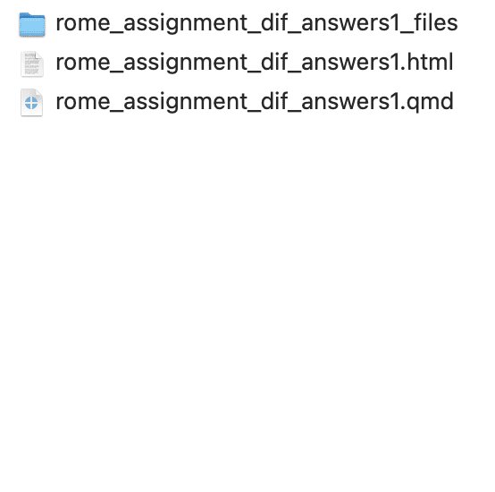
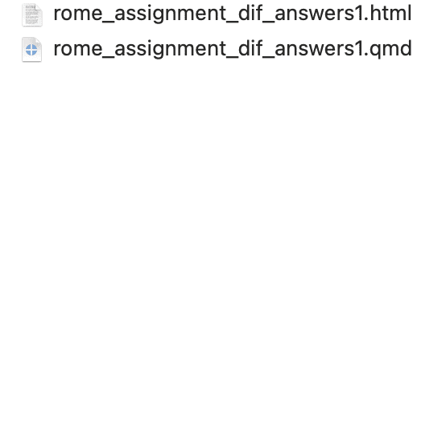
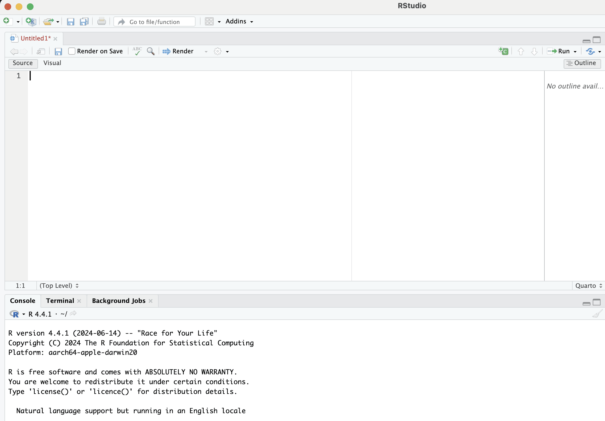
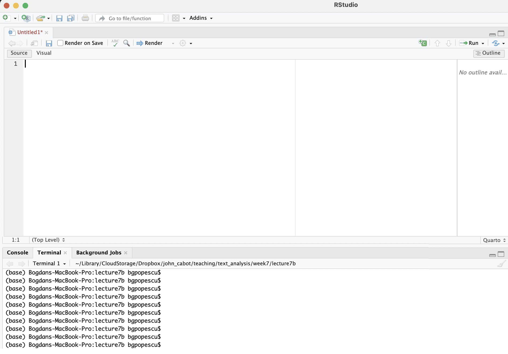
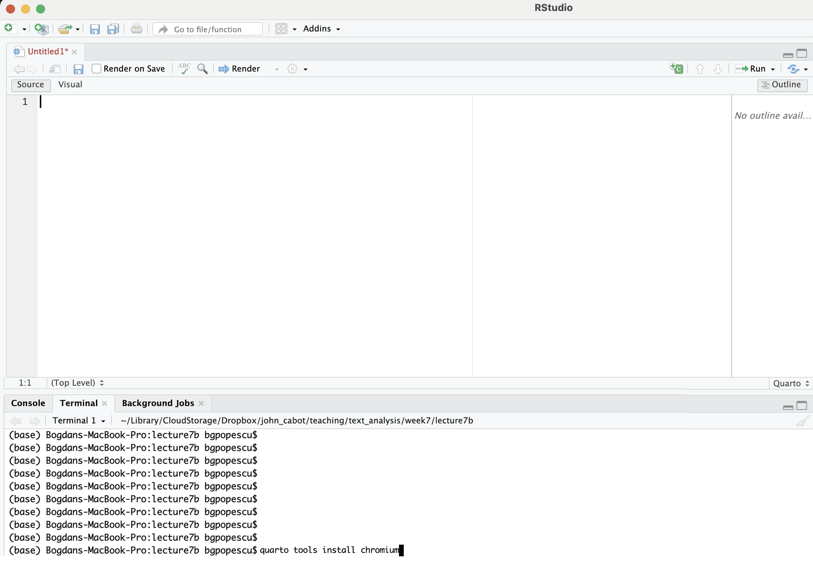
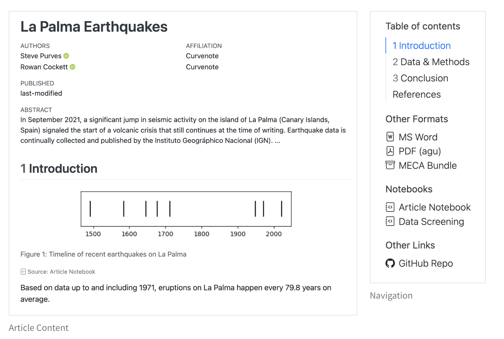

## Introduction

### What is Quarto

::: fragment
Quarto - open-source publishing system designed for creating dynamic, reproducible documents, including reports, presentations, and websites.
:::

::: fragment
It supports multiple formats like HTML, PDF, Word, and slides.
:::

::: fragment
**Why Use Quarto?**
:::

::: fragment
-   Integrates well with R, Python, and Julia.
:::

::: fragment
-   Enables embedding of code chunks directly in documents for dynamic content generation.
:::

::: fragment
-   Facilitates reproducibility by linking code and results seamlessly.
:::


## Quarto Document Structure
### YAML Header

- The YAML header defines the document metadata, such as title, author, date, and output format.


::: columns
::: {.column width="49%"}
```{.yaml}
---
title: "Statistical Analysis Report"
author: "Your Name"
date: today
format: html
---

# Introduction

This is an example.
```
:::


::: {.column width="49%"}
<iframe data-external="1" src="example1.html" width="500" height="500" style="border: 1px solid #ccc" frameborder=0></iframe>
:::
:::


## Creating HTML Output
### Basic YAML Configuration

To generate an HTML file, specify format: `html` in the YAML header.


### Rendering the Document:


Use `quarto render` in R to generate the output.


## Adding a Table of Contents

**Enabling TOC:**

- Add `toc: true` in the YAML header to automatically generate a table of contents.

- Control depth with `toc-depth` (e.g., 2 for two levels of headings).


```{.yaml}
---
title: "Statistical Analysis Report"
author: "Your Name"
date: today
format: html
toc: true
---

# Introduction

This is an example.
```


## Adding a Table of Contents

**Enabling TOC:**

- Add `toc: true` in the YAML header to automatically generate a table of contents.

- Control depth with `toc-depth` (e.g., 2 for two levels of headings).

<iframe data-external="1" src="example2.html" width="800" height="500" style="border: 1px solid #ccc" frameborder=0></iframe>


## Adding a Table of Contents
### Customization


- Rename the title with `toc-title: "Contents".` 


```{.yaml}
---
title: "Statistical Analysis Report"
author: "Your Name"
date: today
format: html
toc: true
toc-title: "Contents"
---

# Introduction

This is an example.
```


## Adding a Table of Contents
### Customization


- Rename the title with `toc-title: "Contents".` 

<iframe data-external="1" src="example3.html" width="800" height="500" style="border: 1px solid #ccc" frameborder=0></iframe>


## Equations

You can easily add inline equations in the following way

::: columns
::: {.column width="49%"}

```{.yaml}
---
title: "Statistical Analysis Report"
author: "Your Name"
date: today
format: html
toc: true
toc-title: "Contents"
---

# Introduction

This is an example.

This is an equation: $E=mc^{2}$
```
:::

::: {.column width="49%"}
<iframe data-external="1" src="example4.html" width="500" height="500" style="border: 1px solid #ccc" frameborder=0></iframe>
:::
:::


## Equations

You can easily add inline equations in the following way


::: fragment
::: columns
::: {.column width="49%"}

```{.yaml}
---
title: "Statistical Analysis Report"
author: "Your Name"
date: today
format: html
toc: true
toc-title: "Contents"
---

# Introduction

This is an example.

This is an equation: $E=mc^{2}$

This is also an equation: 

$$E=mc^{2}$$

```
:::

::: {.column width="49%"}
<iframe data-external="1" src="example5.html" width="500" height="500" style="border: 1px solid #ccc" frameborder=0></iframe>
:::
:::
:::


## Equations

For more advanced equations, check:  [https://qmd4sci.njtierney.com/math](https://qmd4sci.njtierney.com/math){target="_blank"}

<iframe data-external="1" src="https://qmd4sci.njtierney.com/math" width="500" height="500" style="border: 1px solid #ccc" frameborder=0></iframe>


## Code
### Embedding Code

This is how we include code in our documents.

::: columns
::: {.column width="49%"}

````
---
title: "Statistical Analysis Report"
author: "Your Name"
date: today
format: html
toc: true
toc-title: "Contents"
---

# Introduction

This is an example.

This is an equation: $E=mc^{2}$

This is also an equation: 

$$E=mc^{2}$$

```{{r}}
summary(mtcars)
```
````
::: 

::: {.column width="49%"}
<iframe data-external="1" src="example6.html" width="500" height="500" style="border: 1px solid #ccc" frameborder=0></iframe>
:::
:::

## Code
### Embedding Code

This is how we include code in our documents.

::: columns
::: {.column width="49%"}

````
---
title: "Statistical Analysis Report"
author: "Your Name"
date: today
format: html
toc: true
toc-title: "Contents"
---

# Introduction

This is an example.

This is an equation: $E=mc^{2}$

This is also an equation: 

$$E=mc^{2}$$

```{{r echo=TRUE, eval=TRUE}}
summary(mtcars)
```

````

:::

::: {.column width="49%"}
<iframe data-external="1" src="example7.html" width="500" height="500" style="border: 1px solid #ccc" frameborder=0></iframe>
:::
:::

## Code
### Embedding Code

This is how we only include code output in our documents.

::: columns
::: {.column width="49%"}

````
---
title: "Statistical Analysis Report"
author: "Your Name"
date: today
format: html
toc: true
toc-title: "Contents"
---

# Introduction

This is an example.

This is an equation: $E=mc^{2}$

This is also an equation: 

$$E=mc^{2}$$

```{{r echo=FALSE, eval=TRUE}}
summary(mtcars)
```

````
:::


::: {.column width="49%"}
<iframe data-external="1" src="example8.html" width="500" height="500" style="border: 1px solid #ccc" frameborder=0></iframe>
:::
:::


## Code
### Embedding Code

This is how we only include code without output in our documents.

::: columns
::: {.column width="49%"}

````
---
title: "Statistical Analysis Report"
author: "Your Name"
date: today
format: html
toc: true
toc-title: "Contents"
---

# Introduction

This is an example.

This is an equation: $E=mc^{2}$

This is also an equation: 

$$E=mc^{2}$$

```{{r echo=TRUE, eval=FALSE}}
summary(mtcars)
```

````

:::

::: {.column width="49%"}
<iframe data-external="1" src="example9.html" width="500" height="500" style="border: 1px solid #ccc" frameborder=0></iframe>
:::
:::


## Code
### Embedding Code

Many times you might have seen annoying library messages:


::: columns
::: {.column width="45%"}

````
---
title: "Statistical Analysis Report"
author: "Your Name"
date: today
format: html
toc: true
toc-title: "Contents"
---

# Introduction

This is an example.

This is an equation: $E=mc^{2}$

This is also an equation: 

$$E=mc^{2}$$

```{{r echo=TRUE, eval=FALSE}}
summary(mtcars)
```

```{{r}}
library(dplyr)
```

````

:::

::: {.column width="49%"}
<iframe data-external="1" src="example10.html" width="500" height="500" style="border: 1px solid #ccc" frameborder=0></iframe>
:::
:::


## Code
### Embedding Code

To avoid them in printing, you should do:


::: columns
::: {.column width="45%"}

````
---
title: "Statistical Analysis Report"
author: "Your Name"
date: today
format: html
toc: true
toc-title: "Contents"
---

# Introduction

This is an example.

This is an equation: $E=mc^{2}$

This is also an equation: 

$$E=mc^{2}$$

```{{r echo=TRUE, eval=FALSE}}
summary(mtcars)
```

```{{r warning=FALSE, message=FALSE}}
library(dplyr)
```

````

:::

::: {.column width="49%"}
<iframe data-external="1" src="example11.html" width="500" height="500" style="border: 1px solid #ccc" frameborder=0></iframe>
:::
:::


## Embedding Resources

**What is Self-Contained HTML?:**

An HTML document that includes all dependencies (images, CSS, JavaScript) within a single file.

**Why Use It?**

Easy to share and view without requiring external resources.

This means that you will only see an html document being produced.


## Embedding Resources

This a complicated document (with formulae, graphs) without resource-embedding.


::: columns
::: {.column width="45%"}

````
---
title: "Statistical Analysis Report"
author: "Your Name"
date: today
format: html
toc: true
toc-title: "Contents"
---

# Introduction

This is an example.

This is an equation: $E=mc^{2}$

This is also an equation: 

$$E=mc^{2}$$

```{{r echo=TRUE, eval=FALSE}}
summary(mtcars)
```

```{{r}}
library(dplyr)
```

````
:::

::: {.column width="45%"}
{width="98%"}
:::
:::


## Embedding Resources

This a complicated document (with formulae, graphs) with resource-embedding.


::: columns
::: {.column width="45%"}

````
---
title: "Statistical Analysis Report"
author: "Your Name"
date: today
format: html
toc: true
toc-title: "Contents"
embed-resources: true
---

# Introduction

This is an example.

This is an equation: $E=mc^{2}$

This is also an equation: 

$$E=mc^{2}$$

```{{r echo=TRUE, eval=FALSE}}
summary(mtcars)
```

```{{r}}
library(dplyr)
```

````
:::

::: {.column width="45%"}
{width="98%"}
:::
:::


## Text Formatting

This is how we format text within our document.

::: columns
::: {.column width="45%"}

````
---
title: "Statistical Analysis Report"
author: "Your Name"
date: today
format: html
toc: true
toc-title: "Contents"
---

# Introduction

```{{r echo=TRUE, eval=FALSE}}
summary(mtcars)
```

*This is italic text.*

**This is bold text.**

***This is bold and italic.***

This is reference to a `qmd` document.

````
:::

::: {.column width="49%"}
<iframe data-external="1" src="example12.html" width="500" height="500" style="border: 1px solid #ccc" frameborder=0></iframe>
:::
:::


## Headings

This is how we add headings and subheadings.


::: columns
::: {.column width="45%"}

````
---
title: "Statistical Analysis Report"
author: "Your Name"
date: today
format: html
toc: true
toc-title: "Contents"
---

# Introduction

```{{r echo=TRUE, eval=FALSE}}
summary(mtcars)
```

The following are headers:

# Header 2
## Subheader 1
### Sub-subheader 1

````

:::

::: {.column width="49%"}
<iframe data-external="1" src="example13.html" width="500" height="500" style="border: 1px solid #ccc" frameborder=0></iframe>
:::
:::


## Headings

This is how we can automatically number the headers.

::: columns
::: {.column width="45%"}

````
---
title: "Statistical Analysis Report"
author: "Your Name"
date: today
format: html
toc: true
toc-title: "Contents"
number-sections: true
---

# Introduction

```{{r echo=TRUE, eval=FALSE}}
summary(mtcars)
```

The following are headers:

# Header
## Subheader
### Sub-subheader

````

:::

::: {.column width="49%"}
<iframe data-external="1" src="example14.html" width="500" height="500" style="border: 1px solid #ccc" frameborder=0></iframe>
:::
:::


## Headings

This is how we can remove some headers from being numbered.

::: columns
::: {.column width="45%"}

````
---
title: "Statistical Analysis Report"
author: "Your Name"
date: today
format: html
toc: true
toc-title: "Contents"
number-sections: true
---

# Introduction

```{{r echo=TRUE, eval=FALSE}}
summary(mtcars)
```

The following are headers:

# Header
## Subheader {.unnumbered}
### Sub-subheader {.unnumbered}

````

:::

::: {.column width="49%"}
<iframe data-external="1" src="example15.html" width="500" height="500" style="border: 1px solid #ccc" frameborder=0></iframe>
:::
:::

## Headings

This is how we can remove some headers from being numbered and from the Table of Contents


````
---
title: "Statistical Analysis Report"
author: "Your Name"
date: today
format: html
toc: true
toc-title: "Contents"
number-sections: true
---

# Introduction

```{{r echo=TRUE, eval=FALSE}}
summary(mtcars)
```

The following are headers:

# Header
## Subheader {.unnumbered .unlisted}
### Sub-subheader {.unnumbered .unlisted}

````


## Headings

This is how we can remove some headers from being numbered and from the Table of Contents


<iframe data-external="1" src="example16.html" width="800" height="500" style="border: 1px solid #ccc" frameborder=0></iframe>


## Links

This is how we add links.

::: columns
::: {.column width="49%"}

```{.yaml}
---
title: "Statistical Analysis Report"
author: "Your Name"
date: today
format: html
toc: true
toc-title: "Contents"
---

# Introduction

This is how we can include links:

<https://quarto.org>

Another way is: [Quarto](https://quarto.org)
```
:::

::: {.column width="49%"}
<iframe data-external="1" src="example17.html" width="500" height="500" style="border: 1px solid #ccc" frameborder=0></iframe>
:::
:::


## Pictures

This is how we add pictures.

::: columns
::: {.column width="49%"}

```{.yaml}
---
title: "Statistical Analysis Report"
author: "Your Name"
date: today
format: html
toc: true
toc-title: "Contents"
---

# Introduction

This is how we can include pictures:

{width="50%"}

```
You can [download the picture here](https://www.dropbox.com/scl/fi/0r0iizbiqmtachq23a6m4/elephant.png?rlkey=pwunqdcft94xionckc2v4drw6&st=x1z9gz4i&dl=0){target="_blank"}.
:::

::: {.column width="49%"}
<iframe data-external="1" src="example18.html" width="500" height="500" style="border: 1px solid #ccc" frameborder=0></iframe>
:::
:::


## Lists

This is how we add lists.


::: columns
::: {.column width="49%"}

```{.yaml}
---
title: "Statistical Analysis Report"
author: "Your Name"
date: today
format: html
toc: true
toc-title: "Contents"
---

# Introduction

* unordered list
  + sub-item 1
  + sub-item 2
    - sub-sub-item 1

1. ordered list
2. item 2
    i) sub-item 1
         A.  sub-sub-item 1
```

:::

::: {.column width="49%"}
<iframe data-external="1" src="example19.html" width="500" height="500" style="border: 1px solid #ccc" frameborder=0></iframe>
:::
:::


## Tables

This is how we add tables.

::: columns
::: {.column width="45%"}

```{.yaml}
---
title: "Statistical Analysis Report"
author: "Your Name"
date: today
format: html
toc: true
toc-title: "Contents"
---

# Introduction

This is a table.

| Right | Left | Default | Center |
|------:|:-----|---------|:------:|
|    12 | 12   | 12      |   12   |
|   123 | 123  | 123     |  123   |
|     1 | 1    | 1       |   1    |

```
:::

::: {.column width="49%"}
<iframe data-external="1" src="example20.html" width="500" height="500" style="border: 1px solid #ccc" frameborder=0></iframe>
:::
:::


## Diagrams

Quarto has native support for embedding [Mermaid](https://mermaid-js.github.io/mermaid/#/) and [Graphviz](https://graphviz.org/) diagrams. 

This enables you to create flowcharts, sequence diagrams, state diagrams.

::: columns
::: {.column width="45%"}

````
---
title: "Statistical Analysis Report"
author: "Your Name"
date: today
format: html
toc: true
toc-title: "Contents"
---

# Introduction

This is a diagram.

```{{mermaid}}
%%| echo: fenced
flowchart LR
  A[Hard edge] --> B(Round edge)
  B --> C{Decision}
  C --> D[Result one]
  C --> E[Result two]
```
````
:::

::: {.column width="49%"}
<iframe data-external="1" src="example21.html" width="500" height="500" style="border: 1px solid #ccc" frameborder=0></iframe>
:::
:::


## Videos

You can include videos in documents using the `{}` [shortcode](shortcodes.qmd). For example, here we embed a YouTube video:

Videos can refer to video files (e.g. MPEG) or can be links to videos published on YouTube, Vimeo, or Brightcove.

``` {.markdown shortcodes="false"}

```

## Callout Blocks

### Markdown Syntax

``` markdown
:::{.callout-note}
Note that there are five types of callouts, including: 
`note`, `tip`, `warning`, `caution`, and `important`.
:::
```

### Output

::: callout-note
Note that there are five types of callouts, including `note`, `tip`, `warning`, `caution`, and `important`.
:::


## Word Basics

In order to create Word docs you will need to install:

::: columns
::: {.column width="45%"}
```{.bash filename="Terminal"}
quarto tools install chromium
```
:::

::: {.column width="45%"}


:::
:::


## Word Basics

In order to create Word docs you will need to install:

::: columns
::: {.column width="45%"}
```{.bash filename="Terminal"}
quarto tools install chromium
```
:::

::: {.column width="45%"}


:::
:::


## Word Basics

In order to create Word docs you will need to install:

::: columns
::: {.column width="45%"}
```{.bash filename="Terminal"}
quarto tools install chromium
```
:::

::: {.column width="45%"}


:::
:::


## Word Basics

In order to create Word docs you will need to install:

::: columns
::: {.column width="45%"}
```{.bash filename="Terminal"}
quarto tools install chromium
```
:::

::: {.column width="45%"}


:::
:::


## Word Basics

Use the docx format to create MS Word output. For example:

```{.yaml}
---
title: "My Document"
format:
  docx:
    toc: true
    number-sections: true
    highlight-style: github
---
```


## PDF Basics

Use the `pdf` format to create PDF output. For example:

```{.yaml}
---
title: "My document"
format:
  pdf:
    toc: true
    number-sections: true
    colorlinks: true
---
```


### Prerequisites

In order to create PDFs you will need to install a recent distribution of TeX. We recommend the use of TinyTeX (which is based on TexLive), which you can install with the following command:

```{.bash filename="Terminal"}
quarto install tinytex
```


## Document Class

Quarto uses [KOMA Script](https://ctan.org/pkg/koma-script) document classes by default for PDF documents and books. 

For PDF documents this results in the following Pandoc options set by default:

``` yaml
format:
  pdf:
    documentclass: scrartcl
    papersize: letter
```

You can set `documentclass` to the standard `article`, `report` or `book` classes.

::: callout-note
Setting your `documentclass` to either `book` or `scrbook` will automatically handle many of the common needs for printing and binding PDFs into a physical book.
:::


## Output Options

There are numerous options available for customizing PDF output, including:

-   Specifying document classes and their options

-   Including lists of figures and tables

-   Numerous options for customizing fonts and colors.

For example, here we use a few of these options:


## Output Options

Here is an example:

``` yaml
---
title: "My Document"
format: 
  pdf: 
    documentclass: report
    lof: true
    lot: true
    geometry:
      - top=30mm
      - left=20mm
      - heightrounded
    mainfont: Times New Roman
    colorlinks: true
---
```

## Quarto Manuscripts

Quarto manuscript projects provide a framework for writing and publishing scholarly articles.

By using one or more notebooks or `.qmd` documents as the source of content and computations, computations can be published alongside the manuscript, allowing readers to dive into your code.

It is possible to produce manuscripts in multiple formats (including LaTeX or MS Word)

## Quarto Manuscripts

The output of a Quarto manuscript is a website ([live example](https://quarto-ext.github.io/manuscript-template-jupyter/){target="_blank"})

{width="18%"} 


## Conclusion

There are lots of options for Quarto Documents:

Checkout the [Quarto Guide](https://quarto.org/docs/guide/){target="_blank"}

Most relevant are:

- Authoring
- Computations
- Documents
- Presentations

Please make sure that your assignments look nice from now on :smile:

