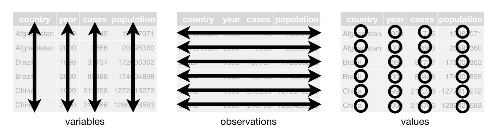
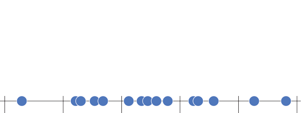
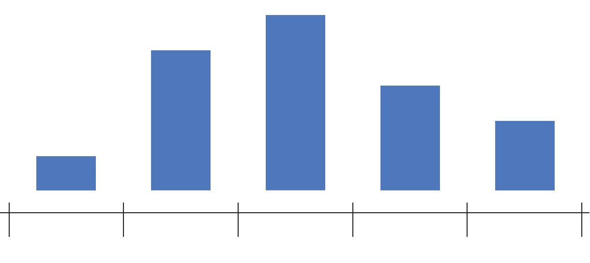

## Learning Outcomes

By the end of this lecture, you will be able to:

::: fragment
- Understand the logic of the Grammar of Graphics.
- Create plots in R using ggplot2.
- Choose the right geom for your data:
  - points
  - bars
  - lines
  - boxplots
  - density plots
  - maps
:::

# Purpose of Visuals {background-color="#40666e"}

## Why Visuals?
### Numbers vs Visuals


::: columns
::: {.column width="50%"}
Would you rather read this?

::: fragment
```{r, echo=FALSE}
# Set working directory
setwd("/Users/bgpopescu/Dropbox/john_cabot/teaching/gis/week4/data/")

# Step 1: Load the data
life_exp_urb <- read.csv("life_exp_urb.csv")

# Step 2: Get Top 5 countries by life expectancy
top5 <- head(life_exp_urb[order(-life_exp_urb$life_exp), ], 5)
top5 <- top5[, c("Entity", "life_exp_mean")]
colnames(top5) <- c("Country", "LifeExpectancy")

# Step 3: Display as an HTML table
knitr::kable(top5, format = "html", row.names = FALSE)
```
:::
:::

::: {.column width="50%"}
::: fragment
...or see this?
<br></br>
:::

::: fragment
```{r}
library(ggplot2)

# Step 4: Create horizontal bar chart
ggplot(top5, aes(x = reorder(Country, LifeExpectancy), y = LifeExpectancy)) +
  geom_col(fill = "grey50") +
  coord_flip() +
  labs(
    title = "Top 5 Countries by Life Expectancy",
    x = "Country",
    y = "Mean Life Expectancy"
  ) +
  theme_bw(base_size = 25)

```
:::
:::
:::


## Why Visuals Matter

Visuals are powerful because they:

::: fragment
- Reveal patterns we miss in tables
:::

::: fragment
- Help us explain results clearly
:::

::: fragment
- Persuade others more effectively
:::

# Intro to ggplot2 {background-color="#40666e"}


## The ggplot2 library in R

R can help us achieve great visualizations with the help of `ggplot2`

{width="38%"}

## The ggplot2 library in R {visibility="uncounted"}

R can help us achieve great visualizations with the help of `ggplot2`

{width="38%"}

## The ggplot2 library in R {visibility="uncounted"}

R can help us achieve great visualizations with the help of `ggplot2`

{width="38%"}


## The Essentials
### Grammar of Graphics

::: columns
::: {.column width="55%"}
::: fragment
-   At the most basic level we have:

    - data
    - geometries
    - aesthetics
:::


::: fragment
-   Optional layers include: 

    - facets
    - coordinates
    - annotations
    - themes, etc.
:::


::: fragment
-   We can add them together in `ggplot()` with `+`
:::
:::

::: {.column width="45%"}
```{r fig.dim=c(7,7), out.width="100%"}
library(ggplot2)

# Layers bottom → top now (Data at bottom, Themes at top)
layers <- rev(c("Themes","Annotations","Coordinates",
                "Facets","Aesthetics","Geometries","Data"))

# Parameters
gap_y <- 2
w0    <- 5
h0    <- 2
x_shift <- 6
n <- length(layers)

# Function to build diamonds
make_plate <- function(k) {
  w  <- w0
  h  <- h0
  y0 <- (k - 1) * gap_y
  x <- c(-w, 0,  w,  0) + x_shift
  y <- c( 0, h,  0, -h) + y0
  data.frame(
    layer = layers[k],
    k = k,
    x = x,
    y = y,
    id = paste0("P", k),
    stringsAsFactors = FALSE
  )
}

plates <- do.call(rbind, lapply(seq_len(n), make_plate))

# Label positions
label_pos <- aggregate(cbind(y) ~ layer + k, plates, mean)
label_pos$x <- x_shift - (w0 * 2.2)

# Plot
ggplot() +
  geom_polygon(
    data = plates,
    aes(x, y, group = id, fill = k),
    color = "white", linewidth = 1.3
  ) +
  geom_text(
    data = label_pos,
    aes(x + 5, y, label = layer, color = k),
    hjust = 1, fontface = "bold", size = 7
  ) +
  scale_fill_viridis_c(option = "plasma", direction = 1, guide = "none") +   # reversed
  scale_color_viridis_c(option = "plasma", direction = 1, guide = "none") + # reversed
  coord_fixed(
    xlim = c(-10, 15),
    expand = FALSE
  ) +
  theme_void() +
  theme(plot.margin = margin(20, 20, 20, 20))
```

:::
:::


## Data Cleaning
### Preparing the Data

Before we use `ggplot`, our data has to be tidy. This means:


::: columns
::: {.column width="30%"}
::: fragment
* Each variable is a column
:::

::: fragment
* Each observation has its own row
:::

::: fragment
* Each value has its own cell
:::
:::

::: {.column width="70%"}
{width="100%"}
:::
:::

::: footer
:::


# Simple Geoms {background-color="#40666e"}


## Simple Geoms {visibility="uncounted"}
### Geometries

::: columns
::: {.column width="45%"}
:::

::: {.column width="49%"}
```{r fig.dim=c(7,7), out.width="100%"}
library(ggplot2)

# Layers bottom → top now (Data at bottom, Themes at top)
layers <- rev(c("Themes","Annotations","Coordinates",
                "Facets","Aesthetics","Geometries","Data"))

# Parameters
gap_y <- 2
w0    <- 5
h0    <- 2
x_shift <- 6
n <- length(layers)

# Function to build diamonds
make_plate <- function(k) {
  w  <- w0
  h  <- h0
  y0 <- (k - 1) * gap_y
  x <- c(-w, 0,  w,  0) + x_shift
  y <- c( 0, h,  0, -h) + y0
  data.frame(
    layer = layers[k],
    k = k,
    x = x,
    y = y,
    id = paste0("P", k),
    stringsAsFactors = FALSE
  )
}

plates <- do.call(rbind, lapply(seq_len(n), make_plate))

# Label positions
label_pos <- aggregate(cbind(y) ~ layer + k, plates, mean)
label_pos$x <- x_shift - (w0 * 2.2)

# Plot
ggplot() +
  geom_polygon(
    data = plates,
    aes(x, y, group = id, fill = k),
    color = "white", linewidth = 1.3
  ) +
  geom_text(
    data = label_pos,
    aes(x + 5, y, label = layer, color = k),
    hjust = 1, fontface = "bold", size = 7
  ) +
  scale_fill_viridis_c(option = "plasma", direction = 1, guide = "none") +   # reversed
  scale_color_viridis_c(option = "plasma", direction = 1, guide = "none") + # reversed
  coord_fixed(
    xlim = c(-10, 15),
    expand = FALSE
  ) +
  theme_void() +
  theme(plot.margin = margin(20, 20, 20, 20))
```
:::
:::


## Simple Geoms
### Geometries

::: columns
::: {.column width="45%"}
- Geoms are the "shapes" your data takes on a graph.
- Example: 

  - points (geom_point) make a scatterplot
  - bars (geom_bar) make a bar chart
  - lines (geom_line) make a line graph.
:::

::: {.column width="49%"}
```{r fig.dim=c(7,7), out.width="100%"}
# Add alpha column to polygons
plates$alpha <- ifelse(plates$layer == "Geometries", 1, 0.2)
# Add matching alpha to labels
label_pos$alpha <- ifelse(label_pos$layer == "Geometries", 1, 0.2)

ggplot() +
  geom_polygon(
    data = plates,
    aes(x, y, group = id, fill = k, alpha = alpha),  # add alpha
    color = "white", linewidth = 1.3
  ) +
  geom_text(
    data = label_pos,
    aes(x + 5, y, label = layer, color = k, alpha = alpha), # add alpha
    hjust = 1, fontface = "bold", size = 7
  ) +
  scale_fill_viridis_c(option = "plasma", direction = 1, guide = "none") +
  scale_color_viridis_c(option = "plasma", direction = 1, guide = "none") +
  scale_alpha_identity() +   # ensures your alpha column is used directly
  coord_fixed(
    xlim = c(-10, 15),
    expand = FALSE
  ) +
  theme_void() +
  theme(plot.margin = margin(20, 20, 20, 20))
```
:::
:::


## Simple Geoms
### Examples

::: {layout-ncol=3}

```{r geom-point, echo=FALSE, fig.dim=c(4,2), out.width="100%", fig.cap="`geom_point`"}
library(tibble); library(ggplot2)
eg <- tribble(
  ~x, ~y,
  "A", 1,
  "B", 2,
  "C", 3
)
fig_geom_point<-ggplot(eg, aes(x = x, y = y)) +
  geom_point(size = 5)+
  coord_cartesian(ylim = c(0, 4))
fig_geom_point
```

:::fragment
```{r geom-col, echo=FALSE, fig.dim=c(4,2), out.width="100%", fig.cap="`geom_col`"}
eg2 <- tribble(
  ~x, ~n,
  "A", 1,
  "B", 2,
  "C", 3
)
fig_geom_col<-ggplot(eg2, aes(x = x, y = n)) +
  geom_col()
fig_geom_col
```
:::

:::fragment
```{r geom-bar, echo=FALSE, fig.dim=c(4,2), out.width="100%", fig.cap="`geom_bar`"}
eg2 <- tribble(
  ~x,
  "A",
  "B",
  "B",
  "C",
  "C",
  "C"
)

fig_geom_bar<-ggplot(eg2, aes(x = x)) +
  geom_bar()
fig_geom_bar
```
:::

:::fragment
```{r geom-text, echo=FALSE, fig.dim=c(4,2), out.width="100%", fig.cap="`geom_text`"}
eg3 <- tribble(
  ~x, ~y, ~label,
  "A", 1, "Col. 1",
  "B", 2, "Col. 2",
  "C", 3, "Col. 3"
)
fig_geom_text<-ggplot(eg3, aes(x = x, y = y, label = label)) +
  geom_text(size = 6, vjust = -0.5)+
  coord_cartesian(ylim = c(0, 4))
fig_geom_text
```
:::


:::fragment
```{r geom-line, echo=FALSE, fig.dim=c(4,2), out.width="100%", fig.cap="`geom_line`"}
ts <- tibble(
  t = 1:5,
  y = c(2,3,5,4,6)
)
fig_geom_line<-ggplot(ts, aes(x = t, y = y)) +
  geom_line(linewidth = 1.5)
fig_geom_line
```
:::
:::


## Simple Geoms {.smaller}
### Reference

::: columns
::: {.column width="50%"}
::: {layout-ncol=3}

```{r geom-point2, echo=FALSE, fig.dim=c(4,2), out.width="100%", fig.cap="`geom_point`"}
library(tibble); library(ggplot2)
eg <- tribble(
  ~x, ~y,
  "A", 1,
  "B", 2,
  "C", 3
)
fig_geom_point<-ggplot(eg, aes(x = x, y = y)) +
  geom_point(size = 5)+
  coord_cartesian(ylim = c(0, 4))
fig_geom_point
```


```{r geom-col2, echo=FALSE, fig.dim=c(4,2), out.width="100%", fig.cap="`geom_col`"}
eg2 <- tribble(
  ~x, ~n,
  "A", 1,
  "B", 2,
  "C", 3
)
fig_geom_col<-ggplot(eg2, aes(x = x, y = n)) +
  geom_col()
fig_geom_col
```


```{r geom-bar2, echo=FALSE, fig.dim=c(4,2), out.width="100%", fig.cap="`geom_bar`"}
eg2 <- tribble(
  ~x,
  "A",
  "B",
  "B",
  "C",
  "C",
  "C"
)

fig_geom_bar<-ggplot(eg2, aes(x = x)) +
  geom_bar()
fig_geom_bar
```


```{r geom-text2, echo=FALSE, fig.dim=c(4,2), out.width="100%", fig.cap="`geom_text`"}
eg3 <- tribble(
  ~x, ~y, ~label,
  "A", 1, "Col. 1",
  "B", 2, "Col. 2",
  "C", 3, "Col. 3"
)
fig_geom_text<-ggplot(eg3, aes(x = x, y = y, label = label)) +
  geom_text(size = 6, vjust = -0.5)+
  coord_cartesian(ylim = c(0, 4))
fig_geom_text
```


```{r geom-line2, echo=FALSE, fig.dim=c(4,2), out.width="100%", fig.cap="`geom_line`"}
ts <- tibble(
  t = 1:5,
  y = c(2,3,5,4,6)
)
fig_geom_line<-ggplot(ts, aes(x = t, y = y)) +
  geom_line(linewidth = 1.5)
fig_geom_line
```
:::
:::


::: {.column width="40%"}
|  geom          | Use for                                                 |
|-----------------|----------------------------------------------------------|
| `geom_point()`  | Relationships between two variables; at least 10 obs. |
| `geom_col()`    | Totals/percent per category; ordered bars. Uses pre-computed values for bar height. You must supply both `x` and `y`               |
| `geom_bar()`    | Counts the observations in each category. You must supply `x`, not `y`              |
| `geom_text()`   | Direct labels for small N; annotate outliers            |
| `geom_line()`   | Relationships between two variables; at least 10 obs. |
:::
:::


## Simple Geoms
### `geom_point`


Imagine we have data about 9 countries that records their level of democracy from -10 to +10 (x-axis) and their GDP per capita in $1,000s (y-axis).

```{r, warning=FALSE, message=FALSE, echo=TRUE, eval=TRUE, out.width="60%"}
eg1 <- data.frame(
  democracy = c(-8, -7, -5, -3, 0, 2, 5, 8, 9),   # democracy score
  gdp = c(2, 9, 4, 7, 8, 20, 15, 25, 27)  # GDP per capita in $1000s
)
```


## Simple Geoms
### `geom_point`


Imagine we have data about 9 countries that records their level of democracy from -10 to +10 (x-axis) and their GDP per capita in $1,000s (y-axis).


```{r, warning=FALSE, message=FALSE, echo=FALSE, eval=TRUE, out.width="80%"}
top4<-head(eg1, n=5)
knitr::kable(top4, format = "html", row.names = FALSE)
```


## Simple Geoms
### `geom_point`


Imagine we have data about 9 countries that records their level of democracy from -10 to +10 (x-axis) and their GDP per capita in $1,000s (y-axis).

```{r, warning=FALSE, message=FALSE, echo=TRUE, eval=FALSE, out.width="60%"}
#| code-fold: true
#| code-summary: "Show the code"
# Scatterplot with geom_point
ggplot(data=eg1, 
       aes(x = democracy, y = gdp)) +
  geom_point()
```


```{r, warning=FALSE, message=FALSE, echo=FALSE, eval=TRUE, out.width="60%"}
# Scatterplot with geom_point
ggplot(data=eg1, 
       aes(x = democracy, y = gdp)) +
  geom_point(size=5)+
  theme_grey(base_size = 25)
```


## Simple Geoms
### `geom_point`

**Interpretation**: Each dot shows one country’s democracy score (left to right) and its GDP per person (up and down). The dots suggest that more democratic countries usually have higher GDP per person.

```{r, warning=FALSE, message=FALSE, echo=TRUE, eval=FALSE, out.width="60%"}
#| code-fold: true
#| code-summary: "Show the code"

# Scatterplot with geom_point
ggplot(eg1, aes(x = democracy, y = gdp)) +
  geom_point()
```


```{r, warning=FALSE, message=FALSE, echo=FALSE, eval=TRUE, out.width="60%"}
# Scatterplot with geom_point
ggplot(data=eg1, 
       aes(x = democracy, y = gdp)) +
  geom_point(size=5)+
  theme_grey(base_size = 25)
```


## Simple Geoms
### `geom_col`

Suppose we collected a small survey and just recorded the education level of each respondent. We want to visualize how many respondents fall into each category.

```{r, warning=FALSE, message=FALSE, echo=TRUE, eval=TRUE , out.width="60%"}
# Pre-aggregated counts instead of raw rows
eg2 <- data.frame(
  education = c(
    "Primary", "Primary", "High School", "High School", "High School",
    "College", "College", "College", "College"
  ))
```


::: fragment
```{r, warning=FALSE, message=FALSE, echo=FALSE, eval=TRUE, out.width="80%"}
top4<-head(eg2, n=4)
knitr::kable(top4, format = "html", row.names = FALSE)
```
:::


## Simple Geoms
### `geom_col`

Suppose we collected a small survey and just recorded the education level of each respondent. We want to visualize how many respondents fall into each category.

```{r, warning=FALSE, message=FALSE, echo=TRUE, eval=TRUE , out.width="60%"}
library(dplyr)
# Count occurrences of each education level
eg2_transformed <- eg2 %>%
  count(education)
```


::: fragment
```{r, warning=FALSE, message=FALSE, echo=FALSE, eval=TRUE, out.width="80%"}
top4<-head(eg2_transformed, n=4)
knitr::kable(top4, format = "html", row.names = FALSE)
```
:::

## Simple Geoms
### `geom_col`

Suppose we collected a small survey and just recorded the education level of each respondent. We want to visualize how many respondents fall into each category.

::: fragment
```{r, warning=FALSE, message=FALSE, echo=TRUE, eval=FALSE , out.width="60%"}
#| code-fold: true
#| code-summary: "Show the code"
# Drawing the column
ggplot(eg2_transformed, 
       aes(x = education, y = n)) +
  geom_col()
```


```{r, warning=FALSE, message=FALSE, echo=FALSE, eval=TRUE , out.width="60%"}
# Drawing the column
ggplot(eg2_transformed, 
       aes(x = education, y = n)) +
  geom_col()+
  theme_grey(base_size = 25)
```
:::


## Simple Geoms
### `geom_bar`

Suppose we collected a small survey and just recorded the education level of each respondent. We want to visualize how many respondents fall into each category.

```{r, warning=FALSE, message=FALSE, echo=TRUE, eval=FALSE , out.width="60%"}
#| code-fold: true
#| code-summary: "Show the code"
# Drawing the bar
ggplot(eg2, 
       aes(x = education)) +
  geom_bar()
```

```{r, warning=FALSE, message=FALSE, echo=FALSE, eval=TRUE , out.width="60%"}
# Drawing the bar
ggplot(eg2, 
       aes(x = education)) +
  geom_bar() +
  theme_grey(base_size = 25)
```


## What is the difference? {.smaller}
### `geom_col` vs. `geom_bar`

This is the difference:

::: columns
::: {.column width="50%"}
```{r, echo=TRUE, eval=FALSE , out.width="60%"}
# Drawing the column
ggplot(eg2_transformed, 
       aes(x = education, y = n)) +
  geom_col()
```
:::

::: {.column width="50%"}
```{r, echo=TRUE, eval=FALSE , out.width="60%"}
# Drawing the bar
ggplot(eg2, 
       aes(x = education)) +
  geom_bar()
```
:::
:::

::: columns
::: {.column width="50%"}
```{r, echo=FALSE, eval=TRUE , out.width="100%"}
# Drawing the column
ggplot(eg2_transformed, 
       aes(x = education, y = n)) +
  geom_col()+
  theme_grey(base_size = 25)
```
:::

::: {.column width="50%"}
```{r, echo=FALSE, eval=TRUE , out.width="100%"}
# Drawing the bar
ggplot(eg2, aes(x = education)) +
  geom_bar() +
  theme_grey(base_size = 25)
```
:::
:::

::: footer
:::

## Simple Geoms
### `geom_text`

Suppose we collected a small survey and just recorded the education level of each respondent. We want to visualize how many respondents fall into each category.

```{r, warning=FALSE, message=FALSE, echo=TRUE, eval=FALSE}
#| code-fold: true
#| code-summary: "Show the code"
# Drawing the column
ggplot(eg2_transformed, aes(x = education, y = n)) +
  geom_col() +
  geom_text(
    aes(label = education, y = n/2))
```


```{r, warning=FALSE, message=FALSE, echo=FALSE, eval=TRUE}
# Drawing the column
ggplot(eg2_transformed, aes(x = education, y = n)) +
  geom_col() +
  geom_text(
    aes(label = education),
    size=7, y = n/2)+
  theme_grey(base_size = 25)
```

::: footer
:::

## Simple Geoms
### `geom_text`

We can also use `geom_text` with the first example:

Imagine we have data about 9 countries that records their level of democracy from -10 to +10 (x-axis) and their GDP per capita in $1,000s (y-axis).


::: fragment
```{r, warning=FALSE, message=FALSE, echo=TRUE, eval=TRUE, out.width="60%"}
eg1 <- data.frame(
  democracy = c(-8, -7, -5, -3, 0, 2, 5, 8, 9),   # democracy score
  gdp = c(2, 9, 4, 7, 8, 20, 15, 25, 27),  # GDP per capita in $1000s
  country = c(
    "North Korea",   # very autocratic, very poor
    "Saudi Arabia",  # autocratic, but richer due to oil
    "Zimbabwe",      # authoritarian, low GDP
    "Russia",        # hybrid regime, middle income
    "Nigeria",       # similar position
    "India",         # low–mid democracy, growing GDP
    "Brazil",        # democracy, mid GDP
    "Poland",        # consolidated democracy, higher GDP
    "South Korea"   # rich democracy
  ))
```
:::

::: footer
:::


## Simple Geoms
### `geom_text`

We can also use `geom_text` with the first example:

Imagine we have data about 9 countries that records their level of democracy from -10 to +10 (x-axis) and their GDP per capita in $1,000s (y-axis).


```{r, warning=FALSE, message=FALSE, echo=FALSE, eval=TRUE, out.width="80%"}
top4<-head(eg1, n=5)
knitr::kable(top4, format = "html", row.names = FALSE)
```


## Simple Geoms
### `geom_text`

We can also use `geom_text` with the first example:

Imagine we have data about 9 countries that records their level of democracy from -10 to +10 (x-axis) and their GDP per capita in $1,000s (y-axis).

```{r, warning=FALSE, message=FALSE, echo=TRUE, eval=FALSE, out.width="60%"}
#| code-fold: true
#| code-summary: "Show the code"

# Scatterplot with geom_point
ggplot(eg1, aes(x = democracy, y = gdp)) +
  geom_point() +
  geom_text(aes(label = country), vjust = -1)
```

```{r, warning=FALSE, message=FALSE, echo=FALSE, eval=TRUE, out.width="60%"}
#| code-fold: true
#| code-summary: "Show the code"

# Scatterplot with geom_point
ggplot(eg1, aes(x = democracy, y = gdp)) +
  geom_point(size = 5) +
  geom_text(aes(label = country), vjust = -1, size = 5) +
  theme_grey(base_size = 25)
```

::: footer
:::


## Simple Geoms
### `geom_line`

Suppose we have data on average voter turnout (%) in national elections over several years. We want to see the trend in participation.


```{r, warning=FALSE, message=FALSE, echo=TRUE, eval=TRUE}
# Toy dataset
eg3 <- data.frame(
  year = c(2000, 2004, 2008, 2012, 2016, 2020),
  turnout = c(55, 58, 62, 60, 59, 65))
```


## Simple Geoms
### `geom_line`

Suppose we have data on average voter turnout (%) in national elections over several years. We want to see the trend in participation.


```{r, warning=FALSE, message=FALSE, echo=TRUE, eval=FALSE}
#| code-fold: true
#| code-summary: "Show the code"
# Drawing the time line
ggplot(eg3, aes(x = year, y = turnout)) +
  geom_line()
```


```{r, warning=FALSE, message=FALSE, echo=FALSE, eval=TRUE, out.width="60%"}
#| code-fold: true
#| code-summary: "Show the code"

# Drawing the time line
ggplot(eg3, aes(x = year, y = turnout)) +
  geom_line(size = 1.2) +
  theme_grey(base_size = 25)
```


# Complex Geoms {background-color="#40666e"}


## Complex Geoms
### Examples

::: {layout-ncol=4}

```{r geom-boxplot, echo=FALSE, fig.dim=c(4,2), out.width="100%", fig.cap="`geom_boxplot`"}
set.seed(1)
bx <- tibble(
  group = rep(c("A","B"), each = 20),
  value = c(rnorm(20, 5), rnorm(20, 7))
)
fig_geom_boxplot<-ggplot(bx, aes(x = group, y = value)) +
  geom_boxplot()
fig_geom_boxplot
```


:::fragment
```{r geom-histogram, echo=FALSE, fig.dim=c(4,2), out.width="100%", fig.cap="`geom_histogram`"}
set.seed(1)
eg_hist <- tibble(val = rnorm(100, mean = 5, sd = 1))
ggplot(eg_hist, aes(x = val)) +
  geom_histogram(bins = 10, color = "white")
```
:::

:::fragment
```{r geom-density, echo=FALSE, fig.dim=c(4,2), out.width="100%", fig.cap="`geom_density`"}
ggplot(eg_hist, aes(x = val)) +
  geom_density()
```
:::

:::fragment
```{r geom-violin, echo=FALSE, fig.dim=c(4,2), out.width="100%", fig.cap="`geom_violin`"}
set.seed(2)
eg_violin <- tibble(
  group = rep(c("A","B"), each = 30),
  value = c(rnorm(30, 5, 1), rnorm(30, 7, 1))
)
ggplot(eg_violin, aes(x = group, y = value)) +
  geom_violin()
```
:::

:::fragment
```{r geom-smooth, echo=FALSE, fig.dim=c(4,2), out.width="100%", fig.cap="`geom_smooth`"}
set.seed(3)
eg_smooth <- tibble(
  x = 1:20,
  y = 1:20 + rnorm(20, 0, 3)
)
ggplot(eg_smooth, aes(x = x, y = y)) +
  geom_point() +
  geom_smooth(se = FALSE, 
              method=lm,
              color="black")
```
:::

:::fragment
```{r geom-errorbar, echo=FALSE, fig.dim=c(4,2), out.width="100%", fig.cap="`geom_errorbar`"}
df_err <- tibble(
  group = c("A", "B"),
  mean  = c(5, 6),
  ymin  = c(4, 5.5),
  ymax  = c(6, 6.5)
)

ggplot(df_err, aes(x = group, y = mean)) +
  geom_point(size = 3) +
  geom_errorbar(aes(ymin = ymin, ymax = ymax), width = 0.2)
```
:::

:::fragment
```{r geom-sf, echo=FALSE, fig.cap="`geom_sf`", fig.dim=c(4,2), message=FALSE, warning=FALSE, out.width="100%"}
library(sf)
library(rnaturalearth)
library(dplyr)

world <- ne_countries(scale = "medium", returnclass = "sf")
usa <- world %>% filter(admin == "United States of America")
usa <-st_simplify(usa, dTolerance = 0.05)

ggplot(usa) +
  geom_sf(fill = "grey80", color = "black")+
    coord_sf(xlim = c(-125, -66), ylim = c(24, 50))
```
:::
:::


## Complex Geoms {.smaller}
### Reference

::: columns
::: {.column width="50%"}
::: {layout-ncol=3}

```{r geom-boxplot2, echo=FALSE, fig.dim=c(4,2), out.width="100%", fig.cap="`geom_boxplot`"}
set.seed(1)
bx <- tibble(
  group = rep(c("A","B"), each = 20),
  value = c(rnorm(20, 5), rnorm(20, 7))
)
fig_geom_boxplot<-ggplot(bx, aes(x = group, y = value)) +
  geom_boxplot()
fig_geom_boxplot
```


```{r geom-histogram2, echo=FALSE, fig.dim=c(4,2), out.width="100%", fig.cap="`geom_histogram`"}
set.seed(1)
eg_hist <- tibble(val = rnorm(100, mean = 5, sd = 1))
ggplot(eg_hist, aes(x = val)) +
  geom_histogram(bins = 10, color = "white")
```


```{r geom-density2, echo=FALSE, fig.dim=c(4,2), out.width="100%", fig.cap="`geom_density`"}
ggplot(eg_hist, aes(x = val)) +
  geom_density()
```


```{r geom-violin2, echo=FALSE, fig.dim=c(4,2), out.width="100%", fig.cap="`geom_violin`"}
set.seed(2)
eg_violin <- tibble(
  group = rep(c("A","B"), each = 30),
  value = c(rnorm(30, 5, 1), rnorm(30, 7, 1))
)
ggplot(eg_violin, aes(x = group, y = value)) +
  geom_violin()
```


```{r geom-smooth2, echo=FALSE, fig.dim=c(4,2), out.width="100%", fig.cap="`geom_smooth`"}
set.seed(3)
eg_smooth <- tibble(
  x = 1:20,
  y = 1:20 + rnorm(20, 0, 3)
)
ggplot(eg_smooth, aes(x = x, y = y)) +
  geom_point() +
  geom_smooth(method = lm, se = FALSE, color="black")
```


```{r geom-errorbar2, echo=FALSE, fig.dim=c(4,2), out.width="100%", fig.cap="`geom_errorbar`"}
df_err <- tibble(
  group = c("A", "B"),
  mean = c(5, 6),
  ymin = c(4.5, 5.2),
  ymax = c(5.5, 6.8)
)

ggplot(df_err, aes(x = group, y = mean)) +
  geom_point(size = 3) +
  geom_errorbar(aes(ymin = ymin, ymax = ymax), width = 0.2)
```

```{r geom-sf2, echo=FALSE, fig.cap="`geom_sf`", fig.dim=c(4,2), message=FALSE, warning=FALSE, out.width="100%"}
library(sf)
library(rnaturalearth)
library(dplyr)

world <- ne_countries(scale = "medium", returnclass = "sf")
usa <- world %>% filter(admin == "United States of America")
usa <-st_simplify(usa, dTolerance = 0.05)
ggplot(usa) +
  geom_sf(fill = "grey80", color = "black")+
    coord_sf(xlim = c(-125, -66), ylim = c(24, 50))

```


:::
:::

::: {.column width="40%"}
| geom              | Use for                                                                 |
|-------------------|-------------------------------------------------------------------------|
| `geom_boxplot()`. | Compare distributions across groups                                     |
| `geom_histogram()`| Distribution of a single continuous variable (frequency bins)           |
| `geom_density()`  | Smoothed distribution of a single continuous variable                   |
| `geom_violin()`   | Visualizing distributions across categories (shape of data, not just box)|
| `geom_smooth()`   | Adding fitted trend/smoothed lines (LOESS, GAM, linear, etc.)           |
| `geom_errorbar()` | Showing uncertainty or variability (e.g., CI ranges around a mean)      |
| `geom_sf()`       | Plotting spatial (map) data stored as `sf` objects                      |
:::
:::


## Complex Geoms
### `geom_boxplot`

Suppose we surveyed people about their trust in government on a 1–10 scale (1 = no trust, 10 = complete trust). We want to compare typical values and how spread out the answers are for men and women.

```{r, warning=FALSE, message=FALSE, echo=TRUE, eval=TRUE, out.width="60%"}
set.seed(123)

# Toy survey dataset
eg4 <- data.frame(
  gender = rep(c("Men", "Women"), each = 20),
  trust = c(
    rnorm(20, mean = 5, sd = 2),
    rnorm(20, mean = 8, sd = 1)))
```


## Complex Geoms
### `geom_boxplot`

Suppose we surveyed people about their trust in government on a 1–10 scale (1 = no trust, 10 = complete trust). We want to see the typical values and how spread out the answers are.

```{r, warning=FALSE, message=FALSE, echo=FALSE, eval=TRUE, out.width="80%"}
top3<-head(eg4, n=6)
knitr::kable(top3, format = "html", row.names = FALSE)
```


## Complex Geoms
### `geom_boxplot`

Suppose we surveyed people about their trust in government on a 1–10 scale (1 = no trust, 10 = complete trust). We want to see the typical values and how spread out the answers are.

::: fragment
```{r, warning=FALSE, message=FALSE, echo=TRUE, eval=FALSE, out.width="60%"}
#| code-fold: true
#| code-summary: "Show the code"

# Drawing the boxplot
ggplot(eg4, aes(y = trust)) +
  geom_boxplot()

```


```{r, warning=FALSE, message=FALSE, echo=FALSE, eval=TRUE, out.width="60%"}
#| code-fold: true
#| code-summary: "Show the code"

# Drawing the boxplot
ggplot(eg4, aes(y = trust)) +
  geom_boxplot() +
    theme_grey(base_size = 25)+
  theme(axis.text.x = element_blank(),
        axis.ticks.x = element_blank()) +
  scale_x_discrete(expand = expansion(add = 2)) +
  scale_y_continuous(
    limits = c(min(eg4$trust) - 1, max(eg4$trust) + 1),
    breaks = pretty(c(min(eg4$trust) - 1, max(eg4$trust) + 1), n = 6) # force neat y ticks
  )
```

:::


## Complex Geoms {visibility="uncounted"}
### `geom_boxplot`

Suppose we surveyed people about their trust in government on a 1–10 scale (1 = no trust, 10 = complete trust). We want to see the typical values and how spread out the answers are.


```{r, warning=FALSE, message=FALSE, echo=TRUE, eval=FALSE}
#| code-fold: true
#| code-summary: "Show the code"
ggplot(eg4, aes(y = trust)) +
  geom_boxplot()
```


```{r, warning=FALSE, message=FALSE, echo=FALSE, eval=TRUE}
#| code-fold: true
#| code-summary: "Show the code"
set.seed(123)

eg4 <- data.frame(
  gender = rep(c("Men", "Women"), each = 20),
  trust = c(
    rnorm(20, mean = 5, sd = 2),
    rnorm(20, mean = 8, sd = 1)))

med <- quantile(eg4$trust, 0.5, na.rm=TRUE)
q25 <- quantile(eg4$trust, 0.25, na.rm=TRUE)
q75 <- quantile(eg4$trust, 0.75, na.rm=TRUE)
min_m <- min(eg4$trust, na.rm=TRUE)
max_m <- max(eg4$trust, na.rm=TRUE)

x_start <- -0.55

ggplot(eg4, aes(y = trust)) +
  geom_boxplot(color = "black") +
  labs(x = NULL) +
  theme_grey(base_size = 25) +
  theme(
    axis.text.x  = element_blank(),
    axis.ticks.x = element_blank(),
    axis.title.y = element_text(size = 20)
  ) +
  scale_x_discrete(expand = expansion(add = 2)) +  # same as eg5
  scale_y_continuous(
    limits = c(min(eg4$trust) - 1, max(eg4$trust) + 1),
    breaks = pretty(c(min(eg4$trust) - 1, max(eg4$trust) + 1), n = 6)
  ) +
  
  # --- annotations (unchanged) ---
  annotate("text", x = x_start, y = 6,
           label = "Interquartile\nrange (IQR)", hjust = 1, size = 6) +
  annotate("segment", x = x_start, xend = x_start, y = q25, yend = q75) +
  annotate("segment", x = x_start, xend = x_start+0.15,
           y = q25, yend = q25,
           arrow = arrow(length = unit(0.3, "lines"))) +
  annotate("segment", x = x_start, xend = x_start+0.15,
           y = q75, yend = q75,
           arrow = arrow(length = unit(0.3, "lines"))) +
  annotate("text", x = x_start, y = min_m,
           label = "Minimum\n25% - (1.5 × IQR)", hjust = 1, lineheight = 1, size = 6) +
  annotate("segment", x = x_start, xend = 0, y = min_m, yend = min_m,
           arrow = arrow(length = unit(0.3, "lines"))) +
  annotate("text", x = x_start, y = max_m,
           label = "Maximum\n75% + (1.5 × IQR)", hjust = 1, lineheight = 1, size = 6) +
  annotate("segment", x = x_start, xend = 0, y = max_m, yend = max_m,
           arrow = arrow(length = unit(0.3, "lines"))) +
  annotate("text", y = 6.2, x = 0, label = "Median", fontface = 2, size = 6) +
  annotate("text", x = 1, y = q25, label = "25 percentile", fontface = 3, hjust = 0, size = 6) +
  annotate("segment", x = 0.5, xend = 1, y = q25, yend = q25,
           arrow = arrow(length = unit(0.3, "lines"))) +
  annotate("text", x = 1, y = q75, label = "75 percentile", fontface = 3, hjust = 0, size = 6) +
  annotate("segment", x = 0.5, xend = 1, y = q75, yend = q75,
           arrow = arrow(length = unit(0.3, "lines")))
```


## Complex Geoms
### `geom_boxplot`

Suppose we surveyed people about their trust in government on a 1–10 scale (1 = no trust, 10 = complete trust). We want to compare typical values and how spread out the answers are for men and women.

```{r, warning=FALSE, message=FALSE, echo=TRUE, eval=TRUE}
set.seed(123)

# Toy survey dataset
eg5 <- data.frame(
  gender = rep(c("Men", "Women"), each = 20),
  trust = c(
    rnorm(20, mean = 5, sd = 2),
    rnorm(20, mean = 8, sd = 1)))
```


## Complex Geoms
### `geom_boxplot`

Suppose we surveyed people about their trust in government on a 1–10 scale (1 = no trust, 10 = complete trust). We want to compare typical values and how spread out the answers are for men and women.

```{r, warning=FALSE, message=FALSE, echo=FALSE, eval=TRUE, out.width="80%"}
top3<-head(eg5, n=8)
knitr::kable(top3, format = "html", row.names = FALSE)
```


## Complex Geoms
### `geom_boxplot`

Suppose we surveyed people about their trust in government on a 1–10 scale (1 = no trust, 10 = complete trust). We want to compare typical values and how spread out the answers are for men and women.


```{r, warning=FALSE, message=FALSE, echo=TRUE, eval=FALSE}
#| code-fold: true
#| code-summary: "Show the code"
ggplot(eg5, aes(x = gender, y = trust)) +
  geom_boxplot()
```


```{r, warning=FALSE, message=FALSE, echo=FALSE, eval=TRUE}
ggplot(eg5, aes(x = gender, y = trust)) +
  geom_boxplot() +
  theme_grey(base_size = 25)+
  scale_x_discrete(expand = expansion(add = 2))
```


## Complex Geoms {visibility="uncounted"}
### `geom_boxplot`

Suppose we surveyed people about their trust in government on a 1–10 scale (1 = no trust, 10 = complete trust). We want to compare typical values and how spread out the answers are for men and women.


```{r, warning=FALSE, message=FALSE, echo=TRUE, eval=FALSE}
#| code-fold: true
#| code-summary: "Show the code"

ggplot(eg5, aes(x = gender, y = trust)) +
  geom_boxplot()
```


```{r, warning=FALSE, message=FALSE, echo=FALSE, eval=TRUE}
set.seed(123)

# Calculate boxplot stats for Women group
women <- subset(eg5, gender == "Women")
med <- quantile(women$trust, 0.5, na.rm=TRUE)
q25 <- quantile(women$trust, 0.25, na.rm=TRUE)
q75 <- quantile(women$trust, 0.75, na.rm=TRUE)
iqr <- q75 - q25
min_val <- boxplot.stats(women$trust)$stats[1]
max_val <- boxplot.stats(women$trust)$stats[5]


# Boxplot stats for Men group (left-hand box)
men <- subset(eg5, gender == "Men")
q25_m <- quantile(men$trust, 0.25, na.rm=TRUE)
q75_m <- quantile(men$trust, 0.75, na.rm=TRUE)
iqr_m <- q75_m - q25_m
min_m <- boxplot.stats(men$trust)$stats[1]
max_m <- boxplot.stats(men$trust)$stats[5]

ggplot(eg5, aes(x = gender, y = trust)) +
  geom_boxplot() +
  theme_grey(base_size = 25) +
#  coord_cartesian(ylim = c(3, 8)) +
  labs(
#    x = "Gender",
#    y = "Trust in Government"
  ) +
    scale_x_discrete(expand = expansion(add = 2))+
  
  # Median
  annotate("text", y = med - 0.2, x = 2, label = "Median", fontface = 2, size = 6) +
  
  # 25th percentile annotation with arrow
  annotate("text", x = 2.87, y = q25, label = "25 percentile", fontface = 3, hjust = 0, size = 6) +
  annotate("segment", x = 2.85, xend = 2.45, y = q25, yend = q25,
           arrow = arrow(length = unit(0.3, "lines"))) +
  
  # 75th percentile annotation with arrow
  annotate("text", x = 2.87, y = q75, label = "75 percentile", fontface = 3, hjust = 0, size = 6) +
  annotate("segment", x = 2.85, xend = 2.45, y = q75, yend = q75,
           arrow = arrow(length = unit(0.3, "lines"))) +
  
  # IQR annotation
  annotate("text", x = 0.2, y = q25_m + 0.5 * iqr_m,
           label = "Interquartile\nrange (IQR)", hjust = 1, size = 6) +
  # Arrows stop at the box edge (x = 1)
  annotate("segment", x = 0.2, xend = 0.6, y = q25_m, yend = q25_m,
           arrow = arrow(length = unit(0.3, "lines"))) +
  annotate("segment", x = 0.2, xend = 0.6, y = q75_m, yend = q75_m,
           arrow = arrow(length = unit(0.3, "lines")))+
  # Vertical connector between Q25 and Q75
  annotate("segment", x = 0.2, xend = 0.2, y = q25_m, yend = q75_m)+
  
  # Minimum annotation
  annotate("text", x = 0.6, y = min_m,
           label = "Minimum\n25% - (1.5 × IQR)", hjust = 1, lineheight = 1, size = 6) +
  annotate("segment", x = 0.8, xend = 1, y = min_m, yend = min_m,
           arrow = arrow(length = unit(0.3, "lines"))) +
  
  # Maximum annotation
  annotate("text", x = 0.6, y = max_m,
           label = "Maximum\n75% + (1.5 × IQR)", hjust = 1, lineheight = 1, size = 6) +
  annotate("segment", x = 0.8, xend = 1, y = max_m, yend = max_m,
           arrow = arrow(length = unit(0.3, "lines")))

```


## Complex Geoms
### `geom_histogram`: What is a Histogram?

::: columns
::: {.column width="50%"}
Histograms allow us to better understand how frequently or infrequently certain values occur in our dataset.


::: fragment
Imagine a set of values that are spaced out along a number line.
:::
:::

::: {.column width="50%"}
```{r, warning=FALSE, message=FALSE, echo=FALSE, eval=TRUE, out.width="100%"}
#| code-fold: true
#| code-summary: "Show the code"

ggplot(eg5, aes(x = trust)) +
  geom_histogram(bins = 10, color = "white") +
  coord_cartesian(xlim = c(2, 8)) +                 # zoom x-axis without altering bins
  scale_x_continuous(breaks = 2:8) +                # optional: consistent ticks
  labs(
    x = NULL,
    y = "count"
  ) +
  theme_grey(base_size = 25)
```

{width="50%"}

:::
:::


## Complex Geoms
### `geom_histogram`: What is a Histogram?


::: columns
::: {.column width="50%"}
To construct a histogram, a section of the number line is divided into equal chunks, called bins. 

::: fragment
Next, count how many data points sit inside each bin, and draw bars, one for each bin
:::

::: fragment
The heights of the bars correspond to the number of data points.
:::
:::

::: {.column width="50%"}
```{r, warning=FALSE, message=FALSE, echo=FALSE, eval=TRUE, out.width="100%"}
#| code-fold: true
#| code-summary: "Show the code"

ggplot(eg5, aes(x = trust)) +
  geom_histogram(bins = 10, color = "white") +
  coord_cartesian(xlim = c(2, 8)) +                 # zoom x-axis without altering bins
  scale_x_continuous(breaks = 2:8) +                # optional: consistent ticks
  labs(
    x = NULL,
    y = "count"
  ) +
  theme_grey(base_size = 25)
```
{width="50%"}
:::
:::


## Complex Geoms
### `geom_histogram`: What is a Histogram?

::: columns
::: {.column width="50%"}
Label the data (in the example below each data point is an SAT score)

::: fragment
Draw in a y-axis which counts the number of data points in each bin
:::

::: fragment
Finally label your bins.
:::
:::

::: {.column width="50%"}
```{r, warning=FALSE, message=FALSE, echo=FALSE, eval=TRUE, out.width="100%"}
#| code-fold: true
#| code-summary: "Show the code"

ggplot(eg5, aes(x = trust)) +
  geom_histogram(bins = 10, color = "white") +
  coord_cartesian(xlim = c(2, 8)) +                 # zoom x-axis without altering bins
  scale_x_continuous(breaks = 2:8) +                # optional: consistent ticks
  labs(
    x = NULL,
    y = "count"
  ) +
  theme_grey(base_size = 25)
```
{width="50%"}
:::
:::


## Complex Geoms
### `geom_histogram`: Example

Suppose we surveyed people about their trust in government on a 1–10 scale (1 = no trust, 10 = complete trust). We want to compare typical values and how spread out the answers are.

::: fragment
```{r, warning=FALSE, message=FALSE, echo=TRUE, eval=FALSE, out.width="60%"}
#| code-fold: true
#| code-summary: "Show the code"

# Drawing the Histogram
ggplot(eg5, aes(x = trust)) +
  geom_histogram(bins = 10, color = "white")+
  coord_cartesian(xlim = c(2, 8))
```


```{r, warning=FALSE, message=FALSE, echo=FALSE, eval=TRUE, out.width="60%"}
#| code-fold: true
#| code-summary: "Show the code"
ggplot(eg5, aes(x = trust)) +
  geom_histogram(bins = 10, color = "white") +
  coord_cartesian(xlim = c(2, 8)) +                 # zoom x-axis without altering bins
  scale_x_continuous(breaks = 2:8) +                # optional: consistent ticks
  theme_grey(base_size = 25)
```
:::


## Complex Geoms
### `geom_histogram`: Example

Suppose we surveyed people about their trust in government on a 1–10 scale (1 = no trust, 10 = complete trust). We want to compare typical values and how spread out the answers are.

There is a direct connection between histograms and boxplots:

::: fragment
```{r, warning=FALSE, message=FALSE, echo=FALSE, eval=TRUE, out.width="70%"}
library(ggplot2)
library(ggpubr)

# Histogram (appearance unchanged; just zoomed to 2–8)
fig_hist <- ggplot(eg5, aes(x = trust)) +
  geom_histogram(bins = 10, color = "white") +
  coord_cartesian(xlim = c(2, 8)) +                 # zoom x-axis without altering bins
  scale_x_continuous(breaks = 2:8) +                # optional: consistent ticks
  theme_grey(base_size = 25)+
    labs(
    x = NULL,
    y = "count"
  )

# Boxplot aligned to same x scale
fig_geom_boxplot <- ggplot(eg5, aes(x = trust)) +
  geom_boxplot() +
  coord_cartesian(xlim = c(2, 8)) +                 # same zoom
  scale_x_continuous(breaks = 2:8) +                # optional: same ticks
  theme_grey(base_size = 25) +
  theme(
    axis.text.y  = element_blank(),
    axis.ticks.y = element_blank(),
    panel.grid.major.y = element_blank()
  )

# Arrange vertically so the x-axes line up
ggarrange(fig_hist, fig_geom_boxplot, ncol = 1, heights = c(2, 1), align = "v")
```
:::


## Complex Geoms {visibility="uncounted"}
### `geom_histogram`: Example

Suppose we surveyed people about their trust in government on a 1–10 scale (1 = no trust, 10 = complete trust). We want to compare typical values and how spread out the answers are.

There is a direct connection between histograms and boxplots:

```{r, warning=FALSE, message=FALSE, echo=FALSE, eval=TRUE, out.width="80%"}
library(ggplot2)
library(ggpubr)

# Compute summary statistics for trust
trust_mean   <- mean(eg5$trust, na.rm = TRUE)
trust_median <- median(eg5$trust, na.rm = TRUE)

mean_label   <- paste("Mean Trust:\n", round(trust_mean, 2))
median_label <- paste("Median Trust:\n", round(trust_median, 2))

# Histogram (with mean/median lines and labels)
fig_hist <- ggplot(eg5, aes(x = trust)) +
  geom_histogram(bins = 10, color = "white") +
  geom_vline(xintercept = trust_median, linetype = "solid", color = "red", size=1) +
  annotate("text", x = trust_median + 0.3, y = 8, label = median_label, color = "red", hjust = 0, size=4) +
  coord_cartesian(xlim = c(2, 8)) +                 
  scale_x_continuous(breaks = 2:8) +
  labs(
    x = NULL,
    y = "count"
  ) +
  theme_grey(base_size = 25)

# Boxplot aligned to same x scale + mean/median markers
fig_geom_boxplot <- ggplot(eg5, aes(x = trust)) +
  geom_boxplot() +
  geom_vline(xintercept = trust_median, linetype = "solid", color = "red", size=1) +
  annotate("text", x = trust_median + 0.2, y = Inf, label = median_label, color = "red",
           hjust = 0, vjust = 1.2, lineheight = 0.95, size=4) +
  coord_cartesian(xlim = c(2, 8)) +                 # same zoom
  scale_x_continuous(breaks = 2:8) +                # same ticks
  labs(
    x = "trust",
    y = ""
  ) +
  theme_grey(base_size = 25) +
  theme(
    axis.text.y  = element_blank(),
    axis.ticks.y = element_blank(),
    panel.grid.major.y = element_blank()
  )


# Arrange vertically so the x-axes line up
ggarrange(fig_hist, fig_geom_boxplot, ncol = 1, heights = c(2, 1), align = "v")
```


## Complex Geoms
### `geom_histogram`: Example

One specific aspect pertaining to histograms is the number of bins:

::: fragment
- too wide bins hide structure;
- too narrow bins are noisy..

```{r, warning=FALSE, message=FALSE, echo=FALSE, eval=TRUE, out.width="70%"}
#| code-fold: true
#| code-summary: "Show the code"
library(ggpubr)

p1 <- ggplot(eg5, aes(trust)) +
  geom_histogram(bins=5, boundary = 0.5, color = "white") +
  coord_cartesian(xlim = c(2, 8),
                  ylim = c(0, 18))+
                  labs(title = "geom_histogram(bins = 5)", x = NULL, y = "count")+
  theme_grey(base_size = 13)

p2 <- ggplot(eg5, aes(trust)) +
  geom_histogram(bins = 10, boundary = 0.5, color = "white") +
    coord_cartesian(xlim = c(2, 8),
                  ylim = c(0, 18))+ 
  labs(title = "geom_histogram(bins = 10)", x = NULL, y = NULL)+
    theme_grey(base_size = 13)

p3 <- ggplot(eg5, aes(trust)) +
  geom_histogram(bins = 20, boundary = 0.5, color = "white") +
    coord_cartesian(xlim = c(2, 8),
                  ylim = c(0, 18))+
  labs(title = "geom_histogram(bins = 20)", x = NULL, y = NULL)+
    theme_grey(base_size = 13)


ggarrange(p1, p2, p3, ncol = 3)
```
:::


## Complex Geoms
### `geom_density`: What is a Density Curve?

::: columns
::: {.column width="50%"}
A histogram counts how many students fall in each trust "bucket."

:::

::: {.column width="50%"}
```{r, warning=FALSE, message=FALSE, echo=FALSE, eval=TRUE, out.width="100%"}
# Match default histogram (bins=10, counts), and add secondary density axis
N <- sum(!is.na(eg5$trust))
binwidth <- (max(eg5$trust, na.rm = TRUE) - min(eg5$trust, na.rm = TRUE)) / 10

ggplot(eg5, aes(x = trust)) +
  geom_histogram(bins = 10, color = "white", fill = "grey65") +  # default-style histogram (counts)
  coord_cartesian(xlim = c(2, 8)) +
  scale_x_continuous(breaks = 2:8) +
  scale_y_continuous(
    name = "count",                                   # primary axis (counts)
    sec.axis = sec_axis(~ . / (N * binwidth), name = "density")  # secondary axis (density)
  ) +
  theme_grey(base_size = 25)+
    labs(
    x = "trust"
  )
```

:::
:::


## Complex Geoms {visibility="uncounted"}
### `geom_density`: What is a Density Curve?

::: columns
::: {.column width="50%"}
A histogram counts how many students fall in each trust "bucket."

A density curve smooths those buckets into a single curve so we see the overall shape.

:::

::: {.column width="50%"}
```{r, warning=FALSE, message=FALSE, echo=FALSE, eval=TRUE, out.width="100%"}
# Match default histogram (bins=10, counts), and add secondary density axis
N <- sum(!is.na(eg5$trust))
binwidth <- (max(eg5$trust, na.rm = TRUE) - min(eg5$trust, na.rm = TRUE)) / 10

ggplot(eg5, aes(x = trust)) +
  geom_histogram(bins = 10, color = "white", fill = "grey65") +  # default-style histogram (counts)
  geom_density(aes(y = after_stat(density) * N * binwidth), linewidth = 1) +  # rescaled to counts
  coord_cartesian(xlim = c(2, 8)) +
  scale_x_continuous(breaks = 2:8) +
  scale_y_continuous(
    name = "count",                                   # primary axis (counts)
    sec.axis = sec_axis(~ . / (N * binwidth), name = "density")  # secondary axis (density)
  ) +
  theme_grey(base_size = 25)+
    labs(
    x = "trust"
  )
```

:::
:::


## Complex Geoms {visibility="uncounted"}
### `geom_density`: What is a Density Curve?

::: columns
::: {.column width="50%"}
A histogram counts how many students fall in each trust "bucket."

A density curve smooths those buckets into a single curve so we see the overall shape.

The area under the entire curve = 1 (i.e., 100% of people).

:::

::: {.column width="50%"}
```{r, warning=FALSE, message=FALSE, echo=FALSE, eval=TRUE, out.width="100%"}
# Match default histogram (bins=10, counts), and add secondary density axis
N <- sum(!is.na(eg5$trust))
binwidth <- (max(eg5$trust, na.rm = TRUE) - min(eg5$trust, na.rm = TRUE)) / 10

ggplot(eg5, aes(x = trust)) +
  geom_histogram(bins = 10, color = "white", fill = "grey65") +  # default-style histogram (counts)
  geom_density(
    aes(y = after_stat(density) * N * binwidth),                  # rescale to counts
    fill = "red", alpha = 0.5, linewidth = 1
  ) +
  coord_cartesian(xlim = c(2, 8)) +
  scale_x_continuous(breaks = 2:8) +
  scale_y_continuous(
    name = "count", 
    sec.axis = sec_axis(~ . / (N * binwidth), name = "density")
  ) +
  theme_grey(base_size = 25) +
  labs(x = "trust")
```

:::
:::


## Complex Geoms {visibility="uncounted"}
### `geom_density`: What is a Density Curve?

::: columns
::: {.column width="50%"}
A histogram counts how many students fall in each trust "bucket."

A density curve smooths those buckets into a single curve so we see the overall shape.

The area under the entire curve = 1 (i.e., 100% of people).

The probability that a randomly chosen person's trust score is between certain values (e.g. 5 and 7)

:::

::: {.column width="50%"}
```{r, warning=FALSE, message=FALSE, echo=FALSE, eval=TRUE, out.width="100%"}
# Match default histogram (bins = 10, counts) and set up scaling
N <- sum(!is.na(eg5$trust))
bins <- 10
binwidth <- (max(eg5$trust, na.rm = TRUE) - min(eg5$trust, na.rm = TRUE)) / bins

# Range to illustrate probability
a <- 5
b <- 7
prop_ab <- mean(eg5$trust >= a & eg5$trust <= b, na.rm = TRUE)
label_ab <- paste0("P(", a, " ≤ trust ≤ ", b, ") ≈\n ", sprintf("%.0f%%", prop_ab * 100))

ggplot(eg5, aes(x = trust)) +
  # Default-style histogram (counts)
  geom_histogram(bins = bins, color = "white", fill = "grey65") +
  # Fill the entire density curve (rescaled to counts)
  geom_density(
    aes(y = after_stat(density) * N * binwidth),
    fill = "grey80", alpha = 0.5, linewidth = 1
  ) +
  # Shade only the area under the curve between a and b (also rescaled to counts)
    geom_density(
    aes(y = after_stat(ifelse(x >= a & x <= b, density * N * binwidth, NA_real_))),
    fill = "red", alpha = 0.5) +
  # Annotate the probability
  annotate("label",
           x = (a + b) / 2, y = 2.7, label = label_ab,
           vjust = 1.2, size=6) +
  coord_cartesian(xlim = c(2, 8)) +
  scale_x_continuous(breaks = 2:8) +
  scale_y_continuous(
    name = "count",
    sec.axis = sec_axis(~ . / (N * binwidth), name = "density")
  ) +
  theme_grey(base_size = 25) +
  labs(x = "trust")
```

:::
:::


## Complex Geoms {visibility="uncounted"}
### `geom_density`: What is a Density Curve?

::: columns
::: {.column width="50%"}
A histogram counts how many students fall in each trust "bucket."

A density curve smooths those buckets into a single curve so we see the overall shape.

The area under the entire curve = 1 (i.e., 100% of people).

The probability that a randomly chosen person's trust score is above 5.
:::

::: {.column width="50%"}
```{r, warning=FALSE, message=FALSE, echo=FALSE, eval=TRUE, out.width="100%"}
# Default-style histogram (bins = 10) and scaling
N <- sum(!is.na(eg5$trust))
bins <- 10
binwidth <- (max(eg5$trust, na.rm = TRUE) - min(eg5$trust, na.rm = TRUE)) / bins

# Thresholds and empirical proportions
a <- 5  # right tail threshold
b <- 4  # left tail threshold
prop_gt_a <- mean(eg5$trust > a, na.rm = TRUE)
prop_lt_b <- mean(eg5$trust < b, na.rm = TRUE)

# Label in the same style
label_gt <- paste0("P(trust > ", a, ") ≈\n ", sprintf("%.0f%%", prop_gt_a * 100))
label_lt <- paste0("P(trust < ", b, ") ≈\n ", sprintf("%.0f%%", prop_lt_b * 100))


ggplot(eg5, aes(x = trust)) +
  # Default-style histogram (counts)
  geom_histogram(bins = bins, color = "white", fill = "grey65") +
  # Fill the entire density curve (rescaled to counts)
  geom_density(
    aes(y = after_stat(density) * N * binwidth),
    fill = "grey80", alpha = 0.5, linewidth = 1
  ) +
  geom_density(aes(y = after_stat(ifelse(x > a, density * N * binwidth, NA))),
               fill = "red", alpha = 0.5)+
  # Annotation matching your preferred style
  annotate("label",
           x = a + 1.5, y = 2.7, label = label_gt,
           vjust = 1.2, size = 6) +
  coord_cartesian(xlim = c(2, 8)) +
  scale_x_continuous(breaks = 2:8) +
  scale_y_continuous(
    name = "count",
    sec.axis = sec_axis(~ . / (N * binwidth), name = "density")
  ) +
  theme_grey(base_size = 25) +
  labs(x = "trust")
```

:::
:::


## Complex Geoms {visibility="uncounted"}
### `geom_density`: What is a Density Curve?

::: columns
::: {.column width="50%"}
A histogram counts how many students fall in each trust "bucket."

A density curve smooths those buckets into a single curve so we see the overall shape.

The area under the entire curve = 1 (i.e., 100% of people).

The probability that a randomly chosen person's trust score is below 4.

:::

::: {.column width="50%"}
```{r, warning=FALSE, message=FALSE, echo=FALSE, eval=TRUE, out.width="100%"}
# Default-style histogram (bins = 10) and scaling
N <- sum(!is.na(eg5$trust))
bins <- 10
binwidth <- (max(eg5$trust, na.rm = TRUE) - min(eg5$trust, na.rm = TRUE)) / bins

# Thresholds and empirical proportions
a <- 5  # right tail threshold
b <- 4  # left tail threshold
prop_gt_a <- mean(eg5$trust > a, na.rm = TRUE)
prop_lt_b <- mean(eg5$trust < b, na.rm = TRUE)

# Label in the same style
label_gt <- paste0("P(trust > ", a, ") ≈\n ", sprintf("%.0f%%", prop_gt_a * 100))
label_lt <- paste0("P(trust < ", b, ") ≈\n ", sprintf("%.0f%%", prop_lt_b * 100))


ggplot(eg5, aes(x = trust)) +
  # Default-style histogram (counts)
  geom_histogram(bins = bins, color = "white", fill = "grey65") +
  # Fill the entire density curve (rescaled to counts)
  geom_density(
    aes(y = after_stat(density) * N * binwidth),
    fill = "grey80", alpha = 0.5, linewidth = 1
  ) +
  geom_density(aes(y = after_stat(ifelse(x < b, density * N * binwidth, NA))),
               fill = "red", alpha = 0.5)+
  # Annotation matching your preferred style
  annotate("label",
           x = 3.5, y = 3.5, label = label_lt,
           vjust = 1.2, size = 6) +
  coord_cartesian(xlim = c(2, 8)) +
  scale_x_continuous(breaks = 2:8) +
  scale_y_continuous(
    name = "count",
    sec.axis = sec_axis(~ . / (N * binwidth), name = "density")
  ) +
  theme_grey(base_size = 25) +
  labs(x = "trust")
```

:::
:::


## Complex Geoms
### `geom_density`: What is a Density Curve?

::: columns
::: {.column width="50%"}
Heights tell you nothing by themselves—areas tell you the share.

When I widen the range, the area grows—so the probability grows.

This curve is smoothed from the histogram; bandwidth controls how smooth.
:::

::: {.column width="50%"}
```{r, warning=FALSE, message=FALSE, echo=FALSE, eval=TRUE, out.width="100%"}
# Match default histogram (bins=10, counts), and add secondary density axis
N <- sum(!is.na(eg5$trust))
binwidth <- (max(eg5$trust, na.rm = TRUE) - min(eg5$trust, na.rm = TRUE)) / 10

ggplot(eg5, aes(x = trust)) +
  geom_histogram(bins = 10, color = "white", fill = "grey65") +  # default-style histogram (counts)
  geom_density(aes(y = after_stat(density) * N * binwidth), linewidth = 1) +  # rescaled to counts
  coord_cartesian(xlim = c(2, 8)) +
  scale_x_continuous(breaks = 2:8) +
  scale_y_continuous(
    name = "count",                                   # primary axis (counts)
    sec.axis = sec_axis(~ . / (N * binwidth), name = "density")  # secondary axis (density)
  ) +
  theme_grey(base_size = 25)+
    labs(
    x = "trust"
  )
```
:::
:::


## Complex Geoms
### `geom_density`: What is a Density Curve?

::: columns
::: {.column width="50%"}
Heights tell you nothing by themselves—areas tell you the share.

When I widen the range, the area grows—so the probability grows.

This curve is smoothed from the histogram; bandwidth controls how smooth.

Here too there is a connection between density, histograms, and boxplots.
:::

::: {.column width="50%"}
```{r, warning=FALSE, message=FALSE, echo=FALSE, eval=TRUE, out.width="120%"}
# Match default histogram (bins=10, counts), and add secondary density axis
N <- sum(!is.na(eg5$trust))
binwidth <- (max(eg5$trust, na.rm = TRUE) - min(eg5$trust, na.rm = TRUE)) / 10

fig_hist<-ggplot(eg5, aes(x = trust)) +
  geom_histogram(bins = 10, color = "white", fill = "grey65") +  # default-style histogram (counts)
  geom_density(aes(y = after_stat(density) * N * binwidth), linewidth = 1) +  # rescaled to counts
  coord_cartesian(xlim = c(2, 8)) +
  scale_x_continuous(breaks = 2:8) +
  scale_y_continuous(
    name = "count",                                   # primary axis (counts)
    sec.axis = sec_axis(~ . / (N * binwidth), name = "density")  # secondary axis (density)
  ) +
  theme_grey(base_size = 25)+
    labs(
    x = NULL
  )

# Boxplot aligned to same x scale
fig_geom_boxplot <- ggplot(eg5, aes(x = trust)) +
  geom_boxplot() +
  coord_cartesian(xlim = c(2, 8)) +                 # same zoom
  scale_x_continuous(breaks = 2:8) +                # optional: same ticks
  labs(
    x = "trust",
    y = ""
  ) +
  theme_grey(base_size = 25) +
  theme(
    axis.text.y  = element_blank(),
    axis.ticks.y = element_blank(),
    panel.grid.major.y = element_blank()
  )
# Arrange vertically so the x-axes line up
ggarrange(fig_hist, fig_geom_boxplot, ncol = 1, heights = c(2, 1), align = "v")
```
:::
:::


## Complex Geoms
### `geom_density`: Example

Suppose we surveyed people about their trust in government on a 1–10 scale (1 = no trust, 10 = complete trust). We want to compare typical values and how spread out the answers are.


::: fragment
```{r, warning=FALSE, message=FALSE, echo=TRUE, eval=FALSE, out.width="60%"}
#| code-fold: true
#| code-summary: "Show the code"

# Match density to histogram counts
N <- nrow(eg5)
binwidth <- diff(range(eg5$trust)) / 10  # because bins = 10

# Draw histogram
ggplot(eg5, aes(x = trust)) +
  geom_density(aes(y = after_stat(density) * N * binwidth), linewidth = 1) +
  labs(
    x = "trust",
    y = "count")
```

```{r, warning=FALSE, message=FALSE, echo=FALSE, eval=TRUE, out.width="60%"}
#| code-fold: true
#| code-summary: "Show the code"

# Match density to histogram counts
N <- nrow(eg5)
binwidth <- diff(range(eg5$trust)) / 10  # because bins = 10

# Draw histogram
ggplot(eg5, aes(x = trust)) +
  geom_density(aes(y = after_stat(density) * N * binwidth), linewidth = 1) +
  labs(
    x = "trust",
    y = "count")+
  theme_grey(base_size = 25)
```
:::


## Complex Geoms
### `geom_density`: Example

Suppose we surveyed people about their trust in government on a 1–10 scale (1 = no trust, 10 = complete trust). We want to compare typical values and how spread out the answers are.

It is more informative to include both `geom_density` and `geom_histogram`.

```{r, warning=FALSE, message=FALSE, echo=TRUE, eval=FALSE, out.width="80%"}
#| code-fold: true
#| code-summary: "Show the code"

# Match density to histogram counts
N <- nrow(eg5)
binwidth <- diff(range(eg5$trust)) / 10  # because bins = 10

# Draw histogram
ggplot(eg5, aes(x = trust)) +
  geom_histogram(bins = 10, color = "white") +
  geom_density(aes(y = after_stat(density) * N * binwidth), linewidth = 1) +
  labs(
    x = "trust",
    y = "count")
```

```{r, warning=FALSE, message=FALSE, echo=FALSE, eval=TRUE, out.width="80%"}
#| code-fold: true
#| code-summary: "Show the code"

# Match density to histogram counts
N <- nrow(eg5)
binwidth <- diff(range(eg5$trust)) / 10  # because bins = 10

# Draw histogram
ggplot(eg5, aes(x = trust)) +
  geom_histogram(bins = 10, color = "white") +
  geom_density(aes(y = after_stat(density) * N * binwidth), linewidth = 1) +
  labs(
    x = "trust",
    y = "count")+
  theme_grey(base_size = 25)
```


## Complex Geoms
### `geom_density`: Example

Most people in the survey gave middle-of-the-road trust scores—think around 5 to 7.

As you move toward the extremes (very low 1–3 or very high 8–10), the curve drops, showing fewer people chose those scores.

```{r, warning=FALSE, message=FALSE, echo=TRUE, eval=FALSE, out.width="80%"}
#| code-fold: true
#| code-summary: "Show the code"

# Match density to histogram counts
N <- nrow(eg5)
binwidth <- diff(range(eg5$trust)) / 10  # because bins = 10

# Draw histogram
ggplot(eg5, aes(x = trust)) +
  geom_histogram(bins = 10, color = "white") +
  geom_density(aes(y = after_stat(density) * N * binwidth), linewidth = 1) +
  labs(
    x = "trust",
    y = "count")
```

```{r, warning=FALSE, message=FALSE, echo=FALSE, eval=TRUE, out.width="80%"}
#| code-fold: true
#| code-summary: "Show the code"

# Match density to histogram counts
N <- nrow(eg5)
binwidth <- diff(range(eg5$trust)) / 10  # because bins = 10

# Draw histogram
ggplot(eg5, aes(x = trust)) +
  geom_histogram(bins = 10, color = "white") +
  geom_density(aes(y = after_stat(density) * N * binwidth), linewidth = 1) +
  labs(
    x = "trust",
    y = "count")+
  theme_grey(base_size = 25)
```


## Complex Geoms
### `geom_violin`: Example

::: columns
::: {.column width="50%"}
Violin plots are symmetric representations of `geom_density`
:::


::: {.column width="50%"}
```{r, warning=FALSE, message=FALSE, echo=FALSE, eval=TRUE, out.width="100%"}
#| code-fold: true
#| code-summary: "Show the code"

# Draw Violin Plot
ggplot(eg5, aes(x = "", y = trust)) +
  geom_violin()+
  labs(
    x = NULL,
    y = "count")+
  theme_grey(base_size = 25)
```

:::
:::


## Complex Geoms {visibility="uncounted"}
### `geom_violin`: Example

::: columns
::: {.column width="50%"}
Violin plots are symmetric representations of `geom_density`

This was our density
:::


::: {.column width="50%"}
```{r, warning=FALSE, message=FALSE, echo=FALSE, eval=TRUE, out.width="80%"}
#| code-fold: true
#| code-summary: "Show the code"

# Match density to histogram counts
N <- nrow(eg5)
binwidth <- diff(range(eg5$trust)) / 10  # because bins = 10

# Draw Density
ggplot(eg5, aes(x = trust)) +
  geom_density(aes(y = after_stat(density) * N * binwidth), linewidth = 1) +
  labs(
    x = "trust",
    y = "count")+
  theme_grey(base_size = 25)
```
:::
:::


## Complex Geoms {visibility="uncounted"}
### `geom_violin`: Example

::: columns
::: {.column width="50%"}
Violin plots are symmetric representations of `geom_density`

This was our density shaded in white
:::


::: {.column width="50%"}
```{r, warning=FALSE, message=FALSE, echo=FALSE, eval=TRUE, out.width="80%"}
#| code-fold: true
#| code-summary: "Show the code"

# Match density to histogram counts
N <- nrow(eg5)
binwidth <- diff(range(eg5$trust)) / 10  # because bins = 10

# Draw Density
ggplot(eg5, aes(x = trust)) +
  geom_density(aes(y = after_stat(density) * N * binwidth), 
                   linewidth = 1,
    fill = "white",   # interior color
    color = "black",  # outline
    alpha = 1         # fully opaque
  )+
  labs(
    x = "trust",
    y = "count")+
  theme_grey(base_size = 25)
```
:::
:::


## Complex Geoms {visibility="uncounted"}
### `geom_violin`: Example

::: columns
::: {.column width="50%"}
Violin plots are symmetric representations of `geom_density`

This is our density flipped
:::


::: {.column width="50%"}
```{r, warning=FALSE, message=FALSE, echo=FALSE, eval=TRUE, out.width="80%"}
#| code-fold: true
#| code-summary: "Show the code"
# Match density to histogram counts
N <- nrow(eg5)
binwidth <- diff(range(eg5$trust)) / 10  # because bins = 10

# Draw Density
ggplot(eg5, aes(y = trust)) +
  geom_density(
    aes(x = -after_stat(density) * N * binwidth),
    fill = "white",   # interior color
    color = "black",  # outline
    alpha = 1         # fully opaque
  )+
  labs(
    x = NULL,
    y = "trust"
  ) +
  theme_grey(base_size = 25) +
  theme(
    axis.text.x = element_blank(),
    axis.ticks.x = element_blank()
  ) +
  scale_x_continuous(
    limits = c(-max(density(eg5$trust)$y) * N * binwidth, max(density(eg5$trust)$y) * N * binwidth), # left = density, right = empty
    expand = c(0, 0))
```
:::
:::


## Complex Geoms {visibility="uncounted"}
### `geom_violin`: Example

::: columns
::: {.column width="50%"}
Violin plots are symmetric representations of `geom_density`

This is what happens if we create a mirror density
:::

::: {.column width="50%"}
```{r, warning=FALSE, message=FALSE, echo=FALSE, eval=TRUE, out.width="80%"}
ggplot(eg5, aes(y = trust)) +
  # Right half
  geom_density(
    aes(x =  after_stat(density) * N * binwidth),
    fill = "white",   # interior color
    color = "black",  # outline
    alpha = 1         # fully opaque
  ) +
  # Left half
  geom_density(
    aes(x = -after_stat(density) * N * binwidth),
    fill = "white",   # interior color
    color = "black",  # outline
    alpha = 1         # fully opaque
  )+
  labs(
    x = NULL,
    y = "trust"
  ) +
  theme_grey(base_size = 25) +
  theme(
    axis.text.x = element_blank(),
    axis.ticks.x = element_blank()
  ) 
```
:::
:::


## Complex Geoms {visibility="uncounted"}
### `geom_violin`: Example


::: columns
::: {.column width="50%"}
Violin plots are symmetric representations of `geom_density`

This is what `geom_violin` looks like.

```{r, warning=FALSE, message=FALSE, echo=TRUE, eval=FALSE, out.width="80%"}
ggplot(eg5, aes(x = "", y = trust)) +
  geom_violin()
```
:::

::: {.column width="50%"}
```{r, warning=FALSE, message=FALSE, echo=FALSE, eval=TRUE, out.width="80%"}
#| code-fold: true
#| code-summary: "Show the code"

# Match density to histogram counts
N <- nrow(eg5)
binwidth <- diff(range(eg5$trust)) / 10  # because bins = 10

# Draw Violin
ggplot(eg5, aes(x = "", y = trust)) +
  geom_violin()+
  labs(
    x = NULL,
    y = "trust")+
  theme_grey(base_size = 25)
```
:::
:::


## Complex Geoms
### `geom_violin`: Example

Suppose we surveyed people about their trust in government on a 1–10 scale (1 = no trust, 10 = complete trust). We want to compare typical values and how spread out the answers are for men and women.


```{r, warning=FALSE, message=FALSE, echo=TRUE, eval=FALSE, out.width="80%"}
#| code-fold: true
#| code-summary: "Show the code"

ggplot(eg5, aes(x = gender, y = trust)) +
  geom_violin()
```

```{r, warning=FALSE, message=FALSE, echo=FALSE, eval=TRUE, out.width="80%"}
#| code-fold: true
#| code-summary: "Show the code"

ggplot(eg5, aes(x = gender, y = trust)) +
  geom_violin()+
  labs(
    x = NULL,
    y = "trust")+
  theme_grey(base_size = 25)
```


## Complex Geoms
### `geom_violin`: Example

**Interpretation**: The data suggests that men's responses are more spread out (from low to high trust), while women's are more concentrated in the middle-to-high range.

```{r, warning=FALSE, message=FALSE, echo=TRUE, eval=FALSE, out.width="80%"}
#| code-fold: true
#| code-summary: "Show the code"

ggplot(eg5, aes(x = gender, y = trust)) +
  geom_violin()
```

```{r, warning=FALSE, message=FALSE, echo=FALSE, eval=TRUE, out.width="80%"}
#| code-fold: true
#| code-summary: "Show the code"

ggplot(eg5, aes(x = gender, y = trust)) +
  geom_violin()+
  labs(
    x = NULL,
    y = "trust")+
  theme_grey(base_size = 25)
```


## Complex Geoms
### `geom_smooth`

This is what we had previously:

```{r, warning=FALSE, message=FALSE, echo=TRUE, eval=TRUE, out.width="60%"}
# Example data
eg1 <- data.frame(
  democracy = c(-8, -7, -5, -3, 0, 2, 5, 8, 9),   # democracy score
  gdp = c(2, 9, 4, 7, 8, 20, 15, 25, 27),  # GDP per capita in $1000s
  country = c(
    "North Korea",   # very autocratic, very poor
    "Saudi Arabia",  # autocratic, but richer due to oil
    "Zimbabwe",      # authoritarian, low GDP
    "Russia",        # hybrid regime, middle income
    "Nigeria",       # similar position
    "India",         # low–mid democracy, growing GDP
    "Brazil",        # democracy, mid GDP
    "Poland",        # consolidated democracy, higher GDP
    "South Korea"   # rich democracy
  ))
```


## Complex Geoms
### `geom_smooth`

This is what we had previously:

```{r, warning=FALSE, message=FALSE, echo=FALSE, eval=TRUE, out.width="60%"}
top4<-head(eg1, n=10)
knitr::kable(top4, format = "html", row.names = FALSE)
```


## Complex Geoms
### `geom_smooth`

This is what we had previously:


```{r, warning=FALSE, message=FALSE, echo=TRUE, eval=FALSE, out.width="60%"}
# Scatterplot with geom_point
ggplot(eg1, aes(x = democracy, y = gdp)) +
  geom_point()
```


```{r, warning=FALSE, message=FALSE, echo=FALSE, eval=TRUE, out.width="60%"}
# Scatterplot with geom_point
ggplot(eg1, aes(x = democracy, y = gdp)) +
  geom_point(size = 5) +
  theme_grey(base_size = 25)
```


## Complex Geoms
### `geom_smooth`

This is what happens when we try to fit a line:

```{r, warning=FALSE, message=FALSE, echo=TRUE, eval=FALSE, out.width="60%"}
# Scatterplot with geom_point
ggplot(eg1, aes(x = democracy, y = gdp)) +
  geom_point()+
  geom_smooth(method = lm, se = FALSE, color="black")
```


```{r, warning=FALSE, message=FALSE, echo=FALSE, eval=TRUE, out.width="60%"}
# Scatterplot with geom_point
ggplot(eg1, aes(x = democracy, y = gdp)) +
  geom_point(size = 5) +
  theme_grey(base_size = 25)+
  geom_smooth(method = lm, se = FALSE, color="black")
```


## Complex Geoms
### `geom_smooth`

**Interpretation**: As one moves right (more democratic), the dots usually sit higher—meaning those countries tend to be richer. The black line going up summarizes that big-picture pattern, even though a few dots don't fit.

```{r, warning=FALSE, message=FALSE, echo=TRUE, eval=FALSE, out.width="60%"}
# Scatterplot with geom_point
ggplot(eg1, aes(x = democracy, y = gdp)) +
  geom_smooth(method = lm, se = FALSE, color="black")
```


```{r, warning=FALSE, message=FALSE, echo=FALSE, eval=TRUE, out.width="60%"}
# Scatterplot with geom_point
ggplot(eg1, aes(x = democracy, y = gdp)) +
  geom_point(size = 5) +
  theme_grey(base_size = 25)+
  geom_smooth(method = lm, se = FALSE, color="black")
```


## Complex Geoms
### `geom_errorbar`


::: columns
::: {.column width="50%"}
Error bars are like "antennae" on top of a mean.

::: fragment
They don’t show the full spread like a boxplot, but they give us a quick picture of how precise the average is.
:::

::: fragment
- **Short bars** → data points are close together.
- **Long bars** → data points are spread out.
:::

::: fragment
This is useful when we only want to compare averages.
:::
:::

::: {.column width="50%"}
```{r, warning=FALSE, message=FALSE, echo=FALSE, eval=TRUE}
set.seed(123)

# Toy survey dataset
eg5 <- data.frame(
  gender = rep(c("Men", "Women"), each = 20),
  trust = c(
    rnorm(20, mean = 5, sd = 2),
    rnorm(20, mean = 8, sd = 1)))

# Summarize means + standard errors
library(dplyr)
df_err <- eg5 %>%
  group_by(gender) %>%
  summarise(
    mean = mean(trust),
    se = sd(trust) / sqrt(n()),
  ) %>%
  mutate(
    ymin = mean - se,
    ymax = mean + se
  )

# Draw the Error Bar
ggplot(df_err, aes(x = gender, y = mean)) +
  geom_point(size = 4) +
  geom_errorbar(aes(ymin = ymin, ymax = ymax), width = 0.15) +
  labs(
    x = NULL,
    y = "trust") +
  theme_grey(base_size = 25)
```

:::
:::


## Complex Geoms {.smaller}
### `geom_errorbar`

::: columns
::: {.column width="50%"}
A natural question is how do error bars compare to boxplots.

**Boxplot**

- Shows the distribution of the data: Median, quartiles, and possible outliers.
- Good for: seeing the shape and spread

**Error Bar**

- Summarizes just the mean + uncertainty (often mean ± standard error or confidence interval).
- Doesn’t show the full shape of the data.
:::


::: {.column width="50%"}
```{r, warning=FALSE, message=FALSE, echo=FALSE, eval=TRUE, out.width="100%", fig.height=12}
library(ggplot2)
library(dplyr)

set.seed(123)

# Toy survey dataset
eg5 <- data.frame(
  gender = rep(c("Men", "Women"), each = 20),
  trust = c(
    rnorm(20, mean = 5, sd = 2),
    rnorm(20, mean = 8, sd = 1)))

# 1. Boxplot
p1 <- ggplot(eg5, aes(x = gender, y = trust)) +
  geom_boxplot() +
  labs(
    x = NULL,
    y = "trust",
    title = "Boxplot"
  ) +
  coord_cartesian(ylim = c(0, 10)) +   # fixed y-axis
  theme_grey(base_size = 25)

# 2. Error bars
df_err <- eg5 %>%
  group_by(gender) %>%
  summarise(
    mean = mean(trust),
    se = sd(trust) / sqrt(n()),
    .groups = "drop"
  ) %>%
  mutate(
    ymin = mean - 1.96 * se,   # 95% CI lower bound
    ymax = mean + 1.96 * se    # 95% CI upper bound
  )

p2 <- ggplot(df_err, aes(x = gender, y = mean)) +
  geom_point(size = 4) +
  geom_errorbar(aes(ymin = ymin, ymax = ymax), width = 0.15) +
  labs(
    x = NULL,
    y = "trust",
    title = "Error Bars"
  ) +
  coord_cartesian(ylim = c(0, 10)) +   # same y-axis
  theme_grey(base_size = 25)

# Show them side by side
ggarrange(p1, p2, ncol=1)
```
:::
:::


## Complex Geoms{.smaller}
### `geom_errorbar`

Suppose we surveyed people about their trust in government on a 1–10 scale (1 = no trust, 10 = complete trust). We want to compare typical values and how spread out the answers are for men and women.


::: columns
::: {.column width="50%"}
```{r, warning=FALSE, message=FALSE, echo=TRUE, eval=FALSE, out.width="80%"}
#| code-line-numbers: "1-3|5-7|8-10|12-18|19-20"
# Set a random seed so results are reproducible.
# (Without this, R will generate different random numbers each time.)
set.seed(123)

# -------------------------------------------------------------
# Step 1: Create a toy dataset: "trust in government" by gender
# --------------------------------------------------------------
eg5 <- data.frame(
  # Repeat the labels "Men" and "Women" 20 times each
  gender = rep(c("Men", "Women"), each = 20),
  
  # Generate 20 trust values for Men ~ Normal(mean=5, sd=2)
  # Generate 20 trust values for Women ~ Normal(mean=8, sd=1)
  trust = c(
    rnorm(20, mean = 5, sd = 2),
    rnorm(20, mean = 8, sd = 1)
  )
)
#Print the first 3 entries
head(eg5, n=3)
```

:::fragment
```{r, warning=FALSE, message=FALSE, echo=FALSE, eval=TRUE, out.width="80%"}
top3<-head(eg5, n=3)
knitr::kable(top3, format = "html", row.names = FALSE)
```
:::
:::

::: {.column width="50%"}
```{r, warning=FALSE, message=FALSE, echo=FALSE, eval=TRUE, out.width="80%"}
#| code-fold: true
#| code-summary: "Show the code"
set.seed(123)

#Step1: Toy dataset: trust in government by gender
eg5 <- data.frame(
  gender = rep(c("Men", "Women"), each = 20),
  trust = c(
    rnorm(20, mean = 5, sd = 2),
    rnorm(20, mean = 8, sd = 1)))

#Step2: Calculating Error bars
df_err <- eg5 %>%
  group_by(gender) %>%
  summarise(
    mean = mean(trust),
    se = sd(trust) / sqrt(n()),
  ) %>%
  mutate(
    ymin = mean - 1.96 * se,   # 95% CI lower bound
    ymax = mean + 1.96 * se    # 95% CI upper bound
  )

#Step3: Plotting
ggplot(df_err, aes(x = gender, y = mean)) +
  geom_point(size = 4) +
  geom_errorbar(aes(ymin = ymin, ymax = ymax), width = 0.15) +
  labs(
    x = NULL,
    y = "trust",
    title = "Error Bars"
  ) +
  coord_cartesian(ylim = c(0, 10)) +   # same y-axis
  theme_grey(base_size = 25)
```
:::
:::


## Complex Geoms{.smaller}
### `geom_errorbar`

Suppose we surveyed people about their trust in government on a 1–10 scale (1 = no trust, 10 = complete trust). We want to compare typical values and how spread out the answers are for men and women.


::: columns
::: {.column width="50%"}
```{r, warning=FALSE, message=FALSE, echo=TRUE, eval=FALSE, out.width="80%"}
#| code-line-numbers: "1-3|4-5|6-7|8|9-12|13-14|15"
# ----------------------------------------------------------------------
# Step 2: Calculate mean trust and error bars (95% confidence intervals)
# ----------------------------------------------------------------------
df_err <- eg5 %>%
  group_by(gender) %>%       # Group data by gender
  summarise(
    mean = mean(trust),      # Average trust per gender
    se = sd(trust) / sqrt(n()), # Standard error = sd / sqrt(sample size)
  ) %>%
  mutate(
    # 95% confidence interval = mean ± 1.96 * standard error
    ymin = mean - 1.96 * se,   # Lower bound
    ymax = mean + 1.96 * se    # Upper bound
  )
head(df_err, n=3)
```

:::fragment
```{r, warning=FALSE, message=FALSE, echo=FALSE, eval=TRUE, out.width="80%"}
top3<-head(df_err, n=3)
knitr::kable(top3, format = "html", row.names = FALSE)
```
:::
:::

::: {.column width="50%"}
```{r, warning=FALSE, message=FALSE, echo=FALSE, eval=TRUE, out.width="80%"}
#| code-fold: true
#| code-summary: "Show the code"
set.seed(123)

#Step1: Toy dataset: trust in government by gender
eg5 <- data.frame(
  gender = rep(c("Men", "Women"), each = 20),
  trust = c(
    rnorm(20, mean = 5, sd = 2),
    rnorm(20, mean = 8, sd = 1)))

#Step2: Calculating Error bars
df_err <- eg5 %>%
  group_by(gender) %>%
  summarise(
    mean = mean(trust),
    se = sd(trust) / sqrt(n()),
  ) %>%
  mutate(
    ymin = mean - 1.96 * se,   # 95% CI lower bound
    ymax = mean + 1.96 * se    # 95% CI upper bound
  )

#Step3: Plotting
ggplot(df_err, aes(x = gender, y = mean)) +
  geom_point(size = 4) +
  geom_errorbar(aes(ymin = ymin, ymax = ymax), width = 0.15) +
  labs(
    x = NULL,
    y = "trust",
    title = "Error Bars"
  ) +
  coord_cartesian(ylim = c(0, 10)) +   # same y-axis
  theme_grey(base_size = 25)
```
:::
:::


## Complex Geoms{.smaller}
### `geom_errorbar`

Suppose we surveyed people about their trust in government on a 1–10 scale (1 = no trust, 10 = complete trust). We want to compare typical values and how spread out the answers are for men and women.


::: columns
::: {.column width="50%"}
```{r, warning=FALSE, message=FALSE, echo=TRUE, eval=FALSE, out.width="80%"}
#| code-line-numbers: "1-3|4|5|6-9|10-14|15"
# --------------------------------------------------------
# Step 3: Plotting the means with error bars using ggplot2
# --------------------------------------------------------
ggplot(df_err, aes(x = gender, y = mean)) +
  geom_point(size = 4) +  # Plot mean values as large points
  geom_errorbar(
    aes(ymin = ymin, ymax = ymax), # Add vertical error bars
    width = 0.15                   # Small horizontal "cap" on error bars
  ) +
  labs(
    x = NULL,                       # Remove x-axis label
    y = "trust",      # Label y-axis
    title = "Error Bars"            # Add plot title
  ) +
  coord_cartesian(ylim = c(0, 10))  # Set y-axis limits from 0 to 10
```
:::

::: {.column width="50%"}
```{r, warning=FALSE, message=FALSE, echo=FALSE, eval=TRUE, out.width="80%"}
#| code-fold: true
#| code-summary: "Show the code"
set.seed(123)

#Step1: Toy dataset: trust in government by gender
eg5 <- data.frame(
  gender = rep(c("Men", "Women"), each = 20),
  trust = c(
    rnorm(20, mean = 5, sd = 2),
    rnorm(20, mean = 8, sd = 1)))

#Step2: Calculating Error bars
df_err <- eg5 %>%
  group_by(gender) %>%
  summarise(
    mean = mean(trust),
    se = sd(trust) / sqrt(n()),
  ) %>%
  mutate(
    ymin = mean - 1.96 * se,   # 95% CI lower bound
    ymax = mean + 1.96 * se    # 95% CI upper bound
  )

#Step3: Plotting
ggplot(df_err, aes(x = gender, y = mean)) +
  geom_point(size = 4) +
  geom_errorbar(aes(ymin = ymin, ymax = ymax), width = 0.15) +
  labs(
    x = NULL,
    y = "trust",
    title = "Error Bars"
  ) +
  coord_cartesian(ylim = c(0, 10)) +   # same y-axis
  theme_grey(base_size = 25)
```
:::
:::


## Complex Geoms
### `geom_errorbar`

Suppose we surveyed people about their trust in government on a 1–10 scale (1 = no trust, 10 = complete trust). We want to compare typical values and how spread out the answers are for men and women.


```{r, warning=FALSE, message=FALSE, echo=TRUE, eval=FALSE, out.width="80%"}
#| code-fold: true
#| code-summary: "Show the code"
set.seed(123)

#Step1: Toy dataset: trust in government by gender
eg5 <- data.frame(
  gender = rep(c("Men", "Women"), each = 20),
  trust = c(
    rnorm(20, mean = 5, sd = 2),
    rnorm(20, mean = 8, sd = 1)))

#Step2: Calculating Error bars
df_err <- eg5 %>%
  group_by(gender) %>%
  summarise(
    mean = mean(trust),
    se = sd(trust) / sqrt(n()),
  ) %>%
  mutate(
    ymin = mean - 1.96 * se,   # 95% CI lower bound
    ymax = mean + 1.96 * se    # 95% CI upper bound
  )

#Step3: Plotting
ggplot(df_err, aes(x = gender, y = mean)) +
  geom_point(size = 4) +
  geom_errorbar(aes(ymin = ymin, ymax = ymax), width = 0.15) +
  labs(
    x = NULL,
    y = "trust",
    title = "Error Bars"
  ) +
  coord_cartesian(ylim = c(0, 10))   # same y-axis
```


```{r, warning=FALSE, message=FALSE, echo=FALSE, eval=TRUE, out.width="80%"}
#| code-fold: true
#| code-summary: "Show the code"
set.seed(123)

#Step1: Toy dataset: trust in government by gender
eg5 <- data.frame(
  gender = rep(c("Men", "Women"), each = 20),
  trust = c(
    rnorm(20, mean = 5, sd = 2),
    rnorm(20, mean = 8, sd = 1)))

#Step2: Calculating Error bars
df_err <- eg5 %>%
  group_by(gender) %>%
  summarise(
    mean = mean(trust),
    se = sd(trust) / sqrt(n()),
  ) %>%
  mutate(
    ymin = mean - 1.96 * se,   # 95% CI lower bound
    ymax = mean + 1.96 * se    # 95% CI upper bound
  )

#Step3: Plotting
ggplot(df_err, aes(x = gender, y = mean)) +
  geom_point(size = 4) +
  geom_errorbar(aes(ymin = ymin, ymax = ymax), width = 0.15) +
  labs(
    x = NULL,
    y = "trust",
    title = "Error Bars"
  ) +
  coord_cartesian(ylim = c(0, 10)) +   # same y-axis
  theme_grey(base_size = 25)
```


## Complex Geoms
### `geom_errorbar`

**Interpretation**: Women in this sample show higher average trust in government than men. The bars show our uncertainty, and since they don’t overlap much, it means the difference is likely real and not just due to chance.


```{r, warning=FALSE, message=FALSE, echo=TRUE, eval=FALSE, out.width="80%"}
#| code-fold: true
#| code-summary: "Show the code"
set.seed(123)

#Step1: Toy dataset: trust in government by gender
eg5 <- data.frame(
  gender = rep(c("Men", "Women"), each = 20),
  trust = c(
    rnorm(20, mean = 5, sd = 2),
    rnorm(20, mean = 8, sd = 1)))

#Step2: Calculating Error bars
df_err <- eg5 %>%
  group_by(gender) %>%
  summarise(
    mean = mean(trust),
    se = sd(trust) / sqrt(n()),
  ) %>%
  mutate(
    ymin = mean - 1.96 * se,   # 95% CI lower bound
    ymax = mean + 1.96 * se    # 95% CI upper bound
  )

#Step3: Plotting
ggplot(df_err, aes(x = gender, y = mean)) +
  geom_point(size = 4) +
  geom_errorbar(aes(ymin = ymin, ymax = ymax), width = 0.15) +
  labs(
    x = NULL,
    y = "trust",
    title = "Error Bars"
  ) +
  coord_cartesian(ylim = c(0, 10))   # same y-axis
```


```{r, warning=FALSE, message=FALSE, echo=FALSE, eval=TRUE, out.width="80%"}
#| code-fold: true
#| code-summary: "Show the code"
set.seed(123)

#Step1: Toy dataset: trust in government by gender
eg5 <- data.frame(
  gender = rep(c("Men", "Women"), each = 20),
  trust = c(
    rnorm(20, mean = 5, sd = 2),
    rnorm(20, mean = 8, sd = 1)))

#Step2: Calculating Error bars
df_err <- eg5 %>%
  group_by(gender) %>%
  summarise(
    mean = mean(trust),
    se = sd(trust) / sqrt(n()),
  ) %>%
  mutate(
    ymin = mean - 1.96 * se,   # 95% CI lower bound
    ymax = mean + 1.96 * se    # 95% CI upper bound
  )

#Step3: Plotting
ggplot(df_err, aes(x = gender, y = mean)) +
  geom_point(size = 4) +
  geom_errorbar(aes(ymin = ymin, ymax = ymax), width = 0.15) +
  labs(
    x = NULL,
    y = "trust",
    title = "Error Bars"
  ) +
  coord_cartesian(ylim = c(0, 10)) +   # same y-axis
  theme_grey(base_size = 25)
```


## Complex Geoms
### `geom_sf`

::: columns
::: {.column width="50%"}
`geom_sf` draws maps from sf objects ("simple features" = data + geometry).

It works like other geoms: points and lines

:::

::: {.column width="50%"}
```{r, warning=FALSE, message=FALSE, echo=FALSE, eval=TRUE, out.width="100%"}
library(ggplot2)
library(sf)
library(rnaturalearth)
library(rnaturalearthdata)

world <- ne_countries(scale = "medium",
                      returnclass = "sf")

ggplot() +
  geom_sf(data=world) +
  labs(title = "The World (sf polygons)")+
  theme_grey(base_size = 25)
```
:::
:::


## Complex Geoms
### `geom_sf`

::: columns
::: {.column width="50%"}
`geom_sf` draws maps from sf objects ("simple features" = data + geometry).

With `geom_sf`, you can map points (cities, places, settlements)

:::

::: {.column width="50%"}
```{r, warning=FALSE, message=FALSE, echo=FALSE, eval=TRUE, out.width="100%", fig.width = 6, fig.height = 6}
library(sf)
library(ggplot2)

# Original df
df <- data.frame(
  x = c(1, 2, 3),
  y = c(2, 3, 1),
  lab = c("(1,2)", "(2,3)", "(3,1)")
)

# Convert to sf (point geometry)
df_sf <- st_as_sf(df, coords = c("x", "y"), crs = 4326)  # WGS84 as example


# Plot using geom_sf()
ggplot(df_sf) +
  geom_sf(size = 8) +
  geom_sf_text(aes(label = lab), nudge_x = -0.35, nudge_y = 0.2, size = 10) +
#  scale_x_continuous("Longitude (X)", limits = c(0, 4), breaks = 0:4) +
#  scale_y_continuous("Latitude (Y)", limits = c(0, 4), breaks = 0:4) +
  coord_sf(clip = "off") +
  theme_grey(base_size = 25)+
  theme(axis.title = element_blank())

```
:::
:::


## Complex Geoms
### `geom_sf`

::: columns
::: {.column width="50%"}
`geom_sf` draws maps from sf objects ("simple features" = data + geometry).

With `geom_sf`, you can map lines (rivers, roads, straight lines)

:::

::: {.column width="50%"}
```{r, warning=FALSE, message=FALSE, echo=FALSE, eval=TRUE, out.width="100%", fig.width = 6, fig.height = 6}
library(ggplot2)
library(sf)

# --- make a squiggly LINESTRING ---
t  <- seq(0, 5, length.out = 100)
x  <- t
y  <- sin(t) + 0.3*sin(2.6*t)

ln  <- st_linestring(cbind(x, y))
road <- st_sf(geometry = st_sfc(ln, crs = 4326))   # no CRS needed for example

ggplot() +
  # road body
  geom_sf(data= road)+
  theme_grey(base_size = 25)

```
:::
:::


## Complex Geoms
### `geom_sf`

::: columns
::: {.column width="50%"}
`geom_sf` draws maps from sf objects ("simple features" = data + geometry).

With `geom_sf`, you can map polygons (countries, parks, seas, etc.)
:::

::: {.column width="50%"}
```{r, warning=FALSE, message=FALSE, echo=FALSE, eval=TRUE, out.width="100%", fig.width = 6, fig.height = 6}
library(ggplot2)
library(sf)
library(rnaturalearth)
library(rnaturalearthdata)

world <- ne_countries(scale = "medium", 
                      returnclass = "sf")

germany<-subset(world, admin=="Germany")

ggplot(germany) +
  geom_sf() +
  labs(title = "Germany")+
  theme_grey(base_size = 25)
```
:::
:::


## Complex Geoms
### `geom_sf`

::: columns
::: {.column width="50%"}
`geom_sf` draws maps from sf objects ("simple features" = data + geometry).

It works like other geoms: points and lines

Typical workflow:

- Get a shape (countries, regions, cities, rivers, roads, etc.)
- Plot them with `geom_sf`
:::

::: {.column width="50%"}
```{r, warning=FALSE, message=FALSE, echo=FALSE, eval=TRUE, out.width="100%"}
library(ggplot2)
library(sf)
library(rnaturalearth)
library(rnaturalearthdata)

world <- ne_countries(scale = "medium",
                      returnclass = "sf")

ggplot() +
  geom_sf(data=world) +
  labs(title = "The World (sf polygons)")+
  theme_grey(base_size = 25)
```
:::
:::


## Complex Geoms
### `geom_sf` Example

::: columns
::: {.column width="50%"}
```{r, warning=FALSE, message=FALSE, echo=TRUE, eval=FALSE, out.width="100%"}
#| code-line-numbers: "1-2|3-6|8-9|10"
# Install once (uncomment if needed):
# install.packages(c("sf", "ggplot2", "rnaturalearth", "rnaturalearthdata"))
library(ggplot2)
library(sf)
library(rnaturalearth)
library(rnaturalearthdata)

# Step1: Get a country polygons dataset as an sf object
world <- rnaturalearth::ne_countries(scale = "medium",
                                     returnclass = "sf")
head(world, n=3)
```
:::


::: {.column width="50%"}
```{r, warning=FALSE, message=FALSE, echo=FALSE, eval=TRUE, out.width="100%"}
library(ggplot2)
library(sf)
library(rnaturalearth)
library(rnaturalearthdata)

world <- ne_countries(scale = "medium",
                      returnclass = "sf")

ggplot(world) +
  geom_sf() +
  labs(title = "The World (sf polygons)")+
  theme_grey(base_size = 25)
```
:::
:::

::: fragment
<div style="font-size: 50%;">
```{r, warning=FALSE, message=FALSE, echo=FALSE, eval=TRUE}
# Step 3: Display as an HTML table
top3<-head(world, n=3)
knitr::kable(top3, format = "html", row.names = FALSE)
```
</div>
:::


## Complex Geoms
### `geom_sf` Example

::: columns
::: {.column width="50%"}
```{r, warning=FALSE, message=FALSE, echo=TRUE, eval=FALSE, out.width="100%"}
# Install once (uncomment if needed):
# install.packages(c("sf", "ggplot2", "rnaturalearth", "rnaturalearthdata"))
library(ggplot2)
library(sf)
library(rnaturalearth)
library(rnaturalearthdata)

# Step1: Get a country polygons dataset as an sf object
world <- rnaturalearth::ne_countries(scale = "medium",
                                     returnclass = "sf")
head(world, n=3)
```
:::


::: {.column width="50%"}
```{r, warning=FALSE, message=FALSE, echo=FALSE, eval=TRUE, out.width="100%"}
library(ggplot2)
library(sf)
library(rnaturalearth)
library(rnaturalearthdata)

world <- ne_countries(scale = "medium",
                      returnclass = "sf")

ggplot(world) +
  geom_sf() +
  labs(title = "The World (sf polygons)")+
  theme_grey(base_size = 25)
```
:::
:::

So, the `world` dataframe contains 169 variables (e.g. featurecla, scalerank, labelrank, etc.) and 242 observations


## Complex Geoms
### `geom_sf` Example

::: columns
::: {.column width="50%"}
```{r, warning=FALSE, message=FALSE, echo=TRUE, eval=FALSE, out.width="100%"}
#| code-line-numbers: "1|2|3|4"
# Step2: Draw it
ggplot() +
  geom_sf(data=world) +
  labs(title = "The World (sf polygons)")
```
:::


::: {.column width="50%"}
```{r, warning=FALSE, message=FALSE, echo=FALSE, eval=TRUE, out.width="100%"}
library(ggplot2)
library(sf)
library(rnaturalearth)
library(rnaturalearthdata)

world <- ne_countries(scale = "medium", 
                      returnclass = "sf")

ggplot(world) +
  geom_sf() +
  labs(title = "The World (sf polygons)")+
  theme_grey(base_size = 25)
```
:::
:::


## Complex Geoms
### `geom_sf` Example


::: columns
::: {.column width="50%"}
Use `coord_sf(xlim=..., ylim=...)` to zoom

You can layer multiple sf objects:

- Countries (polygons)
- Cities (points)
:::


::: {.column width="50%"}
```{r, warning=FALSE, message=FALSE, echo=FALSE, eval=TRUE, out.width="100%", fig.height=12}
europe_bounds <- list(x = c(-10, 40), 
                      y = c(35, 70))

ggplot() +
  geom_sf(data = world) +
  coord_sf(xlim = europe_bounds$x, 
           ylim = europe_bounds$y) +
  labs(title = "European Countries") +
  theme_grey(base_size = 25)
```
:::
:::


## Complex Geoms
### `geom_sf` Example


::: columns
::: {.column width="50%"}
```{r, warning=FALSE, message=FALSE, echo=TRUE, eval=FALSE, out.width="100%"}
europe_bounds <- list(x = c(-10, 40),
                      y = c(35, 70))

ggplot() +
  geom_sf(data = world) +
  coord_sf(xlim = europe_bounds$x, 
           ylim = europe_bounds$y) +
  labs(title = "European Countries")
```
:::


::: {.column width="50%"}
```{r, warning=FALSE, message=FALSE, echo=FALSE, eval=TRUE, out.width="100%", fig.height=12}
europe_bounds <- list(x = c(-10, 40),
                      y = c(35, 70))

ggplot() +
  geom_sf(data = world) +
  coord_sf(xlim = europe_bounds$x, 
           ylim = europe_bounds$y) +
  labs(title = "European Countries") +
  theme_grey(base_size = 25)
```
:::
:::


## Complex Geoms
### `geom_sf` Example


::: columns
::: {.column width="50%"}
```{r, warning=FALSE, message=FALSE, echo=TRUE, eval=FALSE, out.width="100%"}
europe_bounds <- list(x = c(-10, 40),
                      y = c(35, 70))

ggplot() +
  geom_sf(data = world) +
  coord_sf(xlim = europe_bounds$x, 
           ylim = europe_bounds$y) +
  labs(title = "European Countries")
```
:::


::: {.column width="50%"}
```{r, warning=FALSE, message=FALSE, echo=FALSE, eval=TRUE, out.width="100%", fig.height=12}
library(ggplot2)
library(sf)

europe_bounds <- list(x = c(-10, 40),
                      y = c(35, 70))

# Make points for corners of bounding box
bbox_points <- data.frame(
  x = rep(europe_bounds$x, each = 2),
  y = rep(europe_bounds$y, times = 2),
  label = c("(-10, 35)", "(-10, 70)", "(40, 35)", "(40, 70)")
)

ggplot() +
  geom_sf(data = world) +
  # bounding box rectangle
  annotate("rect",
           xmin = min(europe_bounds$x), xmax = max(europe_bounds$x),
           ymin = min(europe_bounds$y), ymax = max(europe_bounds$y),
           color = "red", fill = NA, linewidth = 1.2, linetype = "dashed") +
  # add points
  geom_point(data = bbox_points, aes(x, y), color = "red", size = 4) +
  geom_text(data = bbox_points, aes(x, y, label = label), 
            vjust = -1, color = "red", size = 6) +
  coord_sf(xlim = europe_bounds$x, ylim = europe_bounds$y) +
  labs(title = "European Countries",
       x = "Longitude (x)", y = "Latitude (y)") +
  theme_grey(base_size = 25)

```
:::
:::


## Complex Geoms
### `geom_sf` Example


::: columns
::: {.column width="50%"}
```{r, warning=FALSE, message=FALSE, echo=TRUE, eval=FALSE, out.width="100%"}
europe_bounds <- list(x = c(-10, 40),
                      y = c(35, 70))

# Create a few points
cities <- data.frame(
  name = c("Rome", "Berlin", "Paris"),
  lon = c(12.5, 13.4, 2.35),
  lat = c(41.9, 52.5, 48.85)
)

# Convert to sf POINTs
cities_sf <- st_as_sf(cities, coords = c("lon", "lat"), crs = 4326)

# Mapping Them
ggplot() +
  geom_sf(data = world) +
  geom_sf(data = cities_sf) +
  coord_sf(xlim = europe_bounds$x, 
           ylim = europe_bounds$y) +
  labs(title = "European Countries")
```
:::


::: {.column width="50%"}
```{r, warning=FALSE, message=FALSE, echo=FALSE, eval=TRUE, out.width="100%", fig.height=12}
library(ggplot2)
library(sf)

europe_bounds <- list(x = c(-10, 40),
                      y = c(35, 70))

# Create a few points
cities <- data.frame(
  name = c("Rome", "Berlin", "Paris"),
  lon = c(12.5, 13.4, 2.35),
  lat = c(41.9, 52.5, 48.85)
)

# Convert to sf POINTs
cities_sf <- st_as_sf(cities, coords = c("lon", "lat"), crs = 4326)


ggplot() +
  geom_sf(data = world) +
  geom_sf(data = cities_sf, size=5) +
  coord_sf(xlim = europe_bounds$x, ylim = europe_bounds$y) +
  labs(title = "European Countries") +
  theme_grey(base_size = 25)

```
:::
:::


## Complex Geoms
### `geom_sf` Example


::: columns
::: {.column width="50%"}
```{r, warning=FALSE, message=FALSE, echo=TRUE, eval=FALSE, out.width="100%"}
europe_bounds <- list(x = c(-10, 40),
                      y = c(35, 70))

# Create a few points
cities <- data.frame(
  name = c("Rome", "Berlin", "Paris"),
  lon = c(12.5, 13.4, 2.35),
  lat = c(41.9, 52.5, 48.85)
)

# Convert to sf POINTs
cities_sf <- st_as_sf(cities, coords = c("lon", "lat"), crs = 4326)

# Create a line connecting Rome -> Berlin -> Paris
line_sf <- st_sfc(st_linestring(as.matrix(cities[, c("lon", "lat")])), crs = 4326)

# Mapping Them
ggplot() +
  geom_sf(data = world) +
  geom_sf(data = cities_sf) +
  geom_sf(data = line_sf) +
  coord_sf(xlim = europe_bounds$x, 
           ylim = europe_bounds$y) +
  labs(title = "European Countries")
```
:::


::: {.column width="50%"}
```{r, warning=FALSE, message=FALSE, echo=FALSE, eval=TRUE, out.width="100%", fig.height=12}
library(ggplot2)
library(sf)

europe_bounds <- list(x = c(-10, 40),
                      y = c(35, 70))

# Create a few points
cities <- data.frame(
  name = c("Rome", "Berlin", "Paris"),
  lon = c(12.5, 13.4, 2.35),
  lat = c(41.9, 52.5, 48.85)
)

# Convert to sf POINTs
cities_sf <- st_as_sf(cities, coords = c("lon", "lat"), crs = 4326)

# Create a line connecting Rome -> Berlin -> Paris
line_sf <- st_sfc(st_linestring(as.matrix(cities[, c("lon", "lat")])), crs = 4326)

ggplot() +
  geom_sf(data = world) +
  geom_sf(data = cities_sf, size=5) +
    geom_sf(data = line_sf) +
  coord_sf(xlim = europe_bounds$x, ylim = europe_bounds$y) +
  labs(title = "European Countries") +
  theme_grey(base_size = 25)

```
:::
:::


# Conclusion {background-color="#40666e"}

## Key Takeaways

- **Grammar of Graphics**: Data + Aesthetics + Geoms = Visualization.  
- **Simple geoms** (points, bars, lines, text) help explore relationships and categories.  
- **Complex geoms** (histograms, density, boxplots, violins, maps) reveal deeper patterns.  
- **Always tidy your data** before plotting.  
- **Good visualization = clarity + accuracy**


# Exercises {background-color="#40666e"}

## Exercises
### Points vs. Lines

Use the dataset below:

```{r, warning=FALSE, message=FALSE, echo=TRUE, eval=TRUE}
df <- data.frame(
  year = c(2000, 2004, 2008, 2012, 2016, 2020),
  turnout = c(55, 58, 62, 60, 59, 65))
```

1. Make a scatterplot of turnout by year with `geom_point()`.
2. Now use geom_line().
3. Which geom makes more sense for these data? Why?


## Exercises
### Bar vs. Column

Suppose you have survey data on respondents’ education:

```{r, warning=FALSE, message=FALSE, echo=TRUE, eval=TRUE}
df <- data.frame(
  education = c("Primary", "Primary", "High School", "High School", "College", "College", "College")
)

```

1. Plot the distribution of education levels with `geom_bar()`
2. Plot the distribution of education levels with `geom_col()`
3. What is the difference between the two approaches?


## Exercises
### Boxplot vs. Histogram

We surveyed trust in government on a 1–10 scale:

```{r, warning=FALSE, message=FALSE, echo=TRUE, eval=TRUE}
set.seed(123)
df <- data.frame(
  trust = c(rnorm(30, mean = 5, sd = 2), rnorm(30, mean = 7, sd = 1))
)
```

1. Plot the distribution with a histogram.
2. Plot the same distribution with a boxplot.
3. What information is easier to see in the histogram? In the boxplot?


# Exercises Answers {background-color="#40666e"}

## Exercises
### Points vs. Lines

Use the dataset below:

```{r, warning=FALSE, message=FALSE, echo=TRUE, eval=TRUE, out.width="100%", fig.height=12}
df <- data.frame(
  year = c(2000, 2004, 2008, 2012, 2016, 2020),
  turnout = c(55, 58, 62, 60, 59, 65))
```

1. Make a scatterplot of turnout by year with `geom_point()`.

```{r, warning=FALSE, message=FALSE, echo=TRUE, eval=FALSE, out.width="60%"}
#| code-fold: true
#| code-summary: "Show the code"
library(ggplot2)
ggplot(df, aes(x = year, y=turnout)) +
  geom_point()
```

```{r, warning=FALSE, message=FALSE, echo=FALSE, eval=TRUE, out.width="60%"}
#| code-fold: true
#| code-summary: "Show the code"
library(ggplot2)
ggplot(df, aes(x = year, y=turnout)) +
  geom_point(size=8)+
  theme_grey(base_size = 25)
```


## Exercises
### Points vs. Lines

Use the dataset below:

```{r, warning=FALSE, message=FALSE, echo=TRUE, eval=TRUE, out.width="100%", fig.height=12}
df <- data.frame(
  year = c(2000, 2004, 2008, 2012, 2016, 2020),
  turnout = c(55, 58, 62, 60, 59, 65))
```

2. Now use `geom_line()`.

```{r, warning=FALSE, message=FALSE, echo=TRUE, eval=FALSE, out.width="60%"}
#| code-fold: true
#| code-summary: "Show the code"
library(ggplot2)
ggplot(df, aes(x = year, y=turnout)) +
  geom_line()
```

```{r, warning=FALSE, message=FALSE, echo=FALSE, eval=TRUE, out.width="60%"}
#| code-fold: true
#| code-summary: "Show the code"
library(ggplot2)
ggplot(df, aes(x = year, y=turnout)) +
  geom_line(size=2)+
  theme_grey(base_size = 25)
```


## Exercises
### Points vs. Lines

3. Which geom makes more sense for these data? Why?

::: columns
::: {.column width="50%"}
```{r, warning=FALSE, message=FALSE, echo=FALSE, eval=TRUE, out.width="60%"}
# Scatterplot with points
ggplot(df, aes(x = year, y = turnout)) +
  geom_point(size = 4) +
  labs(title = "Turnout by Year (Points)",
       x = "Year", y = "Turnout (%)")+
    theme_grey(base_size = 25)
```
:::

::: {.column width="50%"}
```{r, warning=FALSE, message=FALSE, echo=FALSE, eval=TRUE, out.width="60%"}
# Line plot
ggplot(df, aes(x = year, y = turnout)) +
  geom_line(size = 2) +
  labs(title = "Turnout by Year (Line)",
       x = "Year", y = "Turnout (%)")+
    theme_grey(base_size = 25)
```
:::
:::

::: fragment
The line plot is usually more informative because it shows the trend in turnout over time.
:::


## Exercises
### Bar vs. Column

Suppose you have survey data on respondents’ education:

```{r, warning=FALSE, message=FALSE, echo=TRUE, eval=TRUE}
df <- data.frame(
  education = c("Primary", "Primary", "High School", "High School", "College", "College", "College")
)
```

1. Plot the distribution of education levels with `geom_bar()`

::: fragment
```{r, warning=FALSE, message=FALSE, echo=TRUE, eval=FALSE, out.width="50%"}
#| code-fold: true
#| code-summary: "Show the code"
# Bar plot
ggplot(df, aes(x = education)) +
  geom_bar()
```

```{r, warning=FALSE, message=FALSE, echo=FALSE, eval=TRUE, out.width="50%"}
#| code-fold: true
#| code-summary: "Show the code"
# Bar plot
ggplot(df, aes(x = education)) +
  geom_bar()+
  theme_grey(base_size = 25)
```
:::


## Exercises
### Bar vs. Column

Suppose you have survey data on respondents’ education:

```{r, warning=FALSE, message=FALSE, echo=TRUE, eval=TRUE}
df <- data.frame(
  education = c("Primary", "Primary", "High School", "High School", "College", "College", "College")
)
```

2. Pre-count the values with `dplyr::count()` and plot them with `geom_col()`:

::: fragment
```{r, warning=FALSE, message=FALSE, echo=TRUE, eval=FALSE, out.width="60%"}
#| code-fold: true
#| code-summary: "Show the code"
# Step1: Pre-count the values
df_counts <- df %>%
  count(education)
print(df_counts)
```
:::
:::fragment
```{r, warning=FALSE, message=FALSE, echo=FALSE, eval=TRUE, out.width="80%"}
df_counts <- df %>%
  count(education)
top4<-head(df_counts, n=4)
knitr::kable(top4, format = "html", row.names = FALSE)
```
:::


## Exercises
### Bar vs. Column

Suppose you have survey data on respondents’ education:

```{r, warning=FALSE, message=FALSE, echo=TRUE, eval=TRUE}
df <- data.frame(
  education = c("Primary", "Primary", "High School", "High School", "College", "College", "College")
)
```

2. Pre-count the values with `dplyr::count()` and plot them with `geom_col()`:

::: fragment
```{r, warning=FALSE, message=FALSE, echo=TRUE, eval=FALSE, out.width="50%"}
#| code-fold: true
#| code-summary: "Show the code"
# Step1: Pre-count the values
df_counts <- df %>%
  count(education)

# Step2: Plot with geom_col()
ggplot(df_counts, aes(x = education, y = n)) +
  geom_col()
```

```{r, warning=FALSE, message=FALSE, echo=FALSE, eval=TRUE, out.width="50%"}
#| code-fold: true
#| code-summary: "Show the code"
# Step1: Pre-count the values
df_counts <- df %>%
  count(education)

# Step2: Plot with geom_col()
ggplot(df_counts, aes(x = education, y = n)) +
  geom_col()+
    theme_grey(base_size = 25)
```
:::

::: footer
:::

## Exercises
### Bar vs. Column

Suppose you have survey data on respondents’ education:

```{r, warning=FALSE, message=FALSE, echo=TRUE, eval=TRUE}
df <- data.frame(
  education = c("Primary", "Primary", "High School", "High School", "College", "College", "College")
)
```

3. What is the difference between the two approaches?

::: fragment
The key distinction:

- `geom_bar()` = ggplot does the counting for you.
- `geom_col()` = you must provide the counts yourself.

:::


## Exercises
### Boxplot vs. Histogram


We surveyed trust in government on a 1–10 scale:

```{r, warning=FALSE, message=FALSE, echo=TRUE, eval=TRUE}
set.seed(123)
df <- data.frame(
  trust = c(rnorm(30, mean = 5, sd = 2), rnorm(30, mean = 7, sd = 1))
)
```

1. Plot the distribution with a histogram.


::: fragment
```{r, warning=FALSE, message=FALSE, echo=TRUE, eval=FALSE, out.width="50%"}
#| code-fold: true
#| code-summary: "Show the code"
# Histogram of trust
ggplot(df, aes(x = trust)) +
  geom_histogram(binwidth = 1, color = "white")
```

```{r, warning=FALSE, message=FALSE, echo=FALSE, eval=TRUE, out.width="50%"}
#| code-fold: true
#| code-summary: "Show the code"
# Histogram of trust
ggplot(df, aes(x = trust)) +
  geom_histogram(binwidth = 1, color = "white")+
      theme_grey(base_size = 25)
```
:::

:::footer
:::


## Exercises
### Boxplot vs. Histogram


We surveyed trust in government on a 1–10 scale:

```{r, warning=FALSE, message=FALSE, echo=TRUE, eval=TRUE}
set.seed(123)
df <- data.frame(
  trust = c(rnorm(30, mean = 5, sd = 2), rnorm(30, mean = 7, sd = 1))
)
```

2. Plot the same distribution with a boxplot.

::: fragment
```{r, warning=FALSE, message=FALSE, echo=TRUE, eval=FALSE, out.width="50%"}
#| code-fold: true
#| code-summary: "Show the code"
# Boxplot of trust
ggplot(df, aes(y = trust)) +
  geom_boxplot()
```

```{r, warning=FALSE, message=FALSE, echo=FALSE, eval=TRUE, out.width="50%"}
#| code-fold: true
#| code-summary: "Show the code"
# Boxplot of trust
ggplot(df, aes(y = trust)) +
  geom_boxplot()+
  theme_grey(base_size = 25)
```
:::

:::footer
:::


## Exercises {.smaller}
### Boxplot vs. Histogram


3. What information is easier to see in the histogram? In the boxplot?


::: columns
::: {.column width="50%"}
```{r, warning=FALSE, message=FALSE, echo=FALSE, eval=TRUE, out.width="60%"}
#| code-fold: true
#| code-summary: "Show the code"
# Histogram of trust
ggplot(df, aes(x = trust)) +
  geom_histogram(binwidth = 1, color = "white")+
      theme_grey(base_size = 25)
```

- Easier to see the shape of the distribution (is it unimodal, bimodal, skewed?).
- You can spot clusters (e.g., many respondents around 5 and many around 7).
- You get a sense of frequency across different ranges.
:::
::: {.column width="50%"}
```{r, warning=FALSE, message=FALSE, echo=FALSE, eval=TRUE, out.width="60%"}
#| code-fold: true
#| code-summary: "Show the code"
# Boxplot of trust
ggplot(df, aes(y = trust)) +
  geom_boxplot()+
  theme_grey(base_size = 25)
```

- Easier to see the median and spread at a glance.
- Shows quartiles (middle 50% of the data).
- Highlights outliers explicitly.
:::
:::


