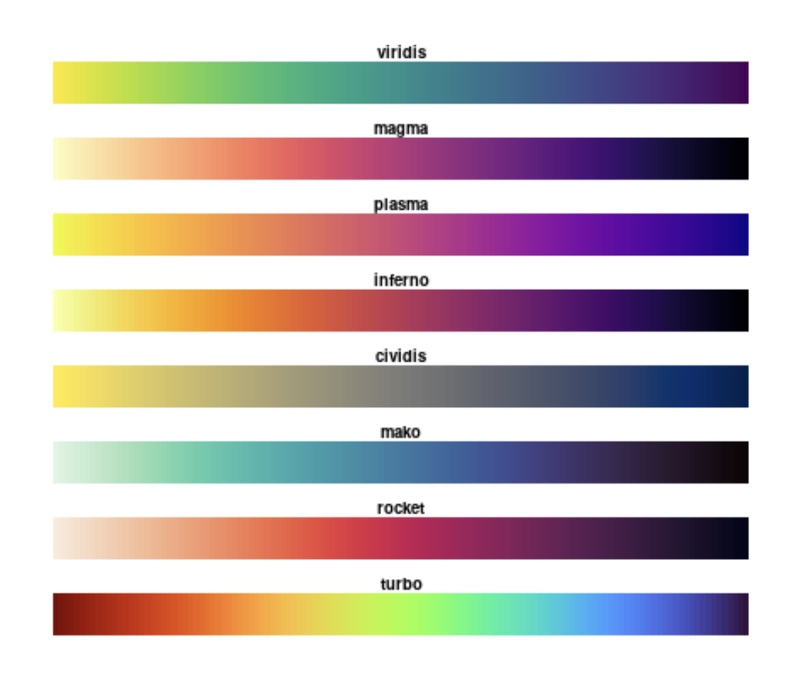

## Learning Outcomes

By the end of this lecture, you will be able to:

::: fragment
- Identify and apply key aesthetics in ggplot2 (color, size, shape, transparency, linetype)
- Distinguish between mapping (data-driven) and setting (fixed) aesthetics
- Enhance plots by layering aesthetics onto common geoms (points, bars, lines, text)
- Evaluate when aesthetics improve clarity vs. when they create clutter
:::


## Simple Geoms
### Aesthetics


::: columns
::: {.column width="45%"}
:::

::: {.column width="49%"}
```{r fig.dim=c(7,7), out.width="100%"}
library(ggplot2)
# Layer order (bottom → top): Data → Geometries → Aesthetics → Facets → Coordinates → Annotations → Themes
layers <- rev(c("Themes","Annotations","Coordinates",
                "Facets","Aesthetics","Geometries","Data"))

# Parameters
gap_y <- 2
w0    <- 5
h0    <- 2
x_shift <- 6
n <- length(layers)

# Function to build diamonds
make_plate <- function(k) {
  w  <- w0
  h  <- h0
  y0 <- (k - 1) * gap_y
  x <- c(-w, 0,  w,  0) + x_shift
  y <- c( 0, h,  0, -h) + y0
  data.frame(
    layer = layers[k],
    k = k,
    x = x,
    y = y,
    id = paste0("P", k),
    stringsAsFactors = FALSE
  )
}

plates <- do.call(rbind, lapply(seq_len(n), make_plate))

# Label positions
label_pos <- aggregate(cbind(y) ~ layer + k, plates, mean)
label_pos$x <- x_shift - (w0 * 2.2)

# Plot
ggplot() +
  geom_polygon(
    data = plates,
    aes(x, y, group = id, fill = k),
    color = "white", linewidth = 1.3
  ) +
  geom_text(
    data = label_pos,
    aes(x + 5, y, label = layer, color = k),
    hjust = 1, fontface = "bold", size = 7
  ) +
  scale_fill_viridis_c(option = "plasma", direction = 1, guide = "none") +  
  scale_color_viridis_c(option = "plasma", direction = 1, guide = "none") +
  coord_fixed(
    xlim = c(-10, 15),
    expand = FALSE
  ) +
  theme_void() +
  theme(plot.margin = margin(20, 20, 20, 20))
```
:::
:::


## Simple Geoms {visibility="uncounted"}
### Aesthetics


::: columns
::: {.column width="45%"}
- Geoms are the "shapes" your data takes on a graph.

::: fragment
Aesthetics bring plots to life: color, size, shape, transparency, linetype

  - `aes()` maps variables to these aesthetics, linking data to visual features.
:::

::: fragment
Aesthetics highlight comparisons and guide attention
:::
:::

::: {.column width="49%"}
```{r fig.dim=c(7,7), out.width="100%"}
library(ggplot2)
# Layer order (bottom → top): Data → Geometries → Aesthetics → Facets → Coordinates → Annotations → Themes
layers <- rev(c("Themes","Annotations","Coordinates",
                "Facets","Aesthetics","Geometries","Data"))

# Parameters
gap_y <- 2
w0    <- 5
h0    <- 2
x_shift <- 6
n <- length(layers)

# Function to build diamonds
make_plate <- function(k) {
  w  <- w0
  h  <- h0
  y0 <- (k - 1) * gap_y
  x <- c(-w, 0,  w,  0) + x_shift
  y <- c( 0, h,  0, -h) + y0
  data.frame(
    layer = layers[k],
    k = k,
    x = x,
    y = y,
    id = paste0("P", k),
    stringsAsFactors = FALSE
  )
}

plates <- do.call(rbind, lapply(seq_len(n), make_plate))

# Label positions
label_pos <- aggregate(cbind(y) ~ layer + k, plates, mean)
label_pos$x <- x_shift - (w0 * 2.2)

# Add alpha column to polygons
plates$alpha <- ifelse(plates$layer == "Aesthetics", 1, 0.2)
# Add matching alpha to labels
label_pos$alpha <- ifelse(label_pos$layer == "Aesthetics", 1, 0.2)

ggplot() +
  geom_polygon(
    data = plates,
    aes(x, y, group = id, fill = k, alpha = alpha),  # add alpha
    color = "white", linewidth = 1.3
  ) +
  geom_text(
    data = label_pos,
    aes(x + 5, y, label = layer, color = k, alpha = alpha), # add alpha
    hjust = 1, fontface = "bold", size = 7
  ) +
  scale_fill_viridis_c(option = "plasma", direction = 1, guide = "none") +
  scale_color_viridis_c(option = "plasma", direction = 1, guide = "none") +
  scale_alpha_identity() +   # ensures your alpha column is used directly
  coord_fixed(
    xlim = c(-10, 15),
    expand = FALSE
  ) +
  theme_void() +
  theme(plot.margin = margin(20, 20, 20, 20))
```
:::
:::


## Simple Geoms
### Examples

These are the simple geoms that we covered previously.

::: {layout-ncol=3}

```{r geom-point, echo=FALSE, fig.dim=c(4,2), out.width="100%", fig.cap="`geom_point`"}
library(tibble); library(ggplot2)
eg <- tribble(
  ~x, ~y,
  "A", 1,
  "B", 2,
  "C", 3
)
fig_geom_point<-ggplot(eg, aes(x = x, y = y)) +
  geom_point(size = 5)+
  coord_cartesian(ylim = c(0, 4))
fig_geom_point
```

```{r geom-col, echo=FALSE, fig.dim=c(4,2), out.width="100%", fig.cap="`geom_col`"}
eg2 <- tribble(
  ~x, ~y,
  "A", 1,
  "B", 2,
  "C", 3
)
fig_geom_col<-ggplot(eg2, aes(x = x, y = y)) +
  geom_col()
fig_geom_col
```


```{r geom-bar, echo=FALSE, fig.dim=c(4,2), out.width="100%", fig.cap="`geom_bar`"}
eg2 <- tribble(
  ~x,
  "A",
  "B",
  "B",
  "C",
  "C",
  "C"
)

fig_geom_bar<-ggplot(eg2, aes(x = x)) +
  geom_bar()
fig_geom_bar
```


```{r geom-text, echo=FALSE, fig.dim=c(4,2), out.width="100%", fig.cap="`geom_text`"}
eg3 <- tribble(
  ~x, ~y, ~label,
  "A", 1, "Col. 1",
  "B", 2, "Col. 2",
  "C", 3, "Col. 3"
)
fig_geom_text<-ggplot(eg3, aes(x = x, y = y, label = label)) +
  geom_text(size = 6, vjust = -0.5)+
  coord_cartesian(ylim = c(0, 4))
fig_geom_text
```


```{r geom-line, echo=FALSE, fig.dim=c(4,2), out.width="100%", fig.cap="`geom_line`"}
ts <- tibble(
  t = 1:5,
  y = c(2,3,5,4,6)
)
fig_geom_line<-ggplot(ts, aes(x = t, y = y)) +
  geom_line(linewidth = 1.5)
fig_geom_line
```

:::


## Simple Geoms {.smaller}
### Reference

This is what they are used for:

::: columns
::: {.column width="50%"}
::: {layout-ncol=3}

```{r geom-point2, echo=FALSE, fig.dim=c(4,2), out.width="100%", fig.cap="`geom_point`"}
library(tibble); library(ggplot2)
eg <- tribble(
  ~x, ~y,
  "A", 1,
  "B", 2,
  "C", 3
)
fig_geom_point<-ggplot(eg, aes(x = x, y = y)) +
  geom_point(size = 5)+
  coord_cartesian(ylim = c(0, 4))
fig_geom_point
```


```{r geom-col2, echo=FALSE, fig.dim=c(4,2), out.width="100%", fig.cap="`geom_col`"}
eg2 <- tribble(
  ~x, ~y,
  "A", 1,
  "B", 2,
  "C", 3
)
fig_geom_col<-ggplot(eg2, aes(x = x, y = y)) +
  geom_col()
fig_geom_col
```


```{r geom-bar2, echo=FALSE, fig.dim=c(4,2), out.width="100%", fig.cap="`geom_bar`"}
eg2 <- tribble(
  ~x,
  "A",
  "B",
  "B",
  "C",
  "C",
  "C"
)

fig_geom_bar<-ggplot(eg2, aes(x = x)) +
  geom_bar()
fig_geom_bar
```


```{r geom-text2, echo=FALSE, fig.dim=c(4,2), out.width="100%", fig.cap="`geom_text`"}
eg3 <- tribble(
  ~x, ~y, ~label,
  "A", 1, "Col. 1",
  "B", 2, "Col. 2",
  "C", 3, "Col. 3"
)
fig_geom_text<-ggplot(eg3, aes(x = x, y = y, label = label)) +
  geom_text(size = 6, vjust = -0.5)+
  coord_cartesian(ylim = c(0, 4))
fig_geom_text
```


```{r geom-line2, echo=FALSE, fig.dim=c(4,2), out.width="100%", fig.cap="`geom_line`"}
ts <- tibble(
  t = 1:5,
  y = c(2,3,5,4,6)
)
fig_geom_line<-ggplot(ts, aes(x = t, y = y)) +
  geom_line(linewidth = 1.5)
fig_geom_line
```
:::
:::


::: {.column width="40%"}
|  geom          | Use for                                                 |
|-----------------|----------------------------------------------------------|
| `geom_point()`  | Relationships between two variables; at least 10 obs. |
| `geom_col()`    | Totals/percent per category; ordered bars. Uses pre-computed values for bar height. You must supply both `x` and `y`               |
| `geom_bar()`    | Counts the observations in each category. You must supply `x`, not `y`              |
| `geom_text()`   | Direct labels for small N; annotate outliers            |
| `geom_line()`   | Relationships between two variables; at least 10 obs. |
:::
:::


# Point Aesthetics {background-color="#40666e"}

## geom_point
### Aesthetics

Let's explore how aesthetics change meaning and clarity.

::: {layout-ncol=3}

```{r aes-color-discrete, echo=FALSE, fig.dim=c(4, 2), out.width="100%", fig.cap = "`color`(discrete)"}
library(tibble)
library(ggplot2)
eg <- tribble(
  ~x, ~y, ~size, ~x1,
  "A", 1, 5, 1,
  "B", 1, 10, 2,
  "C", 1, 15, 3
)

# Color, discrete
ggplot(eg, aes(x = x, y = y, color = x)) +
  geom_point(size = 30) +
  guides(color = "none") +
  theme(axis.text.y = element_blank(),
        axis.ticks = element_blank())
```


```{r aes-color-continuous, echo=FALSE, fig.dim=c(4, 2), out.width="100%", fig.cap = "`color`(continuous)"}
# Color, continuous
ggplot(eg, aes(x = x1, y = y, color = x1)) +
  geom_point(size = 30) +
  guides(color = "none") +
  coord_cartesian(xlim = c(0.5, 3.5)) +
  theme(axis.text.y = element_blank(),
        axis.ticks = element_blank())
```


```{r aes-size, echo=FALSE, fig.dim=c(4, 2), out.width="100%", fig.cap = "`size`(discrete + continuous)"}
# Size
ggplot(eg, aes(x = x, y = y, size = x)) +
  geom_point() +
  scale_size_discrete(range = c(15, 30)) +
  guides(size = "none") +
  theme(axis.text.y = element_blank(),
        axis.ticks = element_blank())
```


```{r aes-fill, echo=FALSE, fig.dim=c(4, 2), out.width="100%", fig.cap = "`fill`(discrete + continuous)"}
# Fill
ggplot(eg, aes(x = x, y = y, fill = x)) +
  geom_point(size = 30, pch = 21, stroke = 5) +
  guides(fill = "none") +
  theme(axis.text.y = element_blank(),
        axis.ticks = element_blank())
```


```{r aes-shape, echo=FALSE, fig.dim=c(4, 2), out.width="100%", fig.cap = "`shape`(discrete)"}
# Shape
ggplot(eg, aes(x = x, y = y, shape = x)) +
  geom_point(size = 30) +
  guides(shape = "none") +
  theme(axis.text.y = element_blank(),
        axis.ticks = element_blank())
```


```{r aes-alpha, echo=FALSE, fig.dim=c(4, 2), out.width="100%", fig.cap = "`alpha`(discrete + continuous)"}
# Alpha
ggplot(eg, aes(x = x, y = y, alpha = x)) +
  geom_point(size = 30) +
  guides(alpha = "none") +
  theme(axis.text.y = element_blank(),
        axis.ticks = element_blank())
```
:::


## geom_point {.smaller}
### Aesthetics

This is what they are used for:

::: columns
::: {.column width="50%"}
::: {layout-ncol=3}

```{r aes-color-discrete2, echo=FALSE, fig.dim=c(4, 2), out.width="100%", fig.cap = "`color`(discrete)"}
library(tibble)
library(ggplot2)
eg <- tribble(
  ~x, ~y, ~size, ~x1,
  "A", 1, 5, 1,
  "B", 1, 10, 2,
  "C", 1, 15, 3
)

# Color, discrete
ggplot(eg, aes(x = x, y = y, color = x)) +
  geom_point(size = 30) +
  guides(color = "none") +
  theme(axis.text.y = element_blank(),
        axis.ticks = element_blank())
```


```{r aes-color-continuous2, echo=FALSE, fig.dim=c(4, 2), out.width="100%", fig.cap = "`color`(continuous)"}
# Color, continuous
ggplot(eg, aes(x = x1, y = y, color = x1)) +
  geom_point(size = 30) +
  guides(color = "none") +
  coord_cartesian(xlim = c(0.5, 3.5)) +
  theme(axis.text.y = element_blank(),
        axis.ticks = element_blank())
```


```{r aes-size2, echo=FALSE, fig.dim=c(4, 2), out.width="100%", fig.cap = "`size`(discrete + continuous)"}
# Size
ggplot(eg, aes(x = x, y = y, size = x)) +
  geom_point() +
  scale_size_discrete(range = c(15, 30)) +
  guides(size = "none") +
  theme(axis.text.y = element_blank(),
        axis.ticks = element_blank())
```


```{r aes-fill2, echo=FALSE, fig.dim=c(4, 2), out.width="100%", fig.cap = "`fill`(discrete + continuous)"}
# Fill
ggplot(eg, aes(x = x, y = y, fill = x)) +
  geom_point(size = 30, pch = 21, stroke = 5) +
  guides(fill = "none") +
  theme(axis.text.y = element_blank(),
        axis.ticks = element_blank())
```


```{r aes-shape2, echo=FALSE, fig.dim=c(4, 2), out.width="100%", fig.cap = "`shape`(discrete)"}
# Shape
ggplot(eg, aes(x = x, y = y, shape = x)) +
  geom_point(size = 30) +
  guides(shape = "none") +
  theme(axis.text.y = element_blank(),
        axis.ticks = element_blank())
```


```{r aes-alpha2, echo=FALSE, fig.dim=c(4, 2), out.width="100%", fig.cap = "`alpha`(discrete + continuous)"}
# Alpha
ggplot(eg, aes(x = x, y = y, alpha = x)) +
  geom_point(size = 30) +
  guides(alpha = "none") +
  theme(axis.text.y = element_blank(),
        axis.ticks = element_blank())
```
:::
:::

::: {.column width="40%"}
| Aesthetic              | Use for                                                                 |
|-------------------------|-------------------------------------------------------------------------|
| `color` (discrete)      | Differentiate categories with distinct hues                            |
| `color` (continuous)    | Show gradual change or intensity across a numeric scale                |
| `size` (discrete + continuous) | Represent magnitude, frequency, or importance; best with moderate differences |
| `fill` (discrete + continuous) | Similar to `color` but applies to filled shapes (bars, areas, points with `pch=21–25`) |
| `shape` (discrete)      | Distinguish categories when colors alone aren’t enough; limited shapes available |
| `alpha` (discrete + continuous) | Control transparency to show overlap/density; reduce clutter in crowded plots |
:::
:::


## geom_point
### Simple Geom


Imagine we have data about 9 countries that record their level of democracy from -10 to +10 (x-axis) and their GDP per capita in $1,000s (y-axis).

::: fragment
```{r, warning=FALSE, message=FALSE, echo=TRUE, eval=TRUE, out.width="60%"}
eg1 <- data.frame(
  democracy = c(-8, -7, -5, -3, 0, 2, 5, 8, 9),   # democracy score
  gdp = c(2, 9, 4, 7, 8, 20, 15, 25, 27)  # GDP per capita in $1,000s
)
```
:::

## geom_point
### Simple Geom


Imagine we have data about 9 countries that record their level of democracy from -10 to +10 (x-axis) and their GDP per capita in $1,000s (y-axis).


```{r, warning=FALSE, message=FALSE, echo=FALSE, eval=TRUE, out.width="80%"}
top4<-head(eg1, n=5)
knitr::kable(top4, format = "html", row.names = FALSE)
```


## geom_point
### Simple Geom


Imagine we have data about 9 countries that record their level of democracy from -10 to +10 (x-axis) and their GDP per capita in $1,000s (y-axis).

```{r, warning=FALSE, message=FALSE, echo=TRUE, eval=FALSE, out.width="60%"}
#| code-fold: true
#| code-summary: "Show the code"
# Scatterplot with geom_point
ggplot(data=eg1, 
       aes(x = democracy, y = gdp)) +
  geom_point()
```


```{r, warning=FALSE, message=FALSE, echo=FALSE, eval=TRUE, out.width="60%"}
# Example data
# Scatterplot with geom_point
ggplot(data=eg1, 
       aes(x = democracy, y = gdp)) +
  geom_point(size=5)+
  theme_grey(base_size = 25)
```


## geom_point {.smaller}
### color(discrete)

Imagine we have data about 9 countries that record their level of democracy from -10 to +10 (x-axis) and their GDP per capita in $1,000s (y-axis).

Let's imagine that we have a new dataset with more variables:

```{r, warning=FALSE, message=FALSE, echo=TRUE, eval=TRUE, out.width="60%"}
# Reusable dataset
eg1 <- data.frame(
  country = c(
    "North Korea",   # very autocratic, very poor
    "Saudi Arabia",  # autocratic, but richer due to oil
    "Zimbabwe",      # authoritarian, low GDP
    "Russia",        # hybrid regime, middle income
    "Nigeria",       # similar position
    "India",         # low–mid democracy, growing GDP
    "Brazil",        # democracy, mid GDP
    "Poland",        # consolidated democracy, higher GDP
    "South Korea"   # rich democracy
  ), 
  democracy = c(-8, -7, -5, -3, 0, 2, 5, 8, 9),          # democracy score
  gdp = c(2, 9, 4, 7, 8, 20, 15, 25, 27),          # GDP per capita ($1,000s)
  region = c("Asia", "Asia", "Africa",
             "Europe", "Africa", "Asia",
             "Americas", "Europe", "Asia"),        # categorical
  population = c(5, 50, 30, 12, 80, 60, 40, 100, 70), # continuous (millions)
  income_group = factor(
    c("Low", "Low", "Low",
      "Middle", "Middle", "Middle",
      "High", "High", "High"),
    levels = c("Low", "Middle", "High")),
  corruption = c(80, 65, 50, 40, 35, 30, 25, 20, 15))
```


## geom_point
### color(discrete)

Imagine we have data about 9 countries that record their level of democracy from -10 to +10 (x-axis) and their GDP per capita in $1,000s (y-axis).

Let's imagine that we have a new dataset with more variables:


```{r, warning=FALSE, message=FALSE, echo=FALSE, eval=TRUE, out.width="80%"}
top4<-head(eg1, n=5)
knitr::kable(top4, format = "html", row.names = FALSE)
```


## geom_point
### color(discrete)

Imagine we have data about 9 countries that record their level of democracy from -10 to +10 (x-axis) and their GDP per capita in $1,000s (y-axis).

This is how we can emphasize the region (discrete):

```{r, warning=FALSE, message=FALSE, echo=TRUE, eval=FALSE, out.width="60%"}
#| code-fold: true
#| code-summary: "Show the code"
# 1) color (discrete): distinguish categories with distinct hues
ggplot(eg1, aes(x = democracy, y = gdp, color = region)) +
  geom_point()
```


```{r, warning=FALSE, message=FALSE, echo=FALSE, eval=TRUE, fig.width = 12.3, fig.height = 5.1}
# 1) color (discrete): distinguish categories with distinct hues
ggplot(eg1, aes(x = democracy, y = gdp, color = region)) +
  geom_point(size = 6) +
  theme_grey(base_size = 25)
```


## geom_point
### color(continuous)


Imagine we have data about 9 countries that record their level of democracy from -10 to +10 (x-axis) and their GDP per capita in $1,000s (y-axis).

This is how we can emphasize the corruption levels (continuous):

```{r, warning=FALSE, message=FALSE, echo=TRUE, eval=FALSE, out.width="60%"}
#| code-fold: true
#| code-summary: "Show the code"
# 2) color (continuous): encode a numeric gradient (low → high)
ggplot(eg1, aes(x = democracy, y = gdp, color = corruption)) +
  geom_point()
```


```{r, warning=FALSE, message=FALSE, echo=FALSE, eval=TRUE, fig.width = 12.3, fig.height = 5.1}
# 2) color (continuous): encode a numeric gradient (low → high)
ggplot(eg1, aes(x = democracy, y = gdp, color = corruption)) +
  geom_point(size = 6) +
  theme_grey(base_size = 25)
```

## geom_point
### size(discrete)


Imagine we have data about 9 countries that record their level of democracy from -10 to +10 (x-axis) and their GDP per capita in $1,000s (y-axis).

This is how we can emphasize the income groups (discrete):

```{r, warning=FALSE, message=FALSE, echo=TRUE, eval=FALSE, out.width="60%"}
#| code-fold: true
#| code-summary: "Show the code"
# 3) size (discrete): High income = large points
ggplot(eg1, aes(x = democracy, y = gdp, size = income_group)) +
  geom_point()
```


```{r, warning=FALSE, message=FALSE, echo=FALSE, eval=TRUE, fig.width = 12.3, fig.height = 5.1}
# 3) size (discrete): High income = large points
ggplot(eg1, aes(x = democracy, y = gdp, size = income_group)) +
  geom_point()+
  theme_grey(base_size = 25)
```


## geom_point
### size(continuous)


Imagine we have data about 9 countries that record their level of democracy from -10 to +10 (x-axis) and their GDP per capita in $1,000s (y-axis).

This is how we can emphasize population size (continuous)

```{r, warning=FALSE, message=FALSE, echo=TRUE, eval=FALSE, out.width="60%"}
#| code-fold: true
#| code-summary: "Show the code"
# 4) size (continuous): encode magnitude (e.g., population)
ggplot(eg1, aes(x = democracy, y = gdp, size = population)) +
  geom_point()
```


```{r, warning=FALSE, message=FALSE, echo=FALSE, eval=TRUE, fig.width = 12.5, fig.height = 5.1}
# 4) size (continuous): encode magnitude (e.g., population)
ggplot(eg1, aes(x = democracy, y = gdp, size = population)) +
  geom_point() +
  theme_grey(base_size = 25)
```

## geom_point
### fill(discrete)


Imagine we have data about 9 countries that record their level of democracy from -10 to +10 (x-axis) and their GDP per capita in $1,000s (y-axis).

This is how we can emphasize income groups (discrete).

```{r, warning=FALSE, message=FALSE, echo=TRUE, eval=FALSE, out.width="60%"}
#| code-fold: true
#| code-summary: "Show the code"
# 5) fill (discrete): categories on filled shapes (pch 21–25, bars, areas)
ggplot(eg1, aes(x = democracy, y = gdp, fill = income_group)) +
  geom_point(shape = 21, color = "black")
```


```{r, warning=FALSE, message=FALSE, echo=FALSE, eval=TRUE, fig.width = 12.5, fig.height = 5.1}
# 5) fill (discrete): categories on filled shapes (pch 21–25, bars, areas)
ggplot(eg1, aes(x = democracy, y = gdp, fill = income_group)) +
  geom_point(shape = 21, color = "black", size=6) +
  theme_grey(base_size = 25)
```


## geom_point
### fill(continuous)


Imagine we have data about 9 countries that record their level of democracy from -10 to +10 (x-axis) and their GDP per capita in $1,000s (y-axis).

This is how we can emphasize the level of corruption (continuous).


```{r, warning=FALSE, message=FALSE, echo=TRUE, eval=FALSE, out.width="60%"}
#| code-fold: true
#| code-summary: "Show the code"
# 6) fill (continuous): numeric gradient on filled shapes
ggplot(eg1, aes(x = democracy, y = gdp, fill = corruption)) +
  geom_point(shape = 21, color = "black")
```


```{r, warning=FALSE, message=FALSE, echo=FALSE, eval=TRUE, fig.width = 12.5, fig.height = 5.1}
# 6) fill (continuous): numeric gradient on filled shapes
ggplot(eg1, aes(x = democracy, y = gdp, fill = corruption)) +
  geom_point(shape = 21, size = 8, color = "black")+
  theme_grey(base_size = 25)
```


## geom_point
### shape(discrete)

Imagine we have data about 9 countries that record their level of democracy from -10 to +10 (x-axis) and their GDP per capita in $1,000s (y-axis).

```{r, warning=FALSE, message=FALSE, echo=TRUE, eval=FALSE, out.width="60%"}
#| code-fold: true
#| code-summary: "Show the code"
# 7) shape (discrete): differentiate categories; limited distinct shapes
ggplot(eg1, aes(x = democracy, y = gdp, shape = region)) +
  geom_point()
```


```{r, warning=FALSE, message=FALSE, echo=FALSE, eval=TRUE, fig.width = 12.5, fig.height = 5.1}
# 7) shape (discrete): differentiate categories; limited distinct shapes
ggplot(eg1, aes(x = democracy, y = gdp, shape = region)) +
  geom_point(size = 6) +
  theme_grey(base_size = 25)
```


## geom_point
### alpha(discrete)

Imagine we have data about 9 countries that record their level of democracy from -10 to +10 (x-axis) and their GDP per capita in $1,000s (y-axis).

```{r, warning=FALSE, message=FALSE, echo=TRUE, eval=FALSE, out.width="60%"}
#| code-fold: true
#| code-summary: "Show the code"
# 8) alpha (discrete): subtle group differences; use sparingly in legends
ggplot(eg1, aes(x = democracy, y = gdp, alpha = region)) +
  geom_point()
```


```{r, warning=FALSE, message=FALSE, echo=FALSE, eval=TRUE, fig.width = 12.5, fig.height = 5.1}
# 8) alpha (discrete): subtle group differences; use sparingly in legends
ggplot(eg1, aes(x = democracy, y = gdp, alpha = region)) +
  geom_point(size = 8) +
  theme_grey(base_size = 25)
```


## geom_point
### alpha(continuous)

Imagine we have data about 9 countries that record their level of democracy from -10 to +10 (x-axis) and their GDP per capita in $1,000s (y-axis).

```{r, warning=FALSE, message=FALSE, echo=TRUE, eval=FALSE, out.width="60%"}
#| code-fold: true
#| code-summary: "Show the code"
# 9) alpha (continuous): opacity encodes intensity (higher → more opaque)
ggplot(eg1, aes(x = democracy, y = gdp, alpha = corruption)) +
  geom_point()
```


```{r, warning=FALSE, message=FALSE, echo=FALSE, eval=TRUE, fig.width = 12.5, fig.height = 5.1}
# 9) alpha (continuous): opacity encodes intensity (higher → more opaque)
ggplot(eg1, aes(x = democracy, y = gdp, alpha = corruption)) +
  geom_point(size = 8) +
  theme_grey(base_size = 25)
```


## geom_point
### multiple aesthetics (readable)

Imagine we have data about 9 countries that record their level of democracy from -10 to +10 (x-axis) and their GDP per capita in $1,000s (y-axis).

```{r, warning=FALSE, message=FALSE, echo=TRUE, eval=FALSE, out.width="60%"}
#| code-fold: true
#| code-summary: "Show the code"
# 10) Combine judiciously: color = region (discrete), size = population (continuous)
ggplot(eg1, aes(x = democracy, y = gdp)) +
  geom_point(aes(color = region, size = population))
```

```{r, warning=FALSE, message=FALSE, echo=FALSE, eval=TRUE, fig.width = 14, fig.height = 5.1}
# 10) Combine judiciously: color = region (discrete), size = population (continuous)
ggplot(eg1, aes(x = democracy, y = gdp)) +
  geom_point(aes(color = region, size = population)) +
  theme_grey(base_size = 25)
```


## geom_point
### too many aesthetics (overloaded)

Imagine we have data about 9 countries that record their level of democracy from -10 to +10 (x-axis) and their GDP per capita in $1,000s (y-axis).

```{r, warning=FALSE, message=FALSE, echo=TRUE, eval=FALSE, out.width="60%"}
#| code-fold: true
#| code-summary: "Show the code"
# Overloaded example (hard to read): too many mapped aesthetics at once
# Prefer ≤2 mappings; prioritize the question your plot answers
ggplot(eg1, aes(x = democracy, y = gdp)) +
  geom_point(
    aes(color = region,
        fill  = income_group,
        shape = region,
        size  = population,
        alpha = corruption)
  )
```


```{r, warning=FALSE, message=FALSE, echo=FALSE, eval=TRUE, fig.width = 20, fig.height = 10}
# Overloaded example (hard to read): too many mapped aesthetics at once
# Prefer ≤2 mappings; prioritize the question your plot answers
ggplot(eg1, aes(x = democracy, y = gdp)) +
  geom_point(
    aes(color = region,
        fill  = income_group,
        shape = region,
        size  = population,
        alpha = corruption)
  ) +
  scale_size(range = c(3, 12)) +
  theme_grey(base_size = 22)
```


## Mapping vs. Setting
### Key Idea

- **Mapping**: aesthetic varies with data → put inside `aes()`
- **Setting**: aesthetic is fixed → put outside `aes()`

This is how we create the data:

```{r, warning=FALSE, message=FALSE, echo=TRUE, eval=TRUE, fig.width = 8, fig.height = 4}
eg2 <- data.frame(
  x = 1:5,
  y = c(2,4,6,8,10),
  group = c("A","B","A","B","A")
)
```


## Mapping vs. Setting
### Key Idea

- **Mapping**: aesthetic varies with data → put inside `aes()`
- **Setting**: aesthetic is fixed → put outside `aes()`

This is what it looks like:

```{r, warning=FALSE, message=FALSE, echo=FALSE, eval=TRUE, out.width="80%"}
top4<-head(eg2, n=6)
knitr::kable(top4, format = "html", row.names = FALSE)
```


## Mapping vs. Setting
### Key Idea

- **Mapping**: aesthetic varies with data → put inside `aes()`
- **Setting**: aesthetic is fixed → put outside `aes()`

This is the difference:

::: columns
::: {.column width="50%"}
```{r, warning=FALSE, message=FALSE, echo=TRUE, eval=FALSE, fig.width = 8, fig.height = 4}
#| code-fold: true
#| code-summary: "Show the code"
# Mapping: put inside aes() when the value comes from data
# Setting: put outside aes() for a constant value
ggplot(eg2, aes(x = x, y = y, color = group)) +
  geom_point()+
  labs(title = "Mapping: color depends on `group`")
```

```{r, warning=FALSE, message=FALSE, echo=FALSE, eval=TRUE, fig.width = 8, fig.height = 4}
#| code-fold: true
#| code-summary: "Show the code"
# Mapping: put inside aes() when the value comes from data
# Setting: put outside aes() for a constant value
ggplot(eg2, aes(x = x, y = y, color = group)) +
  geom_point(size=7) +
  labs(title = "Mapping: color depends on `group`")+
  theme_grey(base_size = 25)
```
:::

::: {.column width="50%"}
```{r, warning=FALSE, message=FALSE, echo=TRUE, eval=FALSE, fig.width = 8, fig.height = 4}
#| code-fold: true
#| code-summary: "Show the code"
# Mapping: put inside aes() when the value comes from data
# Setting: put outside aes() for a constant value
ggplot(eg2, aes(x = x, y = y)) +
  geom_point(color = "red") +
  labs(title = "Setting: all points red")
```

```{r, warning=FALSE, message=FALSE, echo=FALSE, eval=TRUE, fig.width = 8, fig.height = 4}
#| code-fold: true
#| code-summary: "Show the code"
# Mapping: put inside aes() when the value comes from data
# Setting: put outside aes() for a constant value
ggplot(eg2, aes(x = x, y = y)) +
  geom_point(color = "red", size=7) +
  labs(title = "Setting: all points red")+
  theme_grey(base_size = 25)
```
:::
:::


## Mapping vs. Setting
### Common Mistake

::: columns
::: {.column width="50%"}
```{r, warning=FALSE, message=FALSE, echo=TRUE, eval=FALSE, fig.width=8, fig.height=4}
# Wrong: constant inside aes()
ggplot(eg2, aes(x = x, y = y, color = "red")) +
  geom_point() +
  labs(title = "Mistake: constant mapped")
```

```{r, warning=FALSE, message=FALSE, echo=FALSE, eval=TRUE, fig.width=8, fig.height=4}
# Wrong: constant inside aes()
ggplot(eg2, aes(x = x, y = y, color = "red")) +
  geom_point(size=7) +
  labs(title = "Mistake: constant mapped") +
  theme_grey(base_size = 25)
```
:::

::: {.column width="50%"}
```{r, warning=FALSE, message=FALSE, echo=TRUE, eval=FALSE, fig.width=8, fig.height=4}
# Correct: constant outside aes()
ggplot(eg2, aes(x = x, y = y)) +
  geom_point(color = "red") +
  labs(title = "Correct: constant set")
```

```{r, warning=FALSE, message=FALSE, echo=FALSE, eval=TRUE, fig.width=8, fig.height=4}
# Correct: constant outside aes()
ggplot(eg2, aes(x = x, y = y)) +
  geom_point(color = "red", size=7) +
  labs(title = "Correct: constant set") +
  theme_grey(base_size = 25)
```
:::
:::
  
Why it’s wrong:

- Left plot: `"red"` treated as a category, so ggplot makes a useless legend.
- Right plot: `"red"` is just a style — no legend clutter.

::: footer
:::


# Column Aesthetics {background-color="#40666e"}


## geom_col
### Aesthetics

::: {layout-ncol=3}

```{r aes-color-discrete-col, echo=FALSE, fig.dim=c(4, 2), out.width="100%", fig.cap = "`color`(discrete)"}
eg <- tribble(
  ~x, ~y, ~x1,
  "A", 3, 1,
  "B", 6, 2,
  "C", 9, 3
)

# Color, discrete
ggplot(eg, aes(x = x, y = y, color = x)) +
  geom_col(fill = "white", linewidth = 2) +
  guides(color = "none") +
  theme(axis.text.y = element_blank(),
        axis.ticks = element_blank())
```

```{r aes-color-continuous-col, echo=FALSE, fig.dim=c(4, 2), out.width="100%", fig.cap = "`color`(continuous)"}
# Color, continuous
ggplot(eg, aes(x = x1, y = y, color = x1)) +
  geom_col(fill = "white", linewidth = 2) +
  guides(color = "none") +
  coord_cartesian(xlim = c(0.5, 3.5)) +
  theme(axis.text.y = element_blank(),
        axis.ticks = element_blank())
```


```{r aes-fill-col-discrete, echo=FALSE, fig.dim=c(4, 2), out.width="100%", fig.cap = "`fill`(discrete)"}
# Fill
ggplot(eg, aes(x = x, y = y, fill = x)) +
  geom_col() +
  guides(fill = "none") +
  theme(axis.text.y = element_blank(),
        axis.ticks = element_blank())
```


```{r aes-fill-color-col, echo=FALSE, fig.dim=c(4, 2), out.width="100%", fig.cap = "`fill` + `color` (black outline)"}
# Fill + Color (black outline)
ggplot(eg, aes(x = x, y = y, fill = x)) +
  geom_col(color = "black", linewidth = 1) +
  guides(fill = "none") +
  theme(axis.text.y = element_blank(),
        axis.ticks = element_blank())
```


```{r aes-fill-continuous-col, echo=FALSE, fig.dim=c(4, 2), out.width="100%", fig.cap = "`fill`(continuous)"}
# Fill, continuous
ggplot(eg, aes(x = x1, y = y, fill = x1)) +
  geom_col() +
  guides(fill = "none") +
  coord_cartesian(xlim = c(0.5, 3.5)) +
  theme(axis.text.y = element_blank(),
        axis.ticks = element_blank())
```

```{r aes-alpha-col, echo=FALSE, fig.dim=c(4, 2), out.width="100%", fig.cap = "`alpha`(discrete + continuous)"}
# Alpha
ggplot(eg, aes(x = x, y = y, alpha = x)) +
  geom_col(fill = "steelblue") +
  guides(alpha = "none") +
  theme(axis.text.y = element_blank(),
        axis.ticks = element_blank())
```
:::


## geom_col {.smaller}
### Aesthetics

::: columns
::: {.column width="50%"}
::: {layout-ncol=3}

```{r aes-color-discrete-col2, echo=FALSE, fig.dim=c(4, 2), out.width="100%", fig.cap = "`color`(discrete)"}
eg <- tribble(
  ~x, ~y, ~x1,
  "A", 3, 1,
  "B", 6, 2,
  "C", 9, 3
)

# Color, discrete
ggplot(eg, aes(x = x, y = y, color = x)) +
  geom_col(fill = "white", linewidth = 2) +
  guides(color = "none") +
  theme(axis.text.y = element_blank(),
        axis.ticks = element_blank())
```

```{r aes-color-continuous-col2, echo=FALSE, fig.dim=c(4, 2), out.width="100%", fig.cap = "`color`(continuous)"}
# Color, continuous
ggplot(eg, aes(x = x1, y = y, color = x1)) +
  geom_col(fill = "white", linewidth = 2) +
  guides(color = "none") +
  coord_cartesian(xlim = c(0.5, 3.5)) +
  theme(axis.text.y = element_blank(),
        axis.ticks = element_blank())
```


```{r aes-fill-col-discrete2, echo=FALSE, fig.dim=c(4, 2), out.width="100%", fig.cap = "`fill`(discrete)"}
# Fill
ggplot(eg, aes(x = x, y = y, fill = x)) +
  geom_col() +
  guides(fill = "none") +
  theme(axis.text.y = element_blank(),
        axis.ticks = element_blank())
```


```{r aes-fill-color-col2, echo=FALSE, fig.dim=c(4, 2), out.width="100%", fig.cap = "`fill` + `color` (black outline)"}
# Fill + Color (black outline)
ggplot(eg, aes(x = x, y = y, fill = x)) +
  geom_col(color = "black", linewidth = 1) +
  guides(fill = "none") +
  theme(axis.text.y = element_blank(),
        axis.ticks = element_blank())
```


```{r aes-fill-continuous-col2, echo=FALSE, fig.dim=c(4, 2), out.width="100%", fig.cap = "`fill`(continuous)"}
# Fill, continuous
ggplot(eg, aes(x = x1, y = y, fill = x1)) +
  geom_col() +
  guides(fill = "none") +
  coord_cartesian(xlim = c(0.5, 3.5)) +
  theme(axis.text.y = element_blank(),
        axis.ticks = element_blank())
```

```{r aes-alpha-col2, echo=FALSE, fig.dim=c(4, 2), out.width="100%", fig.cap = "`alpha`(discrete + continuous)"}
# Alpha
ggplot(eg, aes(x = x, y = y, alpha = x)) +
  geom_col(fill = "steelblue") +
  guides(alpha = "none") +
  theme(axis.text.y = element_blank(),
        axis.ticks = element_blank())
```
:::
:::


::: {.column width="40%"}
| Aesthetic                   | Use for                                                                 |
|------------------------------|-------------------------------------------------------------------------|
| `color` (discrete)           | Differentiate categories with distinct outline hues (rare for bars)     |
| `color` (continuous)         | Show gradual change or intensity in outline scale (rare for bars)       |
| `fill` (discrete)            | Fill bars by category with distinct hues (common)                       |
| `fill` + `color` (outline)   | Combine interior fill with a contrasting border for clarity              |
| `fill` (continuous)          | Show gradual change or intensity across a numeric fill scale (rare for bars) |
| `alpha` (discrete + continuous) | Control transparency to show emphasis or reduce clutter (rare for bars) |
:::
:::


## geom_point
### Simple Geom

Suppose we collected a small survey and just recorded the education level of each respondent. We want to visualize how many respondents fall into each category.

```{r, warning=FALSE, message=FALSE, echo=TRUE, eval=TRUE, out.width="60%"}
# Pre-aggregated counts instead of raw rows
eg3 <- data.frame(
  education = c(
    "Primary", "Primary", "High School", "High School", "High School",
    "College", "College", "College", "College"
  )
)
```


::: fragment
```{r, warning=FALSE, message=FALSE, echo=FALSE, eval=TRUE, out.width="80%"}
top4<-head(eg3, n=4)
knitr::kable(top4, format = "html", row.names = FALSE)
```
:::


## geom_col
### Simple Geom

Suppose we collected a small survey and just recorded the education level of each respondent. We want to visualize how many respondents fall into each category.

```{r, warning=FALSE, message=FALSE, echo=TRUE, eval=TRUE , out.width="60%"}
library(dplyr)
# Count occurrences of each education level
eg3b <- eg3 %>%
  count(education)
```


::: fragment
```{r, warning=FALSE, message=FALSE, echo=FALSE, eval=TRUE, out.width="80%"}
top4<-head(eg3b, n=4)
knitr::kable(top4, format = "html", row.names = FALSE)
```
:::


## geom_col
### Simple Geom

Suppose we collected a small survey and just recorded the education level of each respondent. We want to visualize how many respondents fall into each category.

::: fragment
```{r, warning=FALSE, message=FALSE, echo=TRUE, eval=FALSE , out.width="60%"}
#| code-fold: true
#| code-summary: "Show the code"
ggplot(eg3b, aes(x = education, y = n)) +
  geom_col()
```


```{r, warning=FALSE, message=FALSE, echo=FALSE, eval=TRUE, out.width="60%"}
ggplot(eg3b, aes(x = education, y = n)) +
  geom_col() +
  theme_grey(base_size = 25)
```
:::


## geom_col
### fill(discrete)

Suppose we collected a small survey and just recorded the education level of each respondent. We want to visualize how many respondents fall into each category.

```{r, warning=FALSE, message=FALSE, echo=TRUE, eval=FALSE , out.width="60%"}
#| code-fold: true
#| code-summary: "Show the code"

# fill = education (discrete)
ggplot(eg3b, aes(x = education, y = n, fill = education)) +
  geom_col()
```

```{r, warning=FALSE, message=FALSE, echo=FALSE, eval=TRUE, fig.width = 13, fig.height = 5}
# fill = education (discrete)
ggplot(eg3b, aes(x = education, y = n, fill = education)) +
  geom_col() +
  theme_grey(base_size = 25)
```


## geom_col
### fill(discrete)

Suppose we collected a small survey and just recorded the education level of each respondent. We want to visualize how many respondents fall into each category.

```{r, warning=FALSE, message=FALSE, echo=TRUE, eval=FALSE , out.width="60%"}
#| code-fold: true
#| code-summary: "Show the code"
# fill = education, color = black border
ggplot(eg3b, aes(x = education, y = n, fill = education)) +
  geom_col(color = "black", linewidth = 1)
```


```{r, warning=FALSE, message=FALSE, echo=FALSE, eval=TRUE, fig.width = 13, fig.height = 5}
# fill = education (discrete)
ggplot(eg3b, aes(x = education, y = n, fill = education)) +
  geom_col(color = "black", linewidth = 1) +
  theme_grey(base_size = 25)
```


# Line Aesthetics {background-color="#40666e"}

## geom_line
### Aesthetics

::: {layout-ncol=3}

```{r aes-color-discrete-line, echo=FALSE, fig.dim=c(3, 1.5), out.width="100%", fig.cap = "`color`(discrete)"}
eg <- tribble(
  ~x, ~y, ~group,
   1,  2, "A",
   2,  3, "A",
   3,  5, "A",
   4,  6, "A",
   5,  8, "A",
   1,  1, "B",
   2,  2, "B",
   3,  3, "B",
   4,  5, "B",
   5,  7, "B"
)

# Color, discrete
ggplot(eg, aes(x = x, y = y, color = group, group=group)) +
  geom_line(linewidth = 2) +
  guides(color = "none") +
  theme(axis.text.y = element_blank(),
        axis.ticks = element_blank())
```


```{r aes-color-continuous-line, echo=FALSE, fig.dim=c(3, 1.5), out.width="100%", fig.cap = "`color`(continuous)"}
ggplot(eg, aes(x = x, y = y, color = x, group=group)) +
  geom_line(linewidth = 2) +
  guides(color = "none") +
  theme(axis.text.y = element_blank(),
  axis.ticks = element_blank())
```


```{r aes-size-line, echo=FALSE, fig.dim=c(3, 1.5), out.width="100%", fig.cap = "`size` - deprecated"}
# Size
ggplot(eg, aes(x = x, y = y, size = x, group=group)) +
  geom_line() +
  scale_size_continuous(range = c(0.5, 3)) +
  guides(size = "none") +
  theme(axis.text.y = element_blank(),
        axis.ticks = element_blank())
```


```{r aes-linewidth, echo=FALSE, fig.dim=c(3, 1.5), out.width="100%", fig.cap = "`linewidth`(discrete + continuous)"}
# Linewidth
ggplot(eg, aes(x = x, y = y, linewidth = x, group=group)) +
  geom_line() +
  scale_linewidth_continuous(range = c(0.5, 3)) +
  guides(linewidth = "none") +
  theme(axis.text.y = element_blank(),
        axis.ticks = element_blank())
```


```{r aes-linetype-line, echo=FALSE, fig.dim=c(3, 1.5), out.width="100%", fig.cap = "`linetype`(discrete)"}
ggplot(eg, aes(x = x, y = y, linetype = group, group=group)) +
  geom_line(linewidth = 1.5) +
  guides(linetype = "none") +
  theme(axis.text.y = element_blank(),
  axis.ticks = element_blank())
```


```{r aes-alpha-line, echo=FALSE, fig.dim=c(3, 1.5), out.width="100%", fig.cap = "`alpha`(discrete+continuous)"}
# Alpha
ggplot(eg, aes(x = x, y = y, alpha = x, group=group)) +
  geom_line(linewidth = 2) +
  guides(alpha = "none") +
  theme(axis.text.y = element_blank(),
        axis.ticks = element_blank())
```
:::


## geom_line {.smaller}
### Aesthetics

::: columns
::: {.column width="50%"}
::: {layout-ncol=3}

```{r aes-color-discrete-line2, echo=FALSE, fig.dim=c(3, 1.5), out.width="100%", fig.cap = "`color`(discrete)"}
eg <- tribble(
  ~x, ~y, ~group,
   1,  2, "A",
   2,  3, "A",
   3,  5, "A",
   4,  6, "A",
   5,  8, "A",
   1,  1, "B",
   2,  2, "B",
   3,  3, "B",
   4,  5, "B",
   5,  7, "B"
)

# Color, discrete
ggplot(eg, aes(x = x, y = y, color = group)) +
  geom_line(linewidth = 2) +
  guides(color = "none") +
  theme(axis.text.y = element_blank(),
        axis.ticks = element_blank())
```


```{r aes-color-continuous-line2, echo=FALSE, fig.dim=c(3, 1.5), out.width="100%", fig.cap = "`color`(continuous)"}
ggplot(eg, aes(x = x, y = y, color = x, group=group)) +
geom_line(linewidth = 2) +
guides(color = "none") +
theme(axis.text.y = element_blank(),
axis.ticks = element_blank())
```


```{r aes-size-line2, echo=FALSE, fig.dim=c(3, 1.5), out.width="100%", fig.cap = "`size` - deprecated"}
# Size
ggplot(eg, aes(x = x, y = y, size = x, group=group)) +
  geom_line() +
  scale_size_continuous(range = c(0.5, 3)) +
  guides(size = "none") +
  theme(axis.text.y = element_blank(),
        axis.ticks = element_blank())
```


```{r aes-linewidth2, echo=FALSE, fig.dim=c(3, 1.5), out.width="100%", fig.cap = "`linewidth`(discrete + continuous)"}
# Linewidth
ggplot(eg, aes(x = x, y = y, linewidth = x, group=group)) +
  geom_line() +
  scale_linewidth_continuous(range = c(0.5, 3)) +
  guides(linewidth = "none") +
  theme(axis.text.y = element_blank(),
        axis.ticks = element_blank())
```


```{r aes-linetype-line2, echo=FALSE, fig.dim=c(3, 1.5), out.width="100%", fig.cap = "`linetype`(discrete)"}
ggplot(eg, aes(x = x, y = y, linetype = group, group=group)) +
geom_line(linewidth = 1.5) +
guides(linetype = "none") +
theme(axis.text.y = element_blank(),
axis.ticks = element_blank())
```


```{r aes-alpha-line2, echo=FALSE, fig.dim=c(3, 1.5), out.width="100%", fig.cap = "`alpha`(discrete+continuous)"}
# Alpha
ggplot(eg, aes(x = x, y = y, alpha = x, group=group)) +
  geom_line(linewidth = 2) +
  guides(alpha = "none") +
  theme(axis.text.y = element_blank(),
        axis.ticks = element_blank())
```
:::
:::


::: {.column width="40%"}
| Aesthetic                   | Use for                                                                 |
|------------------------------|-------------------------------------------------------------------------|
| `color` (discrete)           | Distinguish groups with different line colors            |
| `color` (continuous)         | Show gradient along x or y values; possible but unusual (rare for lines) |
| `size`                       | Deprecated; replaced by `linewidth`                           |
| `linewidth` (discrete + continuous) | Vary line thickness to emphasize magnitude (sometimes used) or weight (rare for lines) |
| `linetype` (discrete)        | Differentiate groups with solid/dashed/dotted styles  |
| `alpha` (discrete + continuous) | Control transparency to reduce clutter when many lines overlap (rare for lines)  |
:::
:::


## geom_line
### Simple Geom

Suppose we have data on average voter turnout (%) in national elections over several years. We want to see the trend in participation.

::: fragment
```{r, warning=FALSE, message=FALSE, echo=TRUE, eval=TRUE}
# Toy dataset
eg4 <- data.frame(
  year = c(2000, 2004, 2008, 2012, 2016, 2020),
  turnout = c(55, 58, 62, 60, 59, 65)
)
```
:::


::: fragment
```{r, warning=FALSE, message=FALSE, echo=FALSE, eval=TRUE, out.width="80%"}
top4<-head(eg4, n=6)
knitr::kable(top4, format = "html", row.names = FALSE)
```
:::


## geom_line
### Simple Geom

Suppose we have data on average voter turnout (%) in national elections over several years. We want to see the trend in participation.

::: fragment
```{r, warning=FALSE, message=FALSE, echo=TRUE, eval=FALSE}
#| code-fold: true
#| code-summary: "Show the code"
ggplot(eg4, aes(x = year, y = turnout)) +
  geom_line()
```


```{r, warning=FALSE, message=FALSE, echo=FALSE, eval=TRUE, out.width="60%"}
#| code-fold: true
#| code-summary: "Show the code"
ggplot(eg4, aes(x = year, y = turnout)) +
  geom_line(linewidth=4) +
  theme_grey(base_size = 25)
```
:::


## geom_line
### color(discrete)

Suppose we have data on average voter turnout (%) in national elections over several years for the US and the UK. We want to see the trend in participation.


```{r, warning=FALSE, message=FALSE, echo=TRUE, eval=TRUE, out.width="60%"}
# Toy dataset with US and UK
eg5 <- data.frame(
  year = rep(c(2000, 2004, 2008, 2012, 2016, 2020), times = 2),
  turnout = c(
    # US presidential elections
    54, 60, 62, 58, 56, 65,
    # UK general elections (closest years aligned to US election years for teaching)
    59, 61, 65, 66, 68, 67
  ),
  country = rep(c("United States", "United Kingdom"), each = 6)
)
```


## geom_line
### color(discrete)

Suppose we have data on average voter turnout (%) in national elections over several years for the US and the UK. We want to see the trend in participation.


```{r, warning=FALSE, message=FALSE, echo=FALSE, eval=TRUE, out.width="80%"}
top4<-head(eg5, n=8)
knitr::kable(top4, format = "html", row.names = FALSE)
```


## geom_line
### color(discrete)

Suppose we have data on average voter turnout (%) in national elections over several years for the US and the UK. We want to see the trend in participation.


```{r, warning=FALSE, message=FALSE, echo=TRUE, eval=FALSE, out.width="60%"}
#| code-fold: true
#| code-summary: "Show the code"

ggplot(eg5, aes(x = year, y = turnout, color = country)) +
  geom_line()
```


```{r, warning=FALSE, message=FALSE, echo=FALSE, eval=TRUE, fig.width = 13, fig.height = 5}
#| code-fold: true
#| code-summary: "Show the code"
ggplot(eg5, aes(x = year, y = turnout, color = country)) +
  geom_line(linewidth=4) +
  theme_grey(base_size = 25)
```


## geom_line
### linewidth(discrete)

Suppose we have data on average voter turnout (%) in national elections over several years for the US and the UK. We want to see the trend in participation.

```{r, warning=FALSE, message=FALSE, echo=TRUE, eval=FALSE, out.width="60%"}
#| code-fold: true
#| code-summary: "Show the code"

ggplot(eg5, aes(x = year, y = turnout, linewidth = country)) +
  geom_line()
```


```{r, warning=FALSE, message=FALSE, echo=FALSE, eval=TRUE, fig.width = 13, fig.height = 5}
#| code-fold: true
#| code-summary: "Show the code"

ggplot(eg5, aes(x = year, y = turnout, linewidth = country)) +
  geom_line() +
  theme_grey(base_size = 25)
```


## geom_line
### linetype(discrete)

Suppose we have data on average voter turnout (%) in national elections over several years for the US and the UK. We want to see the trend in participation.

```{r, warning=FALSE, message=FALSE, echo=TRUE, eval=FALSE, out.width="60%"}
#| code-fold: true
#| code-summary: "Show the code"
ggplot(eg5, aes(x = year, y = turnout, linetype = country)) +
  geom_line()
```


```{r, warning=FALSE, message=FALSE, echo=FALSE, eval=TRUE, fig.width = 13, fig.height = 5}
ggplot(eg5, aes(x = year, y = turnout, linetype = country)) +
  geom_line(linewidth=4) +
  theme_grey(base_size = 25)
```


## geom_line
### Line Types and Color

Suppose we have data on average voter turnout (%) in national elections over several years for the US and the UK. We want to see the trend in participation.

```{r, warning=FALSE, message=FALSE, echo=TRUE, eval=FALSE, out.width="60%"}
#| code-fold: true
#| code-summary: "Show the code"
ggplot(eg5, aes(x = year, y = turnout, 
      linetype = country, color = country)) +
  geom_line()
```


```{r, warning=FALSE, message=FALSE, echo=FALSE, eval=TRUE, fig.width = 13, fig.height = 5}
ggplot(eg5, aes(x = year, y = turnout, 
      linetype = country, color = country)) +
  geom_line(linewidth=4) +
  theme_grey(base_size = 25)
```


## geom_line
### Line Types, Color, and Points

Suppose we have data on average voter turnout (%) in national elections over several years for the US and the UK. We want to see the trend in participation.

```{r, warning=FALSE, message=FALSE, echo=TRUE, eval=FALSE, out.width="60%"}
#| code-fold: true
#| code-summary: "Show the code"
ggplot(eg5, aes(x = year, y = turnout, 
  linetype = country, color = country)) +
  geom_line() +
  geom_point()
```


```{r, warning=FALSE, message=FALSE, echo=FALSE, eval=TRUE, fig.width = 13, fig.height = 5}
ggplot(eg5, aes(x = year, y = turnout, 
  linetype = country, color = country)) +
  geom_line(linewidth=4) +
  geom_point(size = 6) +
  theme_grey(base_size = 25)
```


# Complex Geom Aesthetics {background-color="#40666e"}

## Complex Geom Aesthetics

| Geom      | Useful aesthetics | Avoid       |
| --------- | ----------------- | ----------- |
| Boxplot   | fill, color       | size, shape |
| Histogram | fill, alpha       | shape       |
| Density   | color, linetype   | size        |
| Violin    | fill, color       | shape       |
| Smooth    | color, linetype   | size        |
| SF (maps) | fill, color       | shape       |


## Complex Geoms
### `geom_boxplot`

Suppose we surveyed people about their trust in government on a 1–10 scale (1 = no trust, 10 = complete trust). We want to compare typical values and how spread out the answers are for men and women.

::: fragment
```{r, warning=FALSE, message=FALSE, echo=TRUE, eval=TRUE, out.width="60%"}
set.seed(123)

# Toy survey dataset
eg6 <- data.frame(
  gender = rep(c("Men", "Women"), each = 20),
  trust = c(
    rnorm(20, mean = 5, sd = 2),
    rnorm(20, mean = 8, sd = 1)
  )
)
```
:::


## Complex Geoms
### `geom_boxplot`

Suppose we surveyed people about their trust in government on a 1–10 scale (1 = no trust, 10 = complete trust). We want to compare typical values and how spread out the answers are for men and women.

```{r, warning=FALSE, message=FALSE, echo=FALSE, eval=TRUE, out.width="80%"}
top4<-head(eg6, n=8)
knitr::kable(top4, format = "html", row.names = FALSE)
```


## Complex Geoms
### `geom_boxplot`

Suppose we surveyed people about their trust in government on a 1–10 scale (1 = no trust, 10 = complete trust). We want to compare typical values and how spread out the answers are for men and women.

::: fragment
```{r, warning=FALSE, message=FALSE, echo=TRUE, eval=FALSE, out.width="60%"}
#| code-fold: true
#| code-summary: "Show the code"
ggplot(eg6, aes(x = gender, y = trust)) +
  geom_boxplot()
```


```{r, warning=FALSE, message=FALSE, echo=FALSE, eval=TRUE, out.width="60%"}
#| code-fold: true
#| code-summary: "Show the code"
ggplot(eg6, aes(x = gender, y = trust)) +
  geom_boxplot() +
  theme_grey(base_size = 25)
```
:::


## Complex Geoms
### `geom_boxplot`: fill(color)

Suppose we surveyed people about their trust in government on a 1–10 scale (1 = no trust, 10 = complete trust). We want to compare typical values and how spread out the answers are for men and women.

```{r, warning=FALSE, message=FALSE, echo=TRUE, eval=FALSE, out.width="60%"}
#| code-fold: true
#| code-summary: "Show the code"
ggplot(eg6, aes(x = gender, y = trust, fill = gender)) +
  geom_boxplot()
```


```{r, warning=FALSE, message=FALSE, echo=FALSE, eval=TRUE, fig.width = 12.3, fig.height = 5.1}
#| code-fold: true
#| code-summary: "Show the code"
ggplot(eg6, aes(x = gender, y = trust, fill = gender)) +
  geom_boxplot()+
  theme_grey(base_size = 25)
```


## Complex Geoms
### `geom_histogram`: fill + alpha

Suppose we surveyed people about their trust in government on a 1–10 scale (1 = no trust, 10 = complete trust). We want to compare typical values and how spread out the answers are for men and women.

```{r, warning=FALSE, message=FALSE, echo=TRUE, eval=FALSE, out.width="100%"}
#| code-fold: true
#| code-summary: "Show the code"
ggplot(eg6, aes(x = trust, fill = gender)) +
  geom_histogram(bins = 10, color = "white", alpha = 0.5, position = "identity")
```


```{r, warning=FALSE, message=FALSE, echo=FALSE, eval=TRUE, out.width="60%"}
#| code-fold: true
#| code-summary: "Show the code"
ggplot(eg6, aes(x = trust, fill = gender)) +
  geom_histogram(bins = 10, color = "white", alpha = 0.5, position = "identity") +
  theme_grey(base_size = 25)
```


## Complex Geoms
### `geom_sf` fill(color)


```{r, warning=FALSE, message=FALSE, echo=TRUE, eval=FALSE, out.width="60%"}
#| code-fold: true
#| code-summary: "Show the code"
library(ggplot2)
library(sf)
library(rnaturalearth)
library(rnaturalearthdata)

world <- ne_countries(scale = "medium", 
                      returnclass = "sf")
europe_bounds <- list(x = c(-10, 40),
                      y = c(35, 70))

# Mapping it
ggplot() +
  geom_sf(data = world, aes(fill=log(pop_est))) +
  coord_sf(xlim = europe_bounds$x, 
           ylim = europe_bounds$y)
```


```{r, warning=FALSE, message=FALSE, echo=FALSE, eval=TRUE, out.width="60%"}
#| code-fold: true
#| code-summary: "Show the code"
library(ggplot2)
library(sf)
library(rnaturalearth)
library(rnaturalearthdata)

world <- ne_countries(scale = "medium", 
                      returnclass = "sf")
europe_bounds <- list(x = c(-10, 40),
                      y = c(35, 70))

# Mapping it
ggplot() +
  geom_sf(data = world, aes(fill=log(pop_est))) +
  coord_sf(xlim = europe_bounds$x, 
           ylim = europe_bounds$y) +
  theme_grey(base_size = 25)
```


# Color and Accessibility {background-color="#40666e"}


## Colors

On the most fundamental level, we need to use the right colors for our visualizations

This is relevant for:

::: fragment
* **Clarity and Readability**: users can distinguish among different categories
:::

::: fragment
* **Accessibility**: color-blind people can also see the different categories in your visualization
:::

::: fragment
* **Emphasis**: the right colors can be used to emphasize specific aspects of the data or analysis
:::

::: fragment
* **Consistency**: using a consistent color palette for the same project is helpful
:::


## Color Statistics

8% of men and 0.5% of women have some form of color blindness

Thus, colors should be distinguishable by people with different forms of color blindness

## Color Contrasts

The Viridis palette in R allows us to create color-blind-friendly graphs

These are predefined palettes that are widely used.

::: {.column width="48%"}
::: fragment
{width="100%"}

:::
:::

::: {.column width="48%"}
::: fragment
{width="100%"}
:::
:::


## geom_point {.smaller}
### color(discrete) - No Viridis

Imagine we have data about 9 countries that record their level of democracy from -10 to +10 (x-axis) and their GDP per capita in $1,000s (y-axis).

Let's imagine that we have a new dataset with more variables:

```{r, warning=FALSE, message=FALSE, echo=TRUE, eval=TRUE, out.width="60%"}
# Reusable dataset
eg1 <- data.frame(
  country = c(
    "North Korea",   # very autocratic, very poor
    "Saudi Arabia",  # autocratic, but richer due to oil
    "Zimbabwe",      # authoritarian, low GDP
    "Russia",        # hybrid regime, middle income
    "Nigeria",       # similar position
    "India",         # low–mid democracy, growing GDP
    "Brazil",        # democracy, mid GDP
    "Poland",        # consolidated democracy, higher GDP
    "South Korea"   # rich democracy
  ), 
  democracy = c(-8, -7, -5, -3, 0, 2, 5, 8, 9),          # democracy score
  gdp = c(2, 9, 4, 7, 8, 20, 15, 25, 27),          # GDP per capita ($1,000s)
  region = c("Asia", "Asia", "Africa",
             "Europe", "Africa", "Asia",
             "Americas", "Europe", "Asia"),        # categorical
  population = c(5, 50, 30, 12, 80, 60, 40, 100, 70), # continuous (millions)
  income_group = factor(
    c("Low", "Low", "Low",
      "Middle", "Middle", "Middle",
      "High", "High", "High"),
    levels = c("Low", "Middle", "High")),
  corruption = c(80, 65, 50, 40, 35, 30, 25, 20, 15))
```


## geom_point
### color(discrete) - No Viridis

Imagine we have data about 9 countries that record their level of democracy from -10 to +10 (x-axis) and their GDP per capita in $1,000s (y-axis).

Let's imagine that we have a new dataset with more variables:


```{r, warning=FALSE, message=FALSE, echo=FALSE, eval=TRUE, out.width="80%"}
top4<-head(eg1, n=5)
knitr::kable(top4, format = "html", row.names = FALSE)
```


## geom_point
### color(discrete) - No Viridis


Imagine we have data about 9 countries that record their level of democracy from -10 to +10 (x-axis) and their GDP per capita in $1,000s (y-axis).

```{r, warning=FALSE, message=FALSE, echo=TRUE, eval=FALSE, out.width="60%"}
#| code-fold: true
#| code-summary: "Show the code"

# 1) color (discrete): differentiate categories with distinct hues
ggplot(eg1, aes(x = democracy, y = gdp, color = region)) +
  geom_point()
```


```{r, warning=FALSE, message=FALSE, echo=FALSE, eval=TRUE, fig.width = 12.3, fig.height = 5.1}
# 1) color (discrete): differentiate categories with distinct hues
ggplot(eg1, aes(x = democracy, y = gdp, color = region)) +
  geom_point(size=10) +
  theme_grey(base_size = 25)
```


## geom_point
### color(discrete) - Viridis


Imagine we have data about 9 countries that record their level of democracy from -10 to +10 (x-axis) and their GDP per capita in $1,000s (y-axis).

```{r, warning=FALSE, message=FALSE, echo=TRUE, eval=FALSE, out.width="60%"}
#| code-fold: true
#| code-summary: "Show the code"
# 1) color (discrete): differentiate categories with distinct hues
ggplot(eg1, aes(x = democracy, y = gdp, color = region)) +
  geom_point()+
  scale_color_viridis_d(option = "viridis")  # you can also try "magma", "inferno", "cividis", etc.

```


```{r, warning=FALSE, message=FALSE, echo=FALSE, eval=TRUE, fig.width = 12.3, fig.height = 5.1}
# 1) color (discrete): differentiate categories with distinct hues
ggplot(eg1, aes(x = democracy, y = gdp, color = region)) +
  geom_point(size=10) +
  theme_grey(base_size = 25)+
  scale_color_viridis_d(option = "viridis")  # you can also try "magma", "inferno", "cividis", etc.
```


## geom_point
### color(continuous) - No Viridis

Imagine we have data about 9 countries that record their level of democracy from -10 to +10 (x-axis) and their GDP per capita in $1,000s (y-axis).

```{r, warning=FALSE, message=FALSE, echo=TRUE, eval=FALSE, out.width="60%"}
#| code-fold: true
#| code-summary: "Show the code"
# 2) color (continuous): encode a numeric gradient (low → high)
ggplot(eg1, aes(x = democracy, y = gdp, color = corruption)) +
  geom_point()
```


```{r, warning=FALSE, message=FALSE, echo=FALSE, eval=TRUE, fig.width = 12.3, fig.height = 5.1}
# 2) color (continuous): encode a numeric gradient (low → high)
ggplot(eg1, aes(x = democracy, y = gdp, color = corruption)) +
  geom_point(size = 10) +
  theme_grey(base_size = 25)
```


## geom_point
### color(continuous) - Viridis

Imagine we have data about 9 countries that record their level of democracy from -10 to +10 (x-axis) and their GDP per capita in $1,000s (y-axis).

```{r, warning=FALSE, message=FALSE, echo=TRUE, eval=FALSE, out.width="60%"}
#| code-fold: true
#| code-summary: "Show the code"
# 2) color (continuous): encode a numeric gradient (low → high)
ggplot(eg1, aes(x = democracy, y = gdp, color = corruption)) +
  geom_point()+
  scale_color_viridis_c(option = "viridis")  # you can also try "magma", "inferno", "cividis", etc.
```


```{r, warning=FALSE, message=FALSE, echo=FALSE, eval=TRUE, fig.width = 12.3, fig.height = 5.1}
# 2) color (continuous): encode a numeric gradient (low → high)
ggplot(eg1, aes(x = democracy, y = gdp, color = corruption)) +
  geom_point(size = 10) +
  theme_grey(base_size = 25)+
  scale_color_viridis_c(option = "viridis")  # you can also try "magma", "inferno", "cividis", etc.
```


## Complex Geoms
### `geom_sf` fill(color) - No Viridis


```{r, warning=FALSE, message=FALSE, echo=TRUE, eval=FALSE, out.width="60%"}
#| code-fold: true
#| code-summary: "Show the code"
library(ggplot2)
library(sf)
library(rnaturalearth)
library(rnaturalearthdata)

world <- ne_countries(scale = "medium", 
                      returnclass = "sf")
europe_bounds <- list(x = c(-10, 40),
                      y = c(35, 70))

# Mapping it
ggplot() +
  geom_sf(data = world, aes(fill=log(pop_est))) +
  coord_sf(xlim = europe_bounds$x, 
           ylim = europe_bounds$y) +
  labs(title = "European Countries")
```


```{r, warning=FALSE, message=FALSE, echo=FALSE, eval=TRUE, out.width="60%"}
#| code-fold: true
#| code-summary: "Show the code"
library(ggplot2)
library(sf)
library(rnaturalearth)
library(rnaturalearthdata)

world <- ne_countries(scale = "medium", 
                      returnclass = "sf")
europe_bounds <- list(x = c(-10, 40),
                      y = c(35, 70))

# Mapping it
ggplot() +
  geom_sf(data = world, aes(fill=log(pop_est))) +
  coord_sf(xlim = europe_bounds$x, 
           ylim = europe_bounds$y) +
  labs(title = "European Countries")+
  theme_grey(base_size = 25)
```


## Complex Geoms
### `geom_sf` fill(color) - Viridis


```{r, warning=FALSE, message=FALSE, echo=TRUE, eval=FALSE, out.width="60%"}
#| code-fold: true
#| code-summary: "Show the code"
library(ggplot2)
library(sf)
library(rnaturalearth)
library(rnaturalearthdata)

world <- ne_countries(scale = "medium", 
                      returnclass = "sf")
europe_bounds <- list(x = c(-10, 40),
                      y = c(35, 70))

# Mapping it
ggplot() +
  geom_sf(data = world, aes(fill=log(pop_est))) +
  coord_sf(xlim = europe_bounds$x, 
           ylim = europe_bounds$y) +
  labs(title = "European Countries")+
  scale_fill_viridis_c(option = "viridis")  # you can also try "magma", "inferno", "cividis", etc.
```


```{r, warning=FALSE, message=FALSE, echo=FALSE, eval=TRUE, out.width="60%"}
#| code-fold: true
#| code-summary: "Show the code"
library(ggplot2)
library(sf)
library(rnaturalearth)
library(rnaturalearthdata)

world <- ne_countries(scale = "medium", 
                      returnclass = "sf")
europe_bounds <- list(x = c(-10, 40),
                      y = c(35, 70))

# Mapping it
ggplot() +
  geom_sf(data = world, aes(fill=log(pop_est))) +
  coord_sf(xlim = europe_bounds$x, 
           ylim = europe_bounds$y) +
  labs(title = "European Countries")+
  theme_grey(base_size = 25)+
  scale_fill_viridis_c(option = "viridis", na.value = "grey90")   # <-- use fill scale
```


# Conclusion {background-color="#40666e"}


## Conclusion

- Geoms provide the structure; aesthetics add meaning
- Use aesthetics (color, size, shape, alpha, linetype) to highlight patterns
- Remember: mapping = variable-driven | setting = fixed value
- Aesthetics can clarify or confuse — use them thoughtfully
- Goal: craft plots that are clear, engaging, and persuasive


# Exercises {background-color="#40666e"}


## geom_point
### color(continuous)

<!--
Imagine we have data about 9 countries that record their level of democracy from -10 to +10 (x-axis) and their GDP per capita in $1,000s (y-axis).
-->

What do you see?

```{r, warning=FALSE, message=FALSE, echo=TRUE, eval=FALSE, out.width="60%"}
#| code-fold: true
#| code-summary: "Show the code"

ggplot(eg1, aes(x = democracy, y = gdp)) +
  geom_point()
```


```{r, warning=FALSE, message=FALSE, echo=FALSE, eval=TRUE, fig.width = 12.3, fig.height = 5.1}
ggplot(eg1, aes(x = democracy, y = gdp)) +
  geom_point(size = 6) +
  theme_grey(base_size = 25)
```


## geom_point
### color(continuous)

<!--
Imagine we have data about 9 countries that record their level of democracy from -10 to +10 (x-axis) and their GDP per capita in $1,000s (y-axis).
-->

How does the story change?

```{r, warning=FALSE, message=FALSE, echo=TRUE, eval=FALSE, out.width="60%"}
#| code-fold: true
#| code-summary: "Show the code"

# 2) color (continuous): encode a numeric gradient (low → high)
ggplot(eg1, aes(x = democracy, y = gdp, color=corruption)) +
  geom_point() +
  scale_color_viridis_c(option = "viridis")  # you can also try "magma", "inferno", "cividis", etc.

```


```{r, warning=FALSE, message=FALSE, echo=FALSE, eval=TRUE, fig.width = 12.3, fig.height = 5.1}
# 2) color (continuous): encode a numeric gradient (low → high)
ggplot(eg1, aes(x = democracy, y = gdp, color=corruption)) +
  geom_point(size = 6) +
  theme_grey(base_size = 25)+
  scale_color_viridis_c(option = "viridis")  # you can also try "magma", "inferno", "cividis", etc.
```


## geom_point
### size(continuous)

<!--
Imagine we have data about 9 countries that record their level of democracy from -10 to +10 (x-axis) and their GDP per capita in $1,000s (y-axis).
-->

What does adding size tell us?

```{r, warning=FALSE, message=FALSE, echo=TRUE, eval=FALSE, out.width="60%"}
#| code-fold: true
#| code-summary: "Show the code"
# color (continuous): encode a numeric gradient (low → high)
# size (continuous): encode magnitude with point size
ggplot(eg1, aes(x = democracy, y = gdp, color=corruption, size=population)) +
  geom_point() +
  scale_color_viridis_c(option = "viridis")  # you can also try "magma", "inferno", "cividis", etc.
```


```{r, warning=FALSE, message=FALSE, echo=FALSE, eval=TRUE, fig.width = 15, fig.height = 6}
# color (continuous): encode a numeric gradient (low → high)
# size (continuous): encode magnitude with point size
ggplot(eg1, aes(x = democracy, y = gdp, color=corruption, size=population)) +
  geom_point() +
  theme_grey(base_size = 25)+
  scale_color_viridis_c(option = "viridis") # you can also try "magma", "inferno", "cividis", etc.
```


# Exercises Answers {background-color="#40666e"}


## geom_point
### color(discrete)

<!--
Imagine we have data about 9 countries that record their level of democracy from -10 to +10 (x-axis) and their GDP per capita in $1,000s (y-axis).
-->

What do you see?

```{r, warning=FALSE, message=FALSE, echo=TRUE, eval=FALSE, out.width="60%"}
#| code-fold: true
#| code-summary: "Show the code"
ggplot(eg1, aes(x = democracy, y = gdp)) +
  geom_point()
```


```{r, warning=FALSE, message=FALSE, echo=FALSE, eval=TRUE, fig.width = 12.3, fig.height = 5.1}
ggplot(eg1, aes(x = democracy, y = gdp)) +
  geom_point(size = 6) +
  theme_grey(base_size = 25)
```

::: fragment
democracy ↔ gdp
:::


## geom_point
### color(continuous)

<!--
Imagine we have data about 9 countries that record their level of democracy from -10 to +10 (x-axis) and their GDP per capita in $1,000s (y-axis).
-->

How does the story change?

```{r, warning=FALSE, message=FALSE, echo=TRUE, eval=FALSE, out.width="60%"}
#| code-fold: true
#| code-summary: "Show the code"
# 2) color (continuous): encode a numeric gradient (low → high)
ggplot(eg1, aes(x = democracy, y = gdp, color=corruption)) +
  geom_point() +
  scale_color_viridis_c(option = "viridis")  # you can also try "magma", "inferno", "cividis", etc.
```


```{r, warning=FALSE, message=FALSE, echo=FALSE, eval=TRUE, fig.width = 12.3, fig.height = 5.1}
# 2) color (continuous): encode a numeric gradient (low → high)
ggplot(eg1, aes(x = democracy, y = gdp, color=corruption)) +
  geom_point(size = 6) +
  theme_grey(base_size = 25)+
  scale_color_viridis_c(option = "viridis")  # you can also try "magma", "inferno", "cividis", etc.
```

::: fragment
Corruption and Institutions matter
:::


## geom_point
### color(continuous)

<!--
Imagine we have data about 9 countries that record their level of democracy from -10 to +10 (x-axis) and their GDP per capita in $1,000s (y-axis).
-->

What does adding size tell us?

```{r, warning=FALSE, message=FALSE, echo=TRUE, eval=FALSE, out.width="60%"}
#| code-fold: true
#| code-summary: "Show the code"
# color (continuous): encode a numeric gradient (low → high)
# size (continuous): encode magnitude with point size
ggplot(eg1, aes(x = democracy, y = gdp, color=corruption, size=population)) +
  geom_point() +
  scale_color_viridis_c(option = "viridis")  # you can also try "magma", "inferno", "cividis", etc.
```


```{r, warning=FALSE, message=FALSE, echo=FALSE, eval=TRUE, fig.width = 15, fig.height = 6}
# color (continuous): encode a numeric gradient (low → high)
# size (continuous): encode magnitude with point size
ggplot(eg1, aes(x = democracy, y = gdp, color=corruption, size=population)) +
  geom_point() +
  theme_grey(base_size = 25)+
  scale_color_viridis_c(option = "viridis") + # you can also try "magma", "inferno", "cividis", etc.
  scale_size(range = c(3, 15))
```

::: fragment
Population weights the story: more populous countries also have higher GDP and are more democratic.
:::


