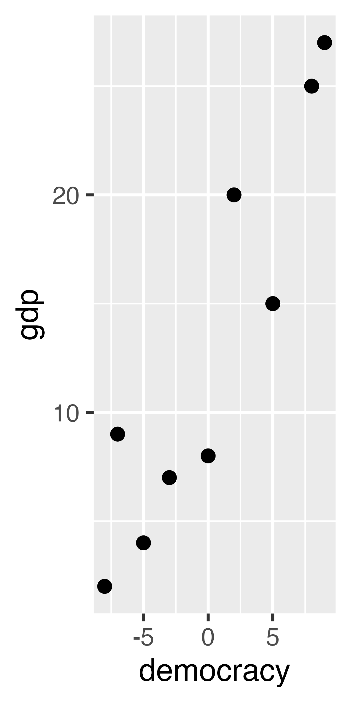
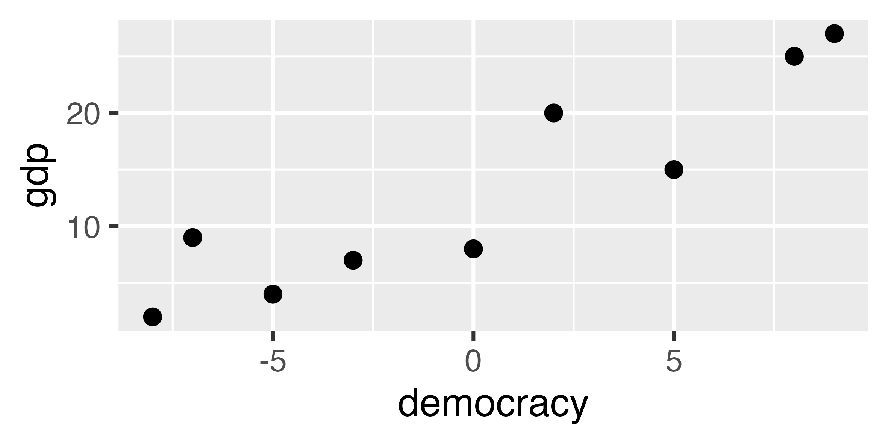
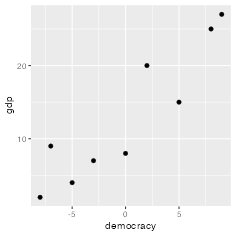

## Introduction
Today we move beyond geoms/aesthetics to **compose, clarify, and polish** plots.

::: fragment
- **Facets vs. color/fill:** when to split panels vs. overlay groups.
:::
::: fragment
- **Coordinates for honesty:** `coord_cartesian()` (zoom w/o dropping), `coord_flip()` (long labels). *Beware truncated axes.*
:::
::: fragment
- **Annotations that guide the eye:** `geom_text()`, `geom_label()`, `ggrepel`, arrows/callouts.
:::
::: fragment
- **Themes that professionalize:** built-ins (`gray`, `bw`, `minimal`, `classic`, `void`) + `ggthemes` (e.g., *economist*, *wsj*); quick tweaks.
:::
::: fragment
- **Combining, motion, export:** `ggarrange()` • `gganimate`/`ggiraph` • `ggsave` (formats, aspect, DPI).
:::


## Simple Geoms
### Aesthetics & the Layer Cake

::: columns
::: {.column width="45%"}
:::

::: {.column width="49%"}
```{r fig.dim=c(7,7), out.width="100%"}
library(ggplot2)

# Layers bottom → top now (Data at bottom, Themes at top)
layers <- rev(c("Themes","Annotations","Coordinates",
                "Facets","Aesthetics","Geometries","Data"))

# Parameters
gap_y <- 2
w0    <- 5
h0    <- 2
x_shift <- 6
n <- length(layers)

# Function to build diamonds
make_plate <- function(k) {
  w  <- w0
  h  <- h0
  y0 <- (k - 1) * gap_y
  x <- c(-w, 0,  w,  0) + x_shift
  y <- c( 0, h,  0, -h) + y0
  data.frame(
    layer = layers[k],
    k = k,
    x = x,
    y = y,
    id = paste0("P", k),
    stringsAsFactors = FALSE
  )
}

plates <- do.call(rbind, lapply(seq_len(n), make_plate))

# Label positions
label_pos <- aggregate(cbind(y) ~ layer + k, plates, mean)
label_pos$x <- x_shift - (w0 * 2.2)

# Plot
ggplot() +
  geom_polygon(
    data = plates,
    aes(x, y, group = id, fill = k),
    color = "white", linewidth = 1.3
  ) +
  geom_text(
    data = label_pos,
    aes(x + 5, y, label = layer, color = k),
    hjust = 1, fontface = "bold", size = 7
  ) +
  scale_fill_viridis_c(option = "plasma", direction = 1, guide = "none") +   # reversed
  scale_color_viridis_c(option = "plasma", direction = 1, guide = "none") + # reversed
  coord_fixed(
    xlim = c(-10, 15),
    expand = FALSE
  ) +
  theme_void() +
  theme(plot.margin = margin(20, 20, 20, 20))
```
:::
:::


## Simple Geoms {visibility="uncounted"}
### Aesthetics & the Layer Cake

::: columns
::: {.column width="45%"}

- **Geoms** are the marks (points, lines, bars) your data takes on a plot.

::: fragment
- **Aesthetics**: color, fill, size, shape, alpha, linetype.
:::

::: fragment
- Today’s focus:

  - **Facets** (small multiples)
  - **Coordinates** (zoom/flip)
  - **Annotations** (guide the eye)
  - **Themes** (professional polish).
:::
:::

::: {.column width="49%"}
```{r fig.dim=c(7,7), out.width="100%"}
library(ggplot2)

# Layers bottom → top now (Data at bottom, Themes at top)
layers <- rev(c("Themes","Annotations","Coordinates",
                "Facets","Aesthetics","Geometries","Data"))

# Parameters
gap_y <- 2
w0    <- 5
h0    <- 2
x_shift <- 6
n <- length(layers)

# Function to build diamonds
make_plate <- function(k) {
  w  <- w0
  h  <- h0
  y0 <- (k - 1) * gap_y
  x <- c(-w, 0,  w,  0) + x_shift
  y <- c( 0, h,  0, -h) + y0
  data.frame(
    layer = layers[k],
    k = k,
    x = x,
    y = y,
    id = paste0("P", k),
    stringsAsFactors = FALSE
  )
}

plates <- do.call(rbind, lapply(seq_len(n), make_plate))

# Label positions
label_pos <- aggregate(cbind(y) ~ layer + k, plates, mean)
label_pos$x <- x_shift - (w0 * 2.2)

# Add alpha column to polygons
plates$alpha <- ifelse(plates$layer %in% c("Facets", "Coordinates", "Annotations", "Themes"), 1, 0.2)
# Add matching alpha to labels
label_pos$alpha <- ifelse(label_pos$layer %in% c("Facets", "Coordinates", "Annotations", "Themes"), 1, 0.2)

ggplot() +
  geom_polygon(
    data = plates,
    aes(x, y, group = id, fill = k, alpha = alpha),  # add alpha
    color = "white", linewidth = 1.3
  ) +
  geom_text(
    data = label_pos,
    aes(x + 5, y, label = layer, color = k, alpha = alpha), # add alpha
    hjust = 1, fontface = "bold", size = 7
  ) +
  scale_fill_viridis_c(option = "plasma", direction = 1, guide = "none") +
  scale_color_viridis_c(option = "plasma", direction = 1, guide = "none") +
  scale_alpha_identity() +   # ensures your alpha column is used directly
  coord_fixed(
    xlim = c(-10, 15),
    expand = FALSE
  ) +
  theme_void() +
  theme(plot.margin = margin(20, 20, 20, 20))
```
:::
:::


# Facets {background-color="#40666e"}

## Facets {.smaller}
### What are they?

Facets split the data into multiple small plots (panels).

- Each panel shows only the subset of data for that category.

::: fragment
**When to use facets?**

- When you want to give each group its own space (avoid overlap/clutter).
- When the comparison you care about is between panels, not within the same axes.
:::

::: fragment
**When to use color/fill aesthetics?**

- When you want to directly compare groups side by side on the same scale.
- When the overlap is not a problem, or even desirable
:::


## Facets
### geom_line

Suppose we have data on average voter turnout (%) in national elections over several years for the US and the UK. We want to see the trend in participation.

::: fragment
This is our dataset:

```{r, warning=FALSE, message=FALSE, echo=TRUE, eval=TRUE, fig.width = 13, fig.height = 4}
library(ggplot2)
set.seed(123)

# Toy dataset with US and UK
eg5 <- data.frame(
  year = rep(c(2000, 2004, 2008, 2012, 2016, 2020), times = 2),
  turnout = c(
    # US presidential elections
    54, 60, 62, 58, 56, 65,
    # UK general elections (closest years aligned to US election years for teaching)
    59, 61, 65, 66, 68, 67
  ),
  country = rep(c("United States", "United Kingdom"), each = 6)
)
```
:::


## Facets
### geom_line

Suppose we have data on average voter turnout (%) in national elections over several years for the US and the UK. We want to see the trend in participation.

This is what it looks like:

```{r, warning=FALSE, message=FALSE, echo=FALSE, eval=TRUE, fig.width = 13, fig.height = 4}
# Step 3: Display as an HTML table
top7<-head(eg5, n=7)
knitr::kable(top7, format = "html", row.names = FALSE)
```


:::footer
:::

## Facets
### geom_line

Suppose we have data on average voter turnout (%) in national elections over several years for the US and the UK. We want to see the trend in participation.

This is what we had previously:

::: fragment
```{r, warning=FALSE, message=FALSE, echo=TRUE, eval=FALSE, fig.width = 13, fig.height = 4}
#| code-fold: true
#| code-summary: "Show the code"
ggplot(eg5, aes(x = year, y = turnout, color = country)) +
  geom_line()
```


```{r, warning=FALSE, message=FALSE, echo=FALSE, eval=TRUE, fig.width = 13, fig.height = 4}
#| code-fold: true
#| code-summary: "Show the code"
ggplot(eg5, aes(x = year, y = turnout, color = country)) +
  geom_line(linewidth=2) +
  theme_grey(base_size = 18)
```
:::
::: footer
:::


## Facets {.smaller}
### geom_line

Suppose we have data on average voter turnout (%) in national elections over several years for the US and the UK. We want to see the trend in participation.

This is the alternative using facets:

::: fragment
```{r, warning=FALSE, message=FALSE, echo=TRUE, eval=FALSE, fig.width = 10, fig.height = 4}
#| code-fold: true
#| code-summary: "Show the code"
ggplot(eg5, aes(x = year, y = turnout)) +
  geom_line() +
  facet_wrap(~ country, ncol = 1)
```


```{r, warning=FALSE, message=FALSE, echo=FALSE, eval=TRUE, fig.width = 10, fig.height = 4}
#| code-fold: true
#| code-summary: "Show the code"
ggplot(eg5, aes(x = year, y = turnout)) +
  geom_line(linewidth=2) +
  facet_wrap(~ country, ncol = 1) +
  theme_grey(base_size = 18)
```
:::

::: footer
:::


## Facets
### geom_histogram

Suppose we surveyed people about their trust in government on a 1–10 scale (1 = no trust, 10 = complete trust). We want to compare typical values and how spread out the answers are for men and women.

::: fragment
This is our dataset:

```{r, warning=FALSE, message=FALSE, echo=TRUE, eval=TRUE, fig.width = 13, fig.height = 4}
library(ggplot2)
set.seed(123)
# Toy survey dataset
eg6 <- data.frame(
  gender = rep(c("Men", "Women"), each = 20),
  trust = c(
    rnorm(20, mean = 5, sd = 2),
    rnorm(20, mean = 8, sd = 1)
  )
)
```
:::


## Facets
### geom_histogram

Suppose we surveyed people about their trust in government on a 1–10 scale (1 = no trust, 10 = complete trust). We want to compare typical values and how spread out the answers are for men and women.

This is what it looks like:

```{r, warning=FALSE, message=FALSE, echo=FALSE, eval=TRUE, fig.width = 13, fig.height = 4}
# Step 3: Display as an HTML table
top7<-head(eg6, n=5)
knitr::kable(top7, format = "html", row.names = FALSE)
```


:::footer
:::


## Facets
### geom_histogram

Suppose we surveyed people about their trust in government on a 1–10 scale (1 = no trust, 10 = complete trust). We want to compare typical values and how spread out the answers are for men and women.

This is what we had previously:

::: fragment
```{r, warning=FALSE, message=FALSE, echo=TRUE, eval=FALSE, fig.width = 13, fig.height = 3}
#| code-fold: true
#| code-summary: "Show the code"
ggplot(eg6, aes(x = trust, fill = gender)) +
  geom_histogram(bins = 10, color = "white", alpha = 0.5)
```


```{r, warning=FALSE, message=FALSE, echo=FALSE, eval=TRUE, fig.width = 13, fig.height = 3}
#| code-fold: true
#| code-summary: "Show the code"
ggplot(eg6, aes(x = trust, fill = gender)) +
  geom_histogram(bins = 10, color = "white", alpha = 0.5) +
  theme_grey(base_size = 25)
```
:::


## Facets {.smaller}
### geom_histogram

Suppose we surveyed people about their trust in government on a 1–10 scale (1 = no trust, 10 = complete trust). We want to compare typical values and how spread out the answers are for men and women.

::: fragment
This is the alternative using facets:

```{r, warning=FALSE, message=FALSE, echo=TRUE, eval=FALSE, fig.width = 10, fig.height = 3}
#| code-fold: true
#| code-summary: "Show the code"
ggplot(eg6, aes(x = trust)) +
  geom_histogram(bins = 10, color = "white") +
  facet_wrap(~ gender, ncol = 1)               # one panel per gender
```


```{r, warning=FALSE, message=FALSE, echo=FALSE, eval=TRUE, out.width="60%"}
#| code-fold: true
#| code-summary: "Show the code"
ggplot(eg6, aes(x = trust)) +
  geom_histogram(bins = 10, color = "white") +
  facet_wrap(~ gender, ncol = 1) +                  # one panel per gender
  theme_grey(base_size = 22)
```
:::


## Putting Plots Side by Side
### `ggarrange()`

Sometimes you don’t want facets (splitting one dataset).

Instead, you might want to combine different plots — for example:

```{r, warning=FALSE, message=FALSE, echo=TRUE, eval=TRUE, fig.width = 10, fig.height = 4}
#| code-fold: true
#| code-summary: "Show the code"
library(ggpubr)

# Plot 1: voter turnout
p1 <- ggplot(eg5, aes(x = year, y = turnout, color = country, group = country)) +
  geom_line(linewidth=1.2) +
  labs(title = "Voter Turnout")

# Plot 2: trust in government
p2 <- ggplot(eg6, aes(x = trust, fill = gender)) +
  geom_histogram(bins = 10, color = "white", alpha = 0.7) +
  labs(title = "Trust in Government")

# Arrange them side by side
ggarrange(p1, p2, ncol = 2)
```


# Coordinates {background-color="#40666e"}

## Coordinates
### Coordinates in ggplot2

- Control how data space is mapped to the plot space
- Can zoom in/out or flip axes
- Crucial for **clarity** and **honesty** in visualizations

::: fragment
Common functions:

- `coord_cartesian()` – zoom without dropping data
- `coord_flip()` – swap x & y axes (useful for long labels)
:::

## Coordinates
### coord_cartesian

Let us check out another toy example inspired by real data.

The data looks like this:

```{r, warning=FALSE, message=FALSE, echo=TRUE, eval=TRUE, out.width="100%"}
brexit_data <- data.frame(
  side = c("Leave", "Remain"),
  support = c(52, 48))
```

```{r, warning=FALSE, message=FALSE, echo=FALSE, eval=TRUE, out.width="80%"}
top4<-head(brexit_data, n=8)
knitr::kable(top4, format = "html", row.names = FALSE)
```


## Coordinates
### coord_cartesian

This is how we can plot our data:


```{r, warning=FALSE, message=FALSE, echo=TRUE, eval=FALSE, out.width="100%"}
#| code-fold: true
#| code-summary: "Show the code"
ggplot(brexit_data, aes(x = side, y = support, fill = side)) +
  geom_col()
```

```{r, warning=FALSE, message=FALSE, echo=FALSE, eval=TRUE, out.width="100%"}
#| code-fold: true
#| code-summary: "Show the code"

ggplot(brexit_data, aes(x = side, y = support, fill = side)) +
  geom_col() +
  theme_grey(base_size = 25)
```


## Coordinates
### coord_cartesian

This is how we can truncate the axis (zoom the view) without dropping data:

```{r, warning=FALSE, message=FALSE, echo=TRUE, eval=FALSE, out.width="100%"}
#| code-fold: true
#| code-summary: "Show the code"
ggplot(brexit_data, aes(x = side, y = support, fill = side)) +
  geom_col() +
  coord_cartesian(ylim = c(45, 55))  # Truncates axis and exaggerates gap
```

```{r, warning=FALSE, message=FALSE, echo=FALSE, eval=TRUE, out.width="100%"}
#| code-fold: true
#| code-summary: "Show the code"
ggplot(brexit_data, aes(x = side, y = support, fill = side)) +
  geom_col() +
  coord_cartesian(ylim = c(45, 55))+  # Truncates axis and exaggerates gap
  theme_grey(base_size = 25)
```


## Coordinates
### coord_cartesian

Moral: Truncated axes exaggerate differences. 

Use `coord_cartesian()` for transparency.


## Flipping
### coord_flip


- `coord_flip()` swaps x and y axes, rotating the entire plot.

- Useful for bar charts with long category labels (improves readability).

- Often makes rankings and comparisons easier to interpret.


## Flipping
### coord_flip

Suppose we have survey data on average voter turnout rates (%) across different education groups. Here we don’t want to plot individual points — instead, we’re comparing aggregated values (categories on x, turnout on y).

```{r, warning=FALSE, message=FALSE, echo=TRUE, eval=TRUE}
# Pre-aggregated counts instead of raw rows
eg2 <- data.frame(
  education = c(
    "Primary", "Primary", "High School", "High School", "High School",
    "College", "College", "College", "College"
  ))
```


::: fragment
```{r, warning=FALSE, message=FALSE, echo=FALSE, eval=TRUE, out.width="80%"}
top4<-head(eg2, n=4)
knitr::kable(top4, format = "html", row.names = FALSE)
```
:::


## Flipping
### coord_flip

Suppose we have survey data on average voter turnout rates (%) across different education groups. Here we don’t want to plot individual points — instead, we’re comparing aggregated values (categories on x, turnout on y).


```{r, warning=FALSE, message=FALSE, echo=TRUE, eval=FALSE}
ggplot(eg2, aes(x = education)) +
  geom_bar()
```


```{r, warning=FALSE, message=FALSE, echo=FALSE, eval=TRUE}
ggplot(eg2, aes(x = education)) +
  geom_bar() +
  theme_grey(base_size = 25)
```


## Flipping
### coord_flip

Suppose we have survey data on average voter turnout rates (%) across different education groups. Here we don’t want to plot individual points — instead, we’re comparing aggregated values (categories on x, turnout on y).

This is how we can use `coord_flip`

```{r, warning=FALSE, message=FALSE, echo=TRUE, eval=FALSE}
#| code-fold: true
#| code-summary: "Show the code"
ggplot(eg2, aes(x = education)) +
  geom_bar()+
  coord_flip()
```


```{r, warning=FALSE, message=FALSE, echo=FALSE, eval=TRUE}
ggplot(eg2, aes(x = education)) +
  geom_bar() +
  theme_grey(base_size = 25)+
  coord_flip()
```


# Annotations {background-color="#40666e"}

## Annotations
### Why Annotations?

Raw plots ≠ finished plots.

Annotations direct the reader’s eye and add context.

**Labels vs Annotations**

- **Labels**: Titles, axis labels, captions (labs()).
- **Annotations**: Extra text, marks on the plot itself


## Annotations
### `geom_text`

We learned to use `geom_text` in this example:

Imagine we have data about 9 countries that record their level of democracy from -10 to +10 (x-axis) and their GDP per capita in $1,000s (y-axis).

::: fragment
```{r, warning=FALSE, message=FALSE, echo=TRUE, eval=TRUE, out.width="60%"}
eg1 <- data.frame(
  democracy = c(-8, -7, -5, -3, 0, 2, 5, 8, 9),   # democracy score
  gdp = c(2, 9, 4, 7, 8, 20, 15, 25, 27),  # GDP per capita in $1,000s
  country = c(
    "North Korea",   # very autocratic, very poor
    "Saudi Arabia",  # autocratic, but richer due to oil
    "Zimbabwe",      # authoritarian, low GDP
    "Russia",        # hybrid regime, middle income
    "Nigeria",       # similar position
    "India",         # low–mid democracy, growing GDP
    "Brazil",        # democracy, mid GDP
    "Poland",        # consolidated democracy, higher GDP
    "South Korea"))   # rich democracy
```
:::


## Annotations
### `geom_text`

We learned to use `geom_text` in this example:

Imagine we have data about 9 countries that record their level of democracy from -10 to +10 (x-axis) and their GDP per capita in $1,000s (y-axis).

```{r, warning=FALSE, message=FALSE, echo=FALSE, eval=TRUE, out.width="80%"}
top4<-head(eg1, n=5)
knitr::kable(top4, format = "html", row.names = FALSE)
```


## Annotations
### `geom_text`

We learned to use `geom_text` in this example:

Imagine we have data about 9 countries that record their level of democracy from -10 to +10 (x-axis) and their GDP per capita in $1,000s (y-axis).

```{r, warning=FALSE, message=FALSE, echo=TRUE, eval=FALSE, out.width="60%"}
#| code-fold: true
#| code-summary: "Show the code"
# Scatterplot with geom_point
ggplot(eg1, aes(x = democracy, y = gdp)) +
  geom_point(size = 5) +
  geom_text(aes(label = country), vjust = -1, size = 5)
```


```{r, warning=FALSE, message=FALSE, echo=FALSE, eval=TRUE, out.width="55%"}
#| code-fold: true
#| code-summary: "Show the code"
# Scatterplot with geom_point
ggplot(eg1, aes(x = democracy, y = gdp)) +
  geom_point(size = 5) +
  geom_text(aes(label = country), vjust = -1, size = 5) + 
  theme_grey(base_size = 25)
```


::: footer
:::


## Annotations
### `geom_label`

We could also use `geom_label` in this example:

Imagine we have data about 9 countries that record their level of democracy from -10 to +10 (x-axis) and their GDP per capita in $1,000s (y-axis).


::: fragment
```{r, warning=FALSE, message=FALSE, echo=TRUE, eval=FALSE, out.width="55%"}
#| code-fold: true
#| code-summary: "Show the code"
# Scatterplot with geom_point
ggplot(eg1, aes(x = democracy, y = gdp)) +
  geom_point(size = 5) +
  geom_label(aes(label = country), vjust = -1, size = 5) 
```


```{r, warning=FALSE, message=FALSE, echo=FALSE, eval=TRUE, out.width="55%"}
# Scatterplot with geom_point
ggplot(eg1, aes(x = democracy, y = gdp)) +
  geom_point(size = 5) +
  geom_label(aes(label = country), vjust = -1, size = 5) +
  theme_grey(base_size = 25)
```
:::

::: footer
:::


## Annotations
### `geom_text_repel`

We could also use `geom_text_repel` in this example to avoid clutter:

Imagine we have data about 9 countries that record their level of democracy from -10 to +10 (x-axis) and their GDP per capita in $1,000s (y-axis).


::: fragment
```{r, warning=FALSE, message=FALSE, echo=TRUE, eval=FALSE, out.width="55%"}
#| code-fold: true
#| code-summary: "Show the code"
library(ggrepel)

# Scatterplot with geom_point
ggplot(eg1, aes(x = democracy, y = gdp)) +
  geom_point(size = 5) +
  geom_text_repel(aes(label = country), size = 5)
```


```{r, warning=FALSE, message=FALSE, echo=FALSE, eval=TRUE, out.width="55%"}
library(ggrepel)

# Scatterplot with geom_point
ggplot(eg1, aes(x = democracy, y = gdp)) +
  geom_point(size = 5) +
  geom_text_repel(aes(label = country), size = 5) +
  theme_grey(base_size = 25)
```
:::

::: footer
:::


## Annotations
### `geom_label_repel`

We could also use `geom_label_repel` in this example to avoid clutter:

Imagine we have data about 9 countries that record their level of democracy from -10 to +10 (x-axis) and their GDP per capita in $1,000s (y-axis).


::: fragment
```{r, warning=FALSE, message=FALSE, echo=TRUE, eval=FALSE, out.width="55%"}
#| code-fold: true
#| code-summary: "Show the code"
library(ggrepel)
# Scatterplot with geom_point
ggplot(eg1, aes(x = democracy, y = gdp)) +
  geom_point(size = 5) +
  geom_label_repel(aes(label = country), size = 5)
```


```{r, warning=FALSE, message=FALSE, echo=FALSE, eval=TRUE, out.width="55%"}
library(ggrepel)
# Scatterplot with geom_point
ggplot(eg1, aes(x = democracy, y = gdp)) +
  geom_point(size = 5) +
  geom_label_repel(aes(label = country), size = 5) +
  theme_grey(base_size = 25)
```
:::

::: footer
:::


## Annotations
### `geom_text`

We learned to use `geom_text` in this example:

Imagine we have data about 9 countries that record their level of democracy from -10 to +10 (x-axis) and their GDP per capita in $1,000s (y-axis).


::: fragment
```{r, warning=FALSE, message=FALSE, echo=TRUE, eval=FALSE, out.width="55%"}
#| code-fold: true
#| code-summary: "Show the code"
# Scatterplot with geom_point
ggplot(eg1, aes(x = democracy, y = gdp)) +
  geom_point(size = 5) +
  geom_text(aes(label = country), vjust = -1, size = 5) + 
  annotate("text", x = -7, y = 11, label = "Oil-rich outlier", 
           color = "red", size = 6, fontface = "bold") +
  annotate("segment", x = -7, xend = -7, y = 9, yend = 10.5, 
           arrow = arrow(length = unit(0.2, "cm")), color = "red")
```


```{r, warning=FALSE, message=FALSE, echo=FALSE, eval=TRUE, out.width="55%"}
#| code-fold: true
#| code-summary: "Show the code"
# Scatterplot with geom_point
ggplot(eg1, aes(x = democracy, y = gdp)) +
  geom_point(size = 5) +
  geom_text(aes(label = country), vjust = -1, size = 5) +
  coord_cartesian(ylim = c(1, 31), xlim = c(-10, 10)) +
  theme_grey(base_size = 25)+
    annotate("text", x = -7, y = 18, label = "Oil-rich outlier", 
           color = "red", size = 6, fontface = "bold") +
  annotate("segment", x = -7, xend = -7, y = 15, yend = 12, 
           arrow = arrow(length = unit(0.2, "cm")), color = "red")
```
:::

::: footer
:::


# Labs {background-color="#40666e"}


## Labs
### Why `labs()`?

Every good plot needs context. `labs()` lets you set:

- **Title / Subtitle** — what the figure is about
- **Axis labels** — what each dimension represents
- **Caption** — notes, sources, disclaimers
- **Legend title** — clarify what colors/shapes mean


## Labs
### Example with Democracy & GDP

Previously, we plotted democracy score vs GDP with labels:

```{r, warning=FALSE, message=FALSE, echo=TRUE, eval=FALSE, out.width="60%"}
#| code-fold: true
#| code-summary: "Show the code"
ggplot(eg1, aes(x = democracy, y = gdp)) +
  geom_point() +
  geom_text(aes(label = country), vjust = -1, size = 5)
```


```{r, warning=FALSE, message=FALSE, echo=FALSE, eval=TRUE, out.width="60%"}
#| code-fold: true
#| code-summary: "Show the code"
ggplot(eg1, aes(x = democracy, y = gdp)) +
  geom_point(size = 5) +
  geom_text(aes(label = country), vjust = -1, size = 5) +
  theme_grey(base_size = 20)
```


## Labs
### Adding Context with `labs()`

Now, we can improve readability:

```{r, warning=FALSE, message=FALSE, echo=TRUE, eval=FALSE, out.width="60%"}
#| code-fold: true
#| code-summary: "Show the code"
ggplot(eg1, aes(x = democracy, y = gdp)) +
  geom_point(size = 5) +
  geom_text(aes(label = country), vjust = -1, size = 5) +
  labs(
    title = "Democracy and Wealth",
    subtitle = "Higher democracy scores often align with higher GDP",
    x = "Democracy Score (-10 = Autocracy, +10 = Democracy)",
    y = "GDP per Capita (in $1,000s)",
    caption = "Toy dataset, inspired by real-world patterns"
  )
```


```{r, warning=FALSE, message=FALSE, echo=FALSE, eval=TRUE, out.width="60%"}
ggplot(eg1, aes(x = democracy, y = gdp)) +
  geom_point(size = 5) +
  geom_text(aes(label = country), vjust = -1, size = 5) +
  labs(
    title = "Democracy and Wealth",
    subtitle = "Higher democracy scores often align with higher GDP",
    x = "Democracy Score (-10 = Autocracy, +10 = Democracy)",
    y = "GDP per Capita (in $1,000s)",
    caption = "Toy dataset, inspired by real-world patterns"
  ) +
  theme_grey(base_size = 20)
```

  

# Themes {background-color="#40666e"}

## Themes
### What are Themes?

Control non-data elements of the plot.

Fonts, background, gridlines, legend placement, margins.

Do not affect the data → only the presentation.

Good themes = clarity + professionalism.


## Themes
### Built-in Themes: `theme_grey()`


Imagine we have data about 9 countries that record their level of democracy from -10 to +10 (x-axis) and their GDP per capita in $1,000s (y-axis).


::: fragment
```{r, warning=FALSE, message=FALSE, echo=TRUE, eval=FALSE, out.width="55%"}
#| code-fold: true
#| code-summary: "Show the code"
# Scatterplot with geom_point
ggplot(eg1, aes(x = democracy, y = gdp)) +
  geom_point(size = 5) +
  geom_text(aes(label = country), vjust = -1, size = 5) + 
  theme_grey()
```


```{r, warning=FALSE, message=FALSE, echo=FALSE, eval=TRUE, out.width="55%"}
# Scatterplot with geom_point
ggplot(eg1, aes(x = democracy, y = gdp)) +
  geom_point(size = 5) +
  geom_text(aes(label = country), vjust = -1, size = 5) + 
  theme_grey(base_size = 25)
```
:::


## Themes
### Built-in Themes: `theme_bw()`


Imagine we have data about 9 countries that record their level of democracy from -10 to +10 (x-axis) and their GDP per capita in $1,000s (y-axis).


```{r, warning=FALSE, message=FALSE, echo=TRUE, eval=FALSE, out.width="55%"}
#| code-fold: true
#| code-summary: "Show the code"
ggplot(eg1, aes(x = democracy, y = gdp)) +
  geom_point(size = 5) +
  geom_text(aes(label = country), vjust = -1, size = 5) + 
  theme_bw()
```


```{r, warning=FALSE, message=FALSE, echo=FALSE, eval=TRUE, out.width="55%"}
# Scatterplot with geom_point
ggplot(eg1, aes(x = democracy, y = gdp)) +
  geom_point(size = 5) +
  geom_text(aes(label = country), vjust = -1, size = 5) + 
  theme_bw(base_size = 25)
```


## Themes
### Built-in Themes: `theme_minimal()`


Imagine we have data about 9 countries that record their level of democracy from -10 to +10 (x-axis) and their GDP per capita in $1,000s (y-axis).


```{r, warning=FALSE, message=FALSE, echo=TRUE, eval=FALSE, out.width="55%"}
#| code-fold: true
#| code-summary: "Show the code"
ggplot(eg1, aes(x = democracy, y = gdp)) +
  geom_point(size = 5) +
  geom_text(aes(label = country), vjust = -1, size = 5) + 
  theme_minimal()
```


```{r, warning=FALSE, message=FALSE, echo=FALSE, eval=TRUE, out.width="55%"}
# Example data
ggplot(eg1, aes(x = democracy, y = gdp)) +
  geom_point(size = 5) +
  geom_text(aes(label = country), vjust = -1, size = 5) + 
  theme_minimal(base_size = 25)
```


## Themes
### Built-in Themes: `theme_classic()`


Imagine we have data about 9 countries that record their level of democracy from -10 to +10 (x-axis) and their GDP per capita in $1,000s (y-axis).


```{r, warning=FALSE, message=FALSE, echo=TRUE, eval=FALSE, out.width="55%"}
#| code-fold: true
#| code-summary: "Show the code"
ggplot(eg1, aes(x = democracy, y = gdp)) +
  geom_point(size = 5) +
  geom_text(aes(label = country), vjust = -1, size = 5) + 
  theme_classic()
```


```{r, warning=FALSE, message=FALSE, echo=FALSE, eval=TRUE, out.width="55%"}
# Example data
ggplot(eg1, aes(x = democracy, y = gdp)) +
  geom_point(size = 5) +
  geom_text(aes(label = country), vjust = -1, size = 5) +  
  theme_classic(base_size = 25)
```


## Themes
### Built-in Themes: `theme_void()`


Imagine we have data about 9 countries that record their level of democracy from -10 to +10 (x-axis) and their GDP per capita in $1,000s (y-axis).


```{r, warning=FALSE, message=FALSE, echo=TRUE, eval=FALSE, out.width="55%"}
#| code-fold: true
#| code-summary: "Show the code"
ggplot(eg1, aes(x = democracy, y = gdp)) +
  geom_point(size = 5) +
  geom_text(aes(label = country), vjust = -1, size = 5) + 
  theme_void()
```


```{r, warning=FALSE, message=FALSE, echo=FALSE, eval=TRUE, out.width="55%"}
# Example data
ggplot(eg1, aes(x = democracy, y = gdp)) +
  geom_point(size = 5) +
  geom_text(aes(label = country), vjust = -1, size = 5) +  
  theme_void(base_size = 25)
```


## Themes {.smaller}
### Supplementary Themes: `ggthemes` - `theme_economist`

To access additional themes you should install the `ggthemes` package

Imagine we have data about 9 countries that record their level of democracy from -10 to +10 (x-axis) and their GDP per capita in $1,000s (y-axis).

```{r, warning=FALSE, message=FALSE, echo=TRUE, eval=FALSE, out.width="55%"}
#| code-fold: true
#| code-summary: "Show the code"
library(ggthemes)
ggplot(eg1, aes(x = democracy, y = gdp)) +
  geom_point(size = 5) +
  geom_text(aes(label = country), vjust = -1, size = 5) + 
  theme_economist()
```


```{r, warning=FALSE, message=FALSE, echo=FALSE, eval=TRUE, out.width="55%"}
# Scatterplot with geom_point
library(ggthemes)
ggplot(eg1, aes(x = democracy, y = gdp)) +
  geom_point(size = 5) +
  geom_text(aes(label = country), vjust = -1, size = 5) + 
  theme_economist(base_size = 25)
```


## Themes {.smaller}
### Supplementary Themes: `ggthemes` - `theme_wsj`

To access additional themes you should install the `ggthemes` package

Imagine we have data about 9 countries that record their level of democracy from -10 to +10 (x-axis) and their GDP per capita in $1,000s (y-axis).

```{r, warning=FALSE, message=FALSE, echo=TRUE, eval=FALSE, out.width="55%"}
#| code-fold: true
#| code-summary: "Show the code"
library(ggthemes)
ggplot(eg1, aes(x = democracy, y = gdp)) +
  geom_point(size = 5) +
  geom_text(aes(label = country), vjust = -1, size = 5) + 
  theme_wsj()
```


```{r, warning=FALSE, message=FALSE, echo=FALSE, eval=TRUE, out.width="55%"}
# Example data
library(ggthemes)
ggplot(eg1, aes(x = democracy, y = gdp)) +
  geom_point(size = 5) +
  geom_text(aes(label = country), vjust = -1, size = 5) +  
  theme_wsj(base_size = 25)+
    theme(
    plot.title = element_text(size = 25)   # override title size
  )
```


## Themes
### Tweaking a Theme

Imagine we have data about 9 countries that record their level of democracy from -10 to +10 (x-axis) and their GDP per capita in $1,000s (y-axis).


```{r, warning=FALSE, message=FALSE, echo=TRUE, eval=FALSE, out.width="55%"}
#| code-fold: true
#| code-summary: "Show the code"

# Scatterplot with geom_point
ggplot(eg1, aes(x = democracy, y = gdp)) +
  geom_point(size = 5) +
  geom_text(aes(label = country), vjust = -1, size = 5) + 
  theme_minimal()+
  theme(panel.background = element_rect(fill = "white"), # Set background color
        axis.title.x = element_text(color = "#BF0404", face = "bold"), # Set x-axis label color
        axis.title.y = element_text(color = "#BF0404", face = "bold"),
        axis.line = element_line(color = "#BF0404", size = 1.5), 
        panel.grid = element_blank(), 
        panel.border = element_blank(), 
        panel.grid.major.y = element_line(color = "#40403E", size = 0.5, linetype = "dotted"))
```


```{r, warning=FALSE, message=FALSE, echo=FALSE, eval=TRUE, out.width="55%"}
# Scatterplot with geom_point
ggplot(eg1, aes(x = democracy, y = gdp)) +
  geom_point(size = 5) +
  geom_text(aes(label = country), vjust = -1, size = 5) + 
  coord_cartesian(ylim = c(1, 31), xlim = c(-10, 10)) +
  theme_minimal(base_size = 25)+
  theme(panel.background = element_rect(fill = "white"), # Set background color
        axis.title.x = element_text(color = "#BF0404", face = "bold"), # Set x-axis label color
        axis.title.y = element_text(color = "#BF0404", face = "bold"),
        axis.line = element_line(color = "#BF0404", size = 1.5), 
        panel.grid = element_blank(), 
        panel.border = element_blank(), 
        panel.grid.major.y = element_line(color = "#40403E", size = 0.5, linetype = "dotted"))
```


# Interactive Plots {background-color="#40666e"}

## Interactive Plots
### Time Series 

Suppose we have data on average voter turnout (%) in national elections over several years for the US and the UK. We want to see the trend in participation.


```{r, warning=FALSE, message=FALSE, echo=TRUE, eval=TRUE, out.width="60%"}
set.seed(123)
library(gganimate)

# Toy dataset with US and UK
eg5 <- data.frame(
  year = rep(c(2000, 2004, 2008, 2012, 2016, 2020), times = 2),
  turnout = c(
    # US presidential elections
    54, 60, 62, 58, 56, 65,
    # UK general elections (closest years aligned to US election years for teaching)
    59, 61, 65, 66, 68, 67
  ),
  country = rep(c("United States", "United Kingdom"), each = 6)
)
```


## Interactive Plots
### Time Series 

Suppose we have data on average voter turnout (%) in national elections over several years for the US and the UK. We want to see the trend in participation.


```{r, warning=FALSE, message=FALSE, echo=FALSE, eval=TRUE, fig.width = 13, fig.height = 4}
# Step 3: Display as an HTML table
top7<-head(eg5, n=7)
knitr::kable(top7, format = "html", row.names = FALSE)
```


## Interactive Plots
### Time Series 

Suppose we have data on average voter turnout (%) in national elections over several years for the US and the UK. We want to see the trend in participation.


```{r, warning=FALSE, message=FALSE, echo=TRUE, eval=FALSE, out.width="60%"}
ggplot(eg5, aes(x = year, y = turnout, color = country, group = country)) +
  geom_line() +
  transition_reveal(year)+
  labs(
    subtitle = "Year: {round(frame_along)}"
  )
```


```{r, warning=FALSE, message=FALSE, echo=FALSE, eval=TRUE, fig.width = 13, fig.height = 5}
#| code-fold: true
#| code-summary: "Show the code"

ggplot(eg5, aes(x = year, y = turnout, color = country, group = country)) +
  geom_line(linewidth=4) +
  theme_grey(base_size = 25) +
  transition_reveal(year)+
  labs(
    subtitle = "Year: {round(frame_along)}"
  )
```


## Interactive Plots
### Time Scatterplots

Let us first create a panel data.

```{r, warning=FALSE, message=FALSE, echo=TRUE, eval=TRUE, out.width="60%"}
library(dplyr)
library(tidyr)

# Base cross-section
eg1 <- data.frame(
  democracy = c(-8, -7, -5, -3, 0, 2, 5, 8, 9),   # democracy score
  gdp = c(2, 9, 4, 7, 8, 20, 15, 25, 27),  # GDP per capita ($1,000s)
  country = c(
    "North Korea",
    "Saudi Arabia",
    "Zimbabwe",
    "Russia",
    "Nigeria",
    "India",
    "Brazil",
    "Poland",
    "South Korea"
  )
)

# Add a fake panel (2000–2020 every 5 years)
set.seed(123)  # reproducible "wiggles"

eg_panel <- eg1 %>%
  slice(rep(1:n(), each = 5)) %>%           # repeat each country 5 times
  mutate(year = rep(seq(2000, 2020, 5), times = nrow(eg1))) %>%
  group_by(country) %>%
  mutate(
    # let democracy scores drift a bit
    democracy = democracy + cumsum(runif(5, -0.6, 0.3)),
    # let GDP grow with some noise
    gdp = gdp + cumsum(runif(5, 0, 2))
  )
```


## Interactive Plots
### Time Scatterplots

Let us first examine the data

```{r}
# Step 3: Display as an HTML table
eg_panel_top7<-head(eg_panel, n=7)
knitr::kable(eg_panel_top7, format = "html", row.names = FALSE)
```


## Interactive Plots
### Time Scatterplots

We learned to use `geom_text` in this example:

Imagine we have data about 9 countries that record their level of democracy from -10 to +10 (x-axis) and their GDP per capita in $1,000s (y-axis).

::: fragment
```{r, warning=FALSE, message=FALSE, echo=TRUE, eval=FALSE, out.width="60%"}
#| code-fold: true
#| code-summary: "Show the code"

# Scatterplot with geom_point
ggplot(eg_panel, aes(x = democracy, y = gdp, label = country)) +
  geom_point(size = 5) +
  geom_text(vjust = -1, size = 5, show.legend = FALSE) +
  labs(
    subtitle = "Year: {round(frame_time)}"
  ) +
  transition_time(round(year)) +
  ease_aes('linear')
```


```{r, warning=FALSE, message=FALSE, echo=FALSE, eval=TRUE, out.width="55%"}
# Scatterplot with geom_point
ggplot(eg_panel, aes(x = democracy, y = gdp, label = country)) +
  geom_point(size = 5) +
  geom_text(vjust = -1, size = 5, show.legend = FALSE) +
  #coord_cartesian(ylim = c(0, 35), xlim = c(-10, 10)) +
  labs(
    subtitle = "Year: {round(frame_time)}"
  ) +
  theme_grey(base_size = 20) +
  transition_time(year)
```
:::

::: footer
:::


## Interactive Plots
### Interactive Maps


```{r, warning=FALSE, message=FALSE, echo=TRUE, eval=FALSE, out.width="60%"}
#| code-fold: true
#| code-summary: "Show the code"
library(ggplot2)
library(sf)
library(rnaturalearth)
library(rnaturalearthdata)
library(ggiraph)
library(glue)
library(scales)


world <- ne_countries(scale = "medium", 
                      returnclass = "sf")
europe_bounds <- list(x = c(-10, 40),
                      y = c(35, 70))

# Mapping Them
# Interactive ggplot
p <- ggplot() +
  geom_sf_interactive(
    data = world,
    aes(
      fill = log(pop_est),
      tooltip = glue("{admin}: {comma(pop_est)}")  # hover text
    ),
    color = "white", linewidth = 0.1
  ) +
  coord_sf(
    xlim = europe_bounds$x,
    ylim = europe_bounds$y
  ) +
  theme_grey(base_size = 25) +
  scale_fill_viridis_c(option = "viridis")

# Render interactive plot with tooltips
girafe(ggobj = p)
```


```{r, warning=FALSE, message=FALSE, echo=FALSE, eval=TRUE, out.width="60%"}
#| code-fold: true
#| code-summary: "Show the code"
library(ggplot2)
library(sf)
library(rnaturalearth)
library(rnaturalearthdata)
library(ggiraph)
library(glue)
library(scales)


world <- ne_countries(scale = "medium", 
                      returnclass = "sf")
europe_bounds <- list(x = c(-10, 40),
                      y = c(35, 70))

# Mapping Them
# Interactive ggplot
p <- ggplot() +
  geom_sf_interactive(
    data = world,
    aes(
      fill = log(pop_est),
      tooltip = glue("{admin}: {comma(pop_est)}")  # hover text
    ),
    color = "white", linewidth = 0.1
  ) +
  coord_sf(
    xlim = europe_bounds$x,
    ylim = europe_bounds$y) +
  theme_grey(base_size = 25) +
  scale_fill_viridis_c(option = "viridis")

# Render interactive plot with tooltips
girafe(ggobj = p)
```


## Saving Figures

This was the first example we had: 

Imagine we have data about 9 countries that record their level of democracy from -10 to +10 (x-axis) and their GDP per capita in $1,000s (y-axis).

::: fragment
```{r, warning=FALSE, message=FALSE, echo=TRUE, eval=TRUE, out.width="60%"}
eg1 <- data.frame(
  democracy = c(-8, -7, -5, -3, 0, 2, 5, 8, 9),   # democracy score
  gdp = c(2, 9, 4, 7, 8, 20, 15, 25, 27)  # GDP per capita in $1,000s
)

```
:::

## Saving Figures

We save the plot to an object and then print it:

```{r, warning=FALSE, message=FALSE, echo=TRUE, eval=FALSE, out.width="60%"}
# Scatterplot with geom_point
pic<-ggplot(data=eg1, 
       aes(x = democracy, y = gdp)) +
  geom_point()
print(pic)
```

  
```{r, warning=FALSE, message=FALSE, echo=FALSE, eval=TRUE, out.width="60%"}
# Scatterplot with geom_point
pic<-ggplot(data=eg1, 
       aes(x = democracy, y = gdp)) +
  geom_point(size=5)+
  theme_grey(base_size = 25)
print(pic)
```


## Saving Figures

The command to save a picture is `ggsave`

We can save it as:

- PDF → small file, best for documents and printing

```{r, warning=FALSE, message=FALSE, echo=TRUE, eval=FALSE, out.width="60%"}
# Square picture
ggsave(pic, filename = "pic.pdf")
```

- PNG → crisp, good for websites or presentations

```{r, warning=FALSE, message=FALSE, echo=TRUE, eval=FALSE, out.width="60%"}
ggsave(pic, filename = "pic.png")
```

- JPG → also common, but usually larger file size

```{r, warning=FALSE, message=FALSE, echo=TRUE, eval=FALSE, out.width="60%"}
ggsave(pic, filename = "pic.jpg")
```


## Saving Figures
### Controlling Shape

When you save, you can tell R how wide and tall the picture should be.

```{r, warning=FALSE, message=FALSE, echo=TRUE, eval=FALSE, out.width="60%"}
ggsave(pic, filename = "pic_square.png", width = 20, height = 20, units = "cm")
```

{width="38%"}


## Saving Figures
### Controlling Shape

When you save, you can tell R how wide and tall the picture should be.

```{r, warning=FALSE, message=FALSE, echo=TRUE, eval=FALSE, out.width="60%"}
ggsave(pic, filename = "pic_height.png", width = 10, height = 20, units = "cm")
```

{width="38%"}


## Saving Figures
### Controlling Shape

When you save, you can tell R how wide and tall the picture should be.

```{r, warning=FALSE, message=FALSE, echo=TRUE, eval=FALSE, out.width="60%"}
ggsave(pic, filename = "pic_width.png", width = 20, height = 10, units = "cm")
```

{width="38%"}

## Saving Figures
### Image Quality

Here's a new word: **dpi = dots per inch**.

- Higher dpi = sharper image, but larger file.
- Lower dpi = fuzzier image, but smaller file.


```{r, warning=FALSE, message=FALSE, echo=TRUE, eval=FALSE, out.width="60%"}
ggsave(pic, filename = "pic_hi.png", width = 20, height = 20, units = "cm", dpi = 300)
```

{width="38%"}


## Saving Figures
### Image Quality

Here’s a new word: **dpi = dots per inch**.

- Higher dpi = sharper image, but larger file.
- Lower dpi = fuzzier image, but smaller file.


```{r, warning=FALSE, message=FALSE, echo=TRUE, eval=FALSE, out.width="60%"}
ggsave(pic, filename = "pic_lo.png", width = 20, height = 20, units = "cm", dpi = 30)
```

{width="38%"}


# Conclusion {background-color="#40666e"}

## Big Takeaways {.smaller}
::: fragment
- **Compose wisely:** 
  
  - Use **facets** when comparisons are *between* groups; 
  - Use **color/fill** when comparisons are *within the same axes*.
:::

::: fragment
- **Be honest with coordinates:** 

  - Zoom with `coord_cartesian()`;
  - flip long labels with `coord_flip()`. 
  - *Avoid misleading truncated axes.*
:::

::: fragment
- **Guide the eye:**

  - Annotations (`geom_text[_repel]`, `geom_label[_repel]`, arrows) for **readable stories**.
:::

::: fragment
- **Context matters:** `labs()` for titles, subtitles, axes, captions, and clear legends.
:::

::: fragment
- **Polish with themes:** Built-ins or `ggthemes` to professionalize—**data first, décor second**.
:::
::: fragment
- **Combine & share:** 

  - `ggarrange()` to curate narratives; 
  - `gganimate`/`ggiraph` to add motion/interaction;
  - `ggsave` to export with the right size & DPI.
:::

::: footer
:::
